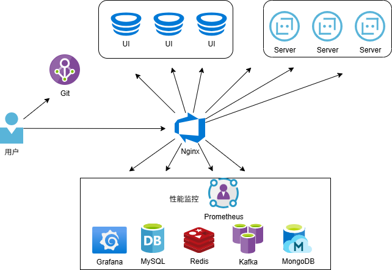

## 1.4 关于仿“小红书”项目整体架构演进全景展示

以下分别为你展示仿“小红书”项目在单体架构、分布式架构、前后端分离架构、微服务架构、云原生+AI架构下的全景展示，包括架构的组成部分、特点等信息。

### 单体架构

三层架构。

- **架构组成**：
    - **表现层（Web层）**：使用如Spring MVC、Thymeleaf等框架，负责接收用户请求，如前端页面的访问请求、发布笔记请求、点赞评论请求等，并将处理结果返回给前端。前端可以使用HTML、CSS、JavaScripts来展示页面。
    - **业务逻辑层**：处理具体的业务逻辑，例如笔记的存储与检索逻辑、用户关系管理逻辑（关注、粉丝等）、推荐算法逻辑（简单的基于热门或时间排序等）。这一层会调用数据访问层的方法来获取或保存数据。
    - **数据访问层（持久层）**：使用如Spring Data JPA等ORM（对象关系映射）框架，与数据库进行交互，实现数据的增删改查操作。数据库可以选择MySQL、Oracle等关系型数据库来存储用户信息、笔记内容、评论数据等。
- **特点**：
    - **优点**：架构简单，开发、测试和部署相对容易，适合小型项目快速开发；所有功能集中在一个项目中，不存在分布式系统中的网络通信问题，系统间调用效率高。
    - **缺点**：随着业务规模扩大，代码量增加，项目变得复杂难以维护；一个模块出现问题可能影响整个系统；扩展性差，难以针对特定功能进行单独扩展。

### 分布式架构

- **架构组成**：
    - **负载均衡器**：如Nginx、HAProxy等，负责将用户请求分发到不同的应用服务器上，实现请求的负载均衡，提高系统的可用性和性能。
    - **应用服务器集群**：部署多个相同的仿小红书应用实例，每个实例处理一部分用户请求，这些应用实例共同组成应用服务器集群。每个应用实例包含表现层、业务逻辑层和数据访问层，与单体架构类似。
    - **分布式缓存**：使用如Redis这样的分布式缓存系统，缓存热点数据，如热门笔记、用户信息等，减轻数据库的压力，提高系统响应速度。
    - **数据库集群**：采用主从复制或分布式数据库（如MySQL Cluster、TiDB等），实现数据的高可用和读写分离，主数据库负责写操作，从数据库负责读操作，提高数据库的性能和可用性。
    - **消息队列**：如RabbitMQ、Kafka等，用于异步处理一些任务，例如用户发布笔记后的异步审核、点赞评论后的消息通知等，解耦系统组件，提高系统的吞吐量和响应速度。
    - **性能监控**：如使用JMeter做性能测试，使用Prometheus+Grafana实现分布式系统监控体系。
- **特点**：
    - **优点**：提高了系统的性能和可用性，通过负载均衡和集群技术可以处理大量用户请求；分布式缓存和消息队列提升了系统的响应速度和处理能力；可以根据业务需求对不同部分进行单独扩展。
    - **缺点**：架构复杂，开发和维护成本高，需要处理分布式系统中的数据一致性、网络通信等问题；增加了系统的调试难度。

### 前后端分离架构

是上述分布式架构的演进版本，主要是将应用分为了前端应用和后端应用。

- **架构组成**：
    - **负载均衡器**：如Nginx、HAProxy等，负责将用户请求分发到不同的应用服务器上，实现请求的负载均衡，提高系统的可用性和性能。
    - **前端应用服务器集群**：部署多个相同的仿小红书应用的前端实例。
    - **后端应用服务器集群**：部署多个相同的仿小红书应用的后端实例。
    - **分布式缓存**：使用如Redis这样的分布式缓存系统，缓存热点数据，如热门笔记、用户信息等，减轻数据库的压力，提高系统响应速度。
    - **数据库集群**：采用主从复制或分布式数据库（如MySQL Cluster、TiDB等），实现数据的高可用和读写分离，主数据库负责写操作，从数据库负责读操作，提高数据库的性能和可用性。
    - **消息队列**：如RabbitMQ、Kafka等，用于异步处理一些任务，例如用户发布笔记后的异步审核、点赞评论后的消息通知等，解耦系统组件，提高系统的吞吐量和响应速度。
    - **性能监控**：如使用JMeter做性能测试，使用Prometheus+Grafana实现分布式系统监控体系。
- **特点**：
    - **优点**：提高了系统的性能和可用性，通过负载均衡和集群技术可以处理大量用户请求；分布式缓存和消息队列提升了系统的响应速度和处理能力；可以根据业务需求对不同部分进行单独扩展
    - **缺点**：架构复杂，开发和维护成本高，需要处理分布式系统中的数据一致性、网络通信等问题；增加了系统的调试难度。

### 微服务架构

- **架构组成**：
    - **前端应用服务器集群**：部署多个相同的仿小红书应用的前端实例。
    - **后端微服务应用集群**：部署多个微服务应用实例。
    - **网关服务**：如Gateway等，作为系统的入口，统一处理外部请求，进行请求的路由、身份验证、限流等操作，将请求转发到相应的微服务。
    - **配置中心**：如Nacos Config等，集中管理各个微服务的配置信息，实现配置的动态更新。
    - **注册中心**：如Nacos等，微服务在启动时向注册中心注册自己的服务信息，其他微服务通过注册中心发现并调用目标服务。
    - **分布式事务处理**：如Seata等，致力于提供高性能和简单易用的分布式事务服务。
    - **服务调用**：如Feign等，负责服务间调用。
- **特点**：
    - **优点**：每个微服务独立开发、部署和维护，降低了系统的耦合度，提高了开发效率和可维护性；可以根据业务需求对单个微服务进行扩展和优化；便于技术选型，不同微服务可以根据自身需求选择合适的技术栈；后端应用可以按需扩展。
    - **缺点**：微服务数量众多，管理和维护复杂，需要处理服务间的通信、数据一致性等问题；增加了系统的部署和测试难度；可能会产生网络延迟等性能问题。 

### 云原生+AI架构

是上述微服务架构的演进版本，主要是将应用通过云原生容器方式部署，引入了AI等技术。

- **架构组成**：
    - **前端应用服务器集群**：部署多个相同的仿小红书应用的前端实例。
    - **后端微服务应用集群**：部署多个微服务应用实例。
    - **网关服务**：如Gateway等，作为系统的入口，统一处理外部请求，进行请求的路由、限流等操作，将请求转发到相应的微服务。
    - **配置中心**：如Nacos Config等，集中管理各个微服务的配置信息，实现配置的动态更新。
    - **注册中心**：如Nacos等，微服务在启动时向注册中心注册自己的服务信息，其他微服务通过注册中心发现并调用目标服务。
    - **分布式事务处理**：如Seata等，致力于提供高性能和简单易用的分布式事务服务。
    - **服务调用**：如Feign等，负责服务间调用。
    - **分布式日志系统**：如ELK（Elasticsearch、Logstash、Kibana），收集和分析各个微服务产生的日志，便于系统的监控和故障排查。
    - **AI技术**：用于文案生成、评论生成、图像识别、情感分析等。
    - **容器化部署**：Docker。
    - **CI/CD**：持续集成与发布。
    - **容器编排与管理**：Kubernetes。
- **特点**：
    - **优点**：容器编排与管理使用Docker镜像标准化部署和发布，可以减轻环境不一致导致的部署问题；实现自动扩容；AI技术有效减轻人工的投入。
    - **缺点**：增加了系统的复杂度。 

