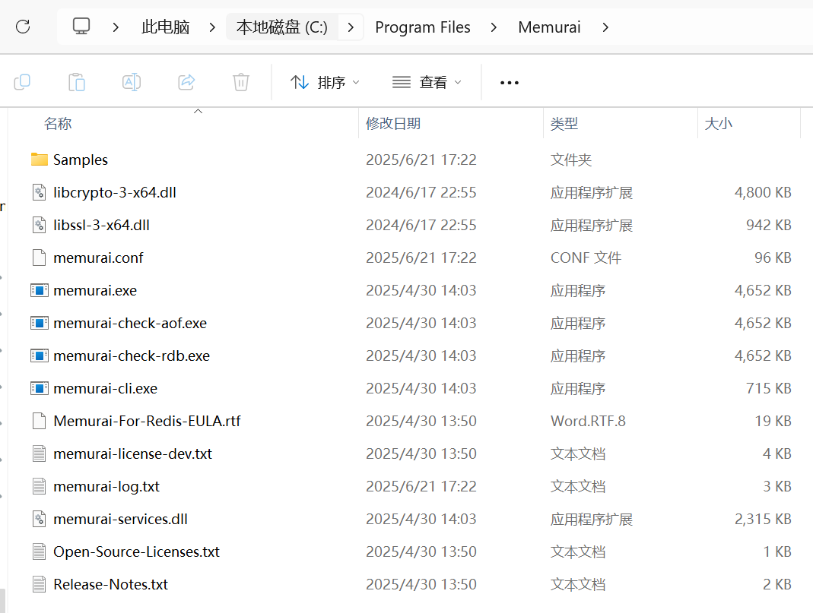
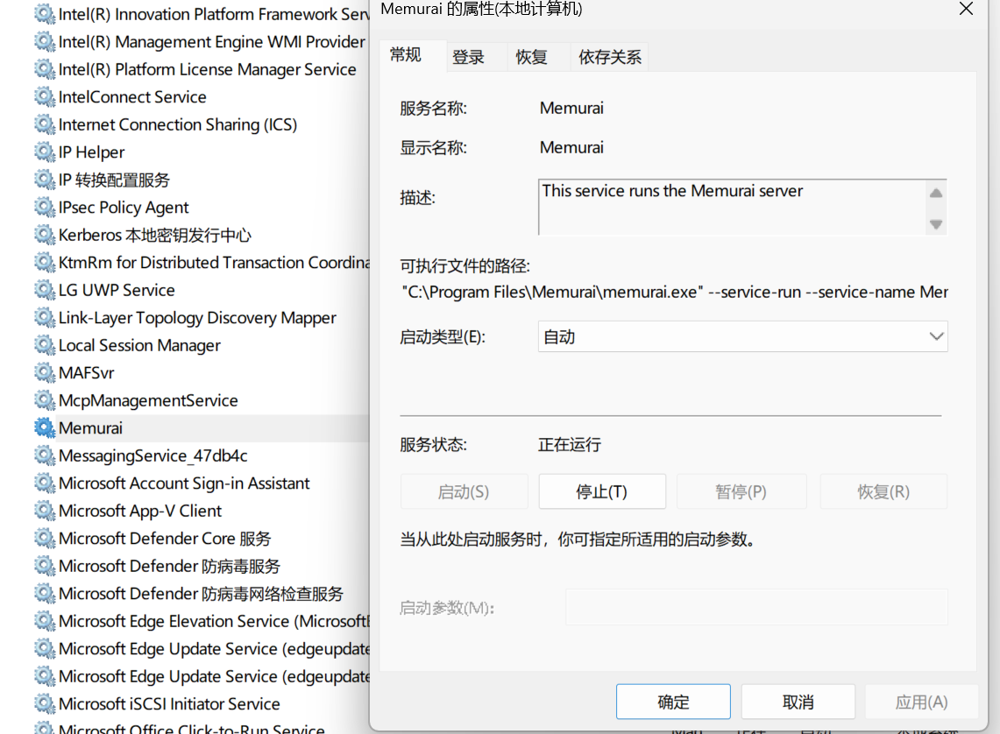

## 2.1 Redis入门指南，从安装到配置，快速实现开发准备


Redis作为高性能的内存数据库，入门的第一步是搭建稳定的运行环境。本指南将从安装、基础配置到开发准备，带你带领你完成Redis的初始化工作，为后续开发奠定基础。


### macOS系统安装

#### 1. 确保已安装 Homebrew

若要在 macOS 上安装 Redis 开源版，请使用 Homebrew。开始执行以下安装步骤前，请确保已安装 Homebrew：

```bash
# 安装Homebrew（已安装可跳过）
/bin/bash -c "$(curl -fsSL https://raw.githubusercontent.com/Homebrew/install/HEAD/install.sh)"
```


#### 2. 使用 Homebrew 安装 Redis

首先，添加 Redis 的 Homebrew 软件源（cask）：

```bash
brew tap redis/redis
```

接下来，执行 `brew install` 命令进行安装：
```bash
brew install --cask redis
```

**注**：由于 Redis 是通过 `brew tap` 命令从 Homebrew 软件源（cask）安装的，因此它不会与 `brew services` 命令集成（即无法通过 `brew services` 命令管理 Redis 服务的启动、停止等）。

#### 3. 运行 Redis

如果这是你首次在系统上安装 Redis，需确保你的 `PATH` 环境变量中包含 Redis 的安装路径。对于搭载 Apple 芯片的 Mac，该路径为 `/opt/homebrew/bin`；对于基于 Intel 芯片的 Mac，该路径为 `/usr/local/bin`。

要检查 `PATH` 变量，执行以下命令：

```bash
echo $PATH
```


确认输出结果中包含 `/opt/homebrew/bin`（Apple 芯片 Mac）或 `/usr/local/bin`（Intel 芯片 Mac）。若这两个路径均未在输出中出现，请按以下步骤添加。打开 `~/.bashrc` 或 `~/.zshrc` 文件（具体取决于你使用的 Shell），添加以下代码行：

```bash
export PATH=$(brew --prefix)/bin:$PATH
```

完成上述设置后，可通过以下命令启动 Redis 服务器：

```bash
redis-server $(brew --prefix)/etc/redis.conf
```

服务器将在后台运行。


#### 4. 卸载 Redis

若要卸载 Redis，执行以下命令：
```bash
brew uninstall redis
brew untap redis/redis
```


### Linux系统安装（以Ubuntu/Debian为例）

```bash
# 更新包索引
sudo apt-get install lsb-release curl gpg
curl -fsSL https://packages.redis.io/gpg | sudo gpg --dearmor -o /usr/share/keyrings/redis-archive-keyring.gpg
sudo chmod 644 /usr/share/keyrings/redis-archive-keyring.gpg
echo "deb [signed-by=/usr/share/keyrings/redis-archive-keyring.gpg] https://packages.redis.io/deb $(lsb_release -cs) main" | sudo tee /etc/apt/sources.list.d/redis.list
sudo apt-get update

# 安装Redis
sudo apt-get install redis

# 启动服务
sudo systemctl start redis-server

# 设置开机自启
sudo systemctl enable redis-server

# 检查服务状态
sudo systemctl status redis-server  # 应显示active (running)
```

### Docker环境安装


#### 1. 在 Docker 上运行 Redis 服务器


若要使用 `redis:<version>` 镜像启动 Redis 开源版服务器，请在终端中执行以下命令：

```bash
docker run -d --name redis -p 6379:6379 redis:<version>
```
> 说明：命令中的 `<version>` 需替换为具体的 Redis 版本号，例如 `redis:7.2.4`，若直接使用 `redis` 则默认拉取最新版本镜像。


#### 2. 在 Docker 上运行 Redis 客户端 redis-cli

之后，你可以通过 `redis-cli` 连接到 Redis 服务器，操作方式与连接其他任何 Redis 实例一致。

### 情况 1：本地未安装 redis-cli
若本地未安装 `redis-cli`，可从 Docker 容器中运行该工具，命令如下：
```bash
$ docker exec -it redis redis-cli
```

### 情况 2：本地已安装 redis-cli
若本地已安装 `redis-cli`，直接在终端中执行以下命令即可连接：
```bash
$ redis-cli -h 127.0.0.1 -p 6379
```
> 说明：`-h` 指定 Redis 服务器地址（此处为本地地址 127.0.0.1），`-p` 指定端口号（Redis 默认端口为 6379）。


#### 3. 使用本地配置文件

默认情况下，Redis Docker 容器使用 Redis 的内置配置文件。若要使用本地配置文件启动 Redis，可选择以下两种方式之一：


##### 方式 1：通过 Dockerfile 配置
你可以创建自定义 Dockerfile，将上下文目录中的 `redis.conf`（本地配置文件）添加到容器的 `/data/` 目录下，示例如下：
```dockerfile
FROM redis
COPY redis.conf /usr/local/etc/redis/redis.conf
CMD [ "redis-server", "/usr/local/etc/redis/redis.conf" ]
```
创建完成后，需通过 `docker build` 构建镜像，再用 `docker run` 启动容器。


##### 方式 2：通过 docker run 命令直接指定（无需 Dockerfile）
也可以在 `docker run` 命令中通过选项直接指定本地配置文件，无需创建 Dockerfile，命令如下：
```bash
$ docker run -v /myredis/conf:/usr/local/etc/redis --name myredis redis redis-server /usr/local/etc/redis/redis.conf
```
- 其中，`/myredis/conf/` 是本地存放 `redis.conf` 文件的目录路径，需根据实际本地路径修改。
- `-v /myredis/conf:/usr/local/etc/redis` 的作用是将本地的 `/myredis/conf` 目录与容器内的 `/usr/local/etc/redis` 目录进行挂载，使容器能读取本地的配置文件。


有关Docker的内容还会在后续课程详细介绍。

### Windows系统安装

Windows官方未提供原生支持，推荐使用 Docker 在 Windows 上运行 Redis。

另外一种方式是使用Memurai。Memurai是Redis on Windows项目钦点的替代产品，同时Memura也是Redis官方的合作伙伴。


#### 1. 下载安装Memurai


下载地址：<https://www.memurai.com/get-memurai>，选择“Memurai for Redis”版本进行下载，可以得到一个名为“Memurai-for-Redis-v4.2.0.msi”的安装包。以管理员身份双击进行安装。可以自定义安装目录和自定义端口。

或者也可以用命令行安装：

```
>msiexec /quiet /i Memurai-for-Redis-v4.2.0.msi
```


安装完成之后，在安装目录下可看到如下目录文件：




#### 2. 配置Memurai

安装完成后，你可以通过编辑Memurai的配置文件来进行一些自定义配置。配置文件位于Memurai安装目录的memurai.conf中。

通过编辑配置文件，你可以配置Memurai的监听地址和端口，设置密码，启用或禁用AOF（append-only file）持久化等。


#### 3. 运行Memurai

一旦安装和配置完成，你就可以启动Memurai服务并开始测试运行了。运行 memurai.exe 就可以启动服务器了。

默认情况下，Memurai是已以Windows服务的方式自动启动了，可以请按下`Win + R`组合键打开运行窗口，输入services.msc并点击确定。在服务管理窗口中，找到Memurai服务，对其进行管理，比如启动方式改为手动，将服务关闭、启动等。




启动完成后，打开命令行工具（如Windows PowerShell或cmd），输入memurai-cli命令即可进入Memurai的命令行界面。

在命令行界面中，你可以使用各种Redis命令，如SET、GET、DEL等，与Memurai进行交互。


```
>memurai-cli.exe
127.0.0.1:6379> SET mykey "Hello World!"
OK
127.0.0.1:6379> GET mykey
"Hello World!"
127.0.0.1:6379> DEL mykey
(integer) 1
127.0.0.1:6379>
```


### Redis基础配置：核心参数调整

Redis的配置文件位置：
- Windows（Memurai版）：`memurai.conf`
- macOS（Homebrew）：`/usr/local/etc/redis.conf`
- Linux：`/etc/redis/redis.conf`

以下是必改的核心配置（开发环境）

1. **绑定地址（允许远程访问）**
   ```conf
   # 注释掉绑定本地地址（或改为0.0.0.0允许所有IP访问）
   # bind 127.0.0.1 ::1
   bind 0.0.0.0
   ```

2. **保护模式（开发环境关闭）**
   ```conf
   # 开发环境可关闭保护模式（生产环境需开启并配置密码）
   protected-mode no
   ```

3. **设置密码（重要！）**
   ```conf
   # 取消注释并设置密码（替换为你的密码）
   requirepass your_strong_password_here
   ```

4. **端口配置（默认6379，可保持不变）**
   ```conf
   port 6379
   ```

5. **内存限制（防止内存溢出）**
   ```conf
   # 设置最大使用内存（根据实际情况调整，如2GB）
   maxmemory 2gb
   # 内存满时的淘汰策略（开发环境推荐）
   maxmemory-policy allkeys-lru
   ```

修改配置后重启Redis使生效：
```bash
# Linux/macOS
sudo systemctl restart redis-server  # systemd系统
# 或
sudo service redis-server restart

# Windows（命令行启动方式）
# 先关闭当前服务（Ctrl+C），再重新启动
redis-server.exe redis.windows.conf
```


### Redis客户端连接与基础操作

#### 1. 使用官方命令行客户端（redis-cli）

```bash
# 本地连接（默认端口）
redis-cli

# 带密码连接
redis-cli -a your_password_here

# 远程连接
redis-cli -h 192.168.1.100 -p 6379 -a your_password

# 连接成功后测试
127.0.0.1:6379> ping
PONG  # 成功响应
```


#### 2. 基础操作示例

```bash
# 设置键值对
127.0.0.1:6379> set username "zhangsan"
OK

# 获取值
127.0.0.1:6379> get username
"zhangsan"

# 设置带过期时间的键（10秒后过期）
127.0.0.1:6379> setex token 10 "abc123"
OK

# 查看键的过期时间（-1表示永不过期，-2表示已过期）
127.0.0.1:6379> ttl token
(integer) 7

# 删除键
127.0.0.1:6379> del username
(integer) 1

# 查看所有键
127.0.0.1:6379> keys *
1) "token"
```


### Redis可视化工具：提升开发效率

推荐几款常用的Redis可视化工具，便于查看和管理数据：

1. **Redis Insight**（官方推荐）
   - 功能全面，支持数据可视化、性能分析
   - 跨平台（Windows/macOS/Linux）
   - 下载地址：[Redis Insight官网](https://redis.io/insight/)

2. **Another Redis Desktop Manager**
   - 轻量开源，界面简洁
   - 支持多语言和批量操作
   - 下载地址：[GitHub仓库](https://github.com/qishibo/AnotherRedisDesktopManager)


### 总结：Redis开发环境搭建 checklist

1. 安装Redis并验证服务启动（`redis-cli ping`返回PONG）
2. 配置基础参数（绑定地址、密码、内存限制）
3. 测试命令行操作（set/get/expire等基础命令）
4. 安装可视化工具便于日常管理

完成以上步骤后，你的Redis开发环境就已准备就绪。后续可以根据具体业务场景，深入学习Redis的数据结构和高级特性，实现缓存、计数器、排行榜等功能。