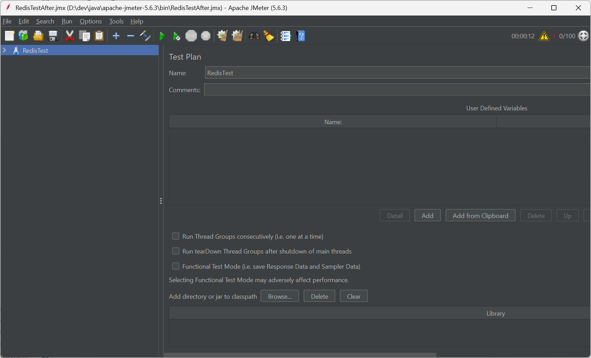
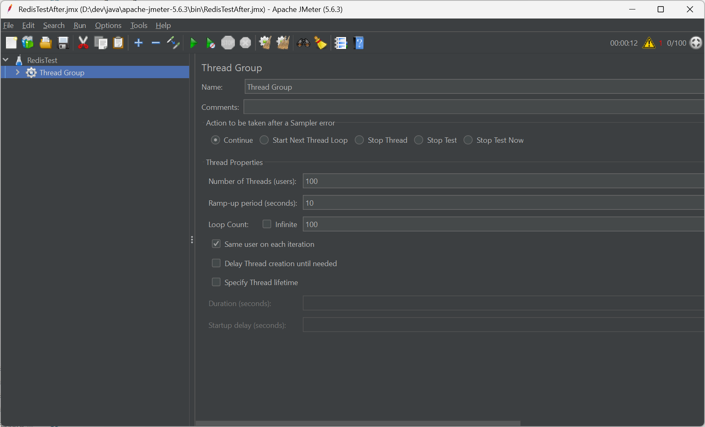
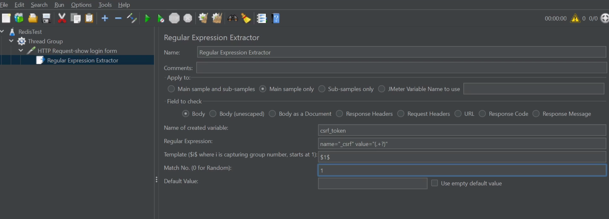
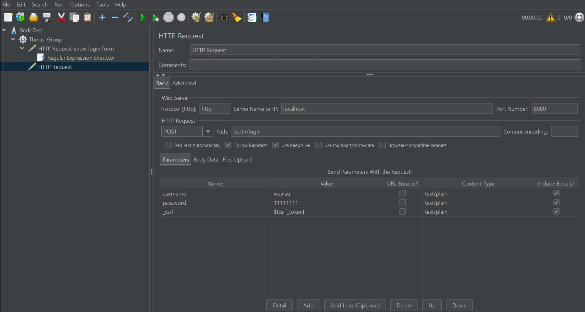
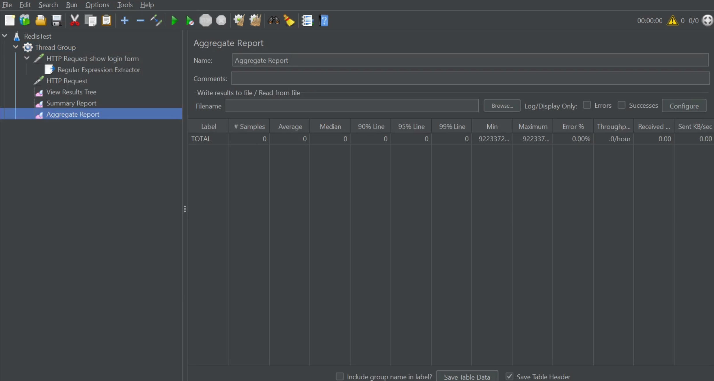
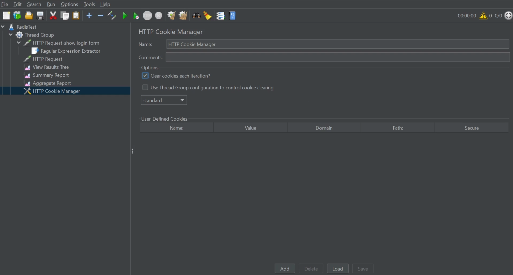
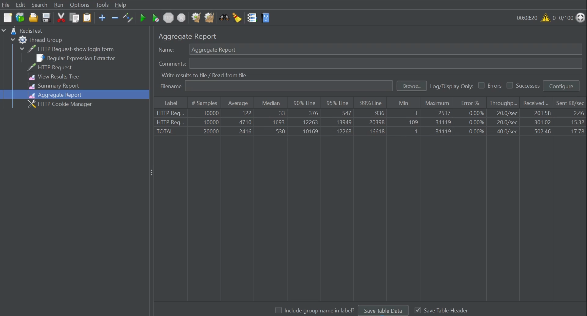
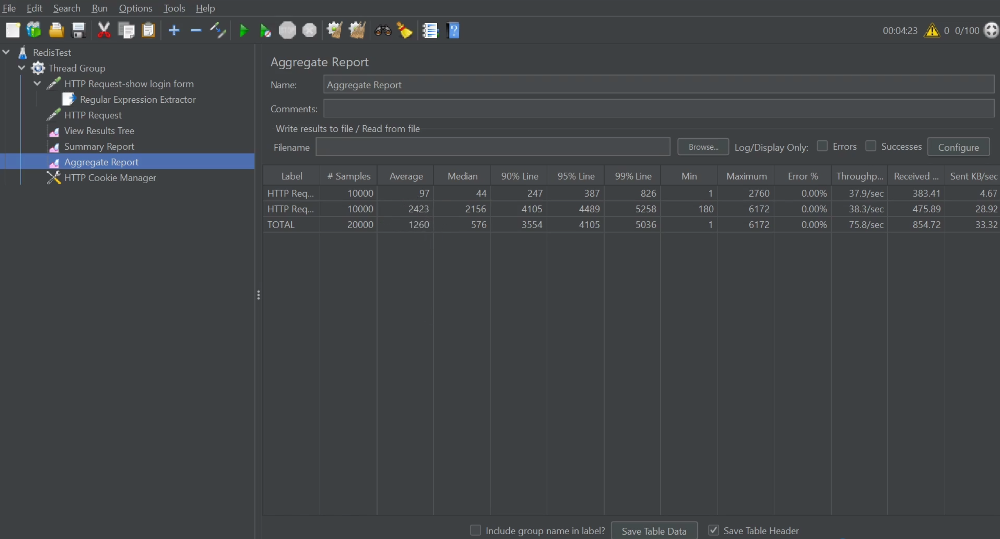

## 2.2 使用JMeter对比Redis优化前后的登录性能

JMeter 是一款强大的性能测试工具，可以帮助你量化 Redis 对登录流程的优化效果。下面我将详细介绍如何使用 JMeter 进行测试并分析结果。

### 下载与安装 JMeter

- 从 [Apache JMeter 官网](https://jmeter.apache.org/download_jmeter.cgi) 下载最新版本
- 解压后运行 `bin/jmeter.bat`（Windows）或 `bin/jmeter.sh`（Linux/Mac）

### 创建 JMeter 测试计划

添加菜单`File` → `New`以创建一个新的测试计划。并将该测试计划“Test Plan”重命名为“RedisTest”。

#### 1. 添加线程组

- 右键点击 `RedisTest` → `Add` → `Threads (Users)` → `Thread Group`
- 配置线程数（模拟并发用户）：
  - 线程数：100（根据服务器性能调整）
  - Ramp-Up 时间：10秒（控制用户启动速度）
  - 循环次数：100（每个用户执行的登录次数）

#### 2. 处理CSRF令牌

Spring Security默认启用CSRF保护，登录请求需携带CSRF令牌：
1. 添加一个**HTTP请求**（用于获取登录页的CSRF令牌）：

- 右键点击线程组 → `Add` → `Sampler` → `HTTP Request`
- 配置请求参数：
  - 名称：HTTP Request-show login form
  - 服务器名称/IP：填写你的应用服务器地址
  - 端口号：8080（或你的应用端口）
  - 协议：HTTP
  - 方法：GET
  - 路径：/auth/login（登录接口路径）

2. 添加**正则表达式提取器**（提取CSRF令牌）：

- 右键上述HTTP请求 → **Add** → **Post Processors** → **Regular Expression Extractor**  
- 配置：
  - **Reference Name**：`csrf_token`
  - **Regular Expression**：`name="_csrf" value="(.+?)"`
  - **Template**：`$1$`
  - **Match No.**：`1`

#### 3. 添加登录请求

- 右键点击线程组 → `Add` → `Sampler` → `HTTP Request`
- 配置请求参数：
  - 服务器名称/IP：填写你的应用服务器地址
  - 端口号：8080（或你的应用端口）
  - 协议：HTTP
  - 方法：POST
  - 路径：/auth/login（登录接口路径）
  - 添加参数：`username` 和 `password`

#### 4. 添加结果监听器

- 右键点击线程组 → `Add` → `Listener` → `View Results Tree`（查看详细结果）
- 右键点击线程组 → `Add` → `Listener` → `Summary Report`（汇总统计）
- 右键点击线程组 → `Add` → `Listener` → `Aggregate Report`（聚合报告）

#### 5. 保存会话信息

- 右键点击线程组 → `Add` → `Config Element` → `HTTP Cookie Manager`
- 勾选 `Clear cookies each iteration?`（每次迭代清除 Cookie）

### 执行测试并收集数据

#### 1. 测试 Redis 优化前
- 确保应用未启用 Redis 会话存储
- 运行 JMeter 测试，主要关注Summary Report里面的以下指标：
  - 平均响应时间（Average）
  - 吞吐量（Throughput）
  - 错误率（Error %）

#### 2. 测试 Redis 优化后

- 启用 Redis 会话存储（按之前的配置方案）
- 可以对上次测试数据进行清理。右键`View Results Tree`、`Summary Report`、`Aggregate Report`三个报告的之后，点“Clear”即可清理。
- 重新运行相同的 JMeter 测试，记录相同指标

### 分析测试结果

通过后优化前后指标对比发现，引入Redis之后，性能是会有极大提升，读者朋友不妨一试。

通过以上步骤，你可以清晰地对比使用 Redis 前后登录性能的差异。通常情况下，使用 Redis 存储会话会显著降低平均响应时间并提高系统吞吐量，特别是在高并发场景下效果更明显。