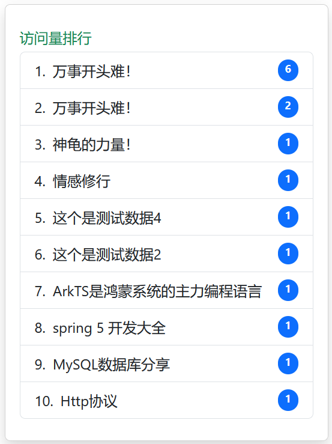
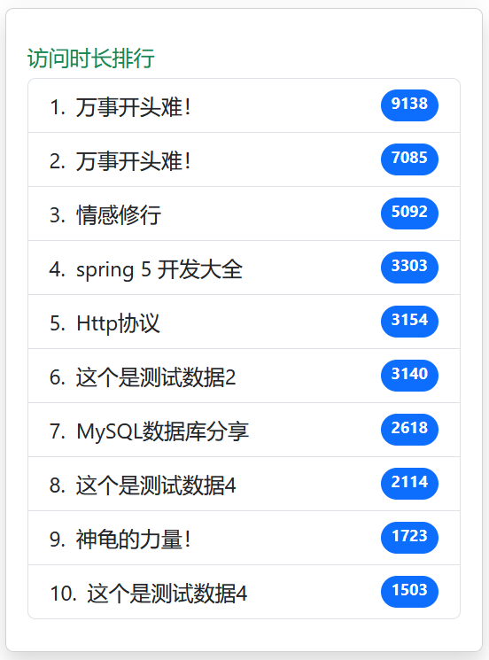

## 3.5 用户行为日志数据展示


###  获取最活跃的笔记列表


NoteService服务增加如下接口：

```java
/**
 * 根据访问量获取笔记列表
 *
 * @param page
 * @param size
 */
List<NoteBrowseCountDto> getNotesByBrowseCount(int page, int size);

/**
 * 根据访问时长获取笔记列表
 *
 * @param page
 * @param size
 */
List<NoteBrowseTimeDto> getNotesByBrowseTime(int page, int size);
```


NoteServiceImpl服务增加如下接口：

```java
@Override
public List<NoteBrowseCountDto> getNotesByBrowseCount(int page, int size) {
    // 获取Redis中指定区间的笔记浏览次数, 按照笔记浏访问量降序排序
    Set<ZSetOperations.TypedTuple<String>> typedTuples =
            redisTemplate.opsForZSet().reverseRangeWithScores(BROWSE_COUNT_KEY, (page - 1) * size, page * size - 1);

    // 转为DTO列表
    List<NoteBrowseCountDto> noteBrowseCountDtos = typedTuples.stream()
            .map(tuple -> {
                NoteBrowseCountDto noteBrowseCountDto = new NoteBrowseCountDto();
                long noteId = Long.parseLong(tuple.getValue());
                noteBrowseCountDto.setNoteId(noteId);
                noteBrowseCountDto.setTitle(noteRepository.findByNoteId(noteId).get().getTitle());
                noteBrowseCountDto.setBrowseCount(tuple.getScore().longValue());
                return noteBrowseCountDto;
            }).collect(Collectors.toUnmodifiableList());

    return noteBrowseCountDtos;
}

@Override
public List<NoteBrowseTimeDto> getNotesByBrowseTime(int page, int size) {
    // 获取Redis中指定区间的笔记浏览次数, 按照笔记浏访问量降序排序
    Set<ZSetOperations.TypedTuple<String>> typedTuples =
            redisTemplate.opsForZSet().reverseRangeWithScores(BROWSE_TIME_KEY, (page - 1) * size, page * size - 1);

    // 转为DTO列表
    List<NoteBrowseTimeDto> noteBrowseTimeDtos = typedTuples.stream()
            .map(tuple -> {
                NoteBrowseTimeDto noteBrowseTimeDto = new NoteBrowseTimeDto();
                long noteId = Long.parseLong(tuple.getValue());
                noteBrowseTimeDto.setNoteId(noteId);
                noteBrowseTimeDto.setTitle(noteRepository.findByNoteId(noteId).get().getTitle());
                noteBrowseTimeDto.setBrowseTime(tuple.getScore().longValue());
                return noteBrowseTimeDto;
            }).collect(Collectors.toUnmodifiableList());

    return noteBrowseTimeDtos;
}
```


### DTO对象

NoteBrowseCountDto：

```java
package com.waylau.rednote.dto;

import lombok.Getter;
import lombok.Setter;

/**
 * NoteBrowseCountDto
 *
 * @author <a href="https://waylau.com">Way Lau</a>
 * @version 2025/09/05
 **/
@Getter
@Setter
public class NoteBrowseCountDto {
    private Long noteId;
    private String title;
    private long browseCount;
}
```

NoteBrowseTimeDto：

```java
package com.waylau.rednote.dto;

import lombok.Getter;
import lombok.Setter;

/**
 * NoteBrowseTimeDto
 *
 * @author <a href="https://waylau.com">Way Lau</a>
 * @version 2025/09/05
 **/
@Getter
@Setter
public class NoteBrowseTimeDto {
    private Long noteId;
    private String title;
    private long browseTime;
}
```


### 修改数据看板API

修改数据看板API，增加如下代码：

```java
@GetMapping("/dashboard")
public String dashboard(Model model) {
    // ...为节约篇幅，此处省略非核心内容

    List<NoteBrowseCountDto> noteBrowseCountDtoList =  noteService.getNoteByBrowseCount(1, 10);
    List<NoteBrowseTimeDto> noteBrowseTimeDtoList =  noteService.getNoteByBrowseTime(1, 10);

    model.addAttribute("noteBrowseCountDtoList", noteBrowseCountDtoList);
    model.addAttribute("noteBrowseTimeDtoList", noteBrowseTimeDtoList);

    // ...为节约篇幅，此处省略非核心内容
}
```

### 界面展示


修改admin-dashboard.html，增加如下：


```html
<div class="col-xl-3 col-md-6 mb-4">
    <div class="card border-left-info shadow h-100 py-2">
        <div class="card-body">
            <div class="row no-gutters align-items-center">
                <div class="col mr-2">
                    <div class="text-xs font-weight-bold text-success text-uppercase mb-1">
                        访问量排行
                    </div>

                    <ol class="list-group list-group-numbered">
                        <li class="list-group-item d-flex justify-content-between align-item-start" th:each="note:${noteBrowseCountDtoList}">
                            <div class="ms-2 me-auto" th:text="${note.title}">
                            </div>
                            <span class="badge text-bg-primary rounded-pill" th:text="${note.browseCount}">
                            </span>
                        </li>
                    </ol>
                </div>
            </div>
        </div>
    </div>
</div>

<div class="col-xl-3 col-md-6 mb-4">
    <div class="card border-left-info shadow h-100 py-2">
        <div class="card-body">
            <div class="row no-gutters align-items-center">
                <div class="col mr-2">
                    <div class="text-xs font-weight-bold text-success text-uppercase mb-1">
                        访问时长排行
                    </div>

                    <ol class="list-group list-group-numbered">
                        <li class="list-group-item d-flex justify-content-between align-item-start" th:each="note:${noteBrowseTimeDtoList}">
                            <div class="ms-2 me-auto" th:text="${note.title}">
                            </div>
                            <span class="badge text-bg-primary rounded-pill" th:text="${note.browseTime}">
                            </span>
                        </li>
                    </ol>
                </div>
            </div>
        </div>
    </div>
</div>
```


### 运行调测

运行MySQL、Redis、Kafka服务，再启动应用。在数据看板查看访问量排行效果，如下图3-1所示。




在首页查看访问时长排行效果，如下图3-2所示。




