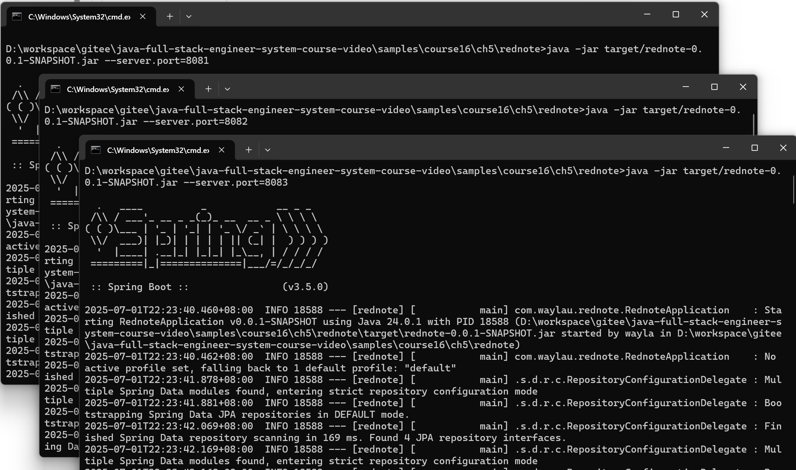
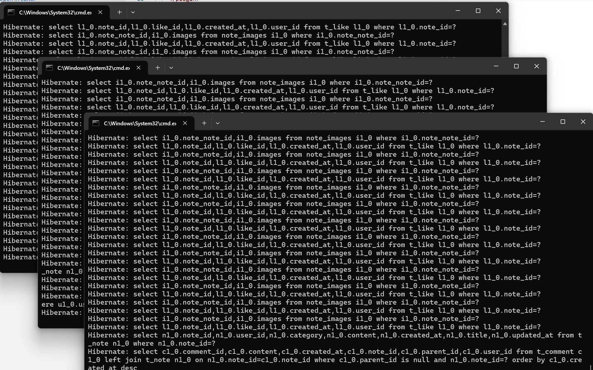

## 5.2 实战反向代理与负载均衡实现应用集群高可用


### 配置Nginx


修改 nginx.conf 增加如下配置：

```c
http {
    # ...为节约篇幅，此处省略非核心内容

    # 上游应用服务器集群
	  upstream rednote {
        server 127.0.0.1:8081;
        server 127.0.0.1:8082;
        server 127.0.0.1:8083;
    }

    server {
        listen 8080;

        # 反向代理配置  
        location / {
            proxy_pass http://rednote;
        }
    }

}
```


### 编译项目


```
>mvn clean package
```


报如下错误：

```
息, 请使用 -Xlint:unchecked 重新编译。
[INFO] -------------------------------------------------------------
[ERROR] COMPILATION ERROR :
[INFO] -------------------------------------------------------------
[ERROR] /D:/workspace/gitee/java-full-stack-engineer-system-course-video/samples/course16/ch5/rednote/src/main/java/com/waylau/rednote/config/UserDetailsServiceImpl.java:[49,21] 找不到符号
  符号:   方法 getUserId()
  位置: 类型为com.waylau.rednote.entity.User的变量 user
[ERROR] /D:/workspace/gitee/java-full-stack-engineer-system-course-video/samples/course16/ch5/rednote/src/main/java/com/waylau/rednote/config/UserDetailsServiceImpl.java:[50,21] 找不到符号
  符号:   方法 getUsername()
  位置: 类型为com.waylau.rednote.entity.User的变量 user
[ERROR] /D:/workspace/gitee/java-full-stack-engineer-system-course-video/samples/course16/ch5/rednote/src/main/java/com/waylau/rednote/config/UserDetailsServiceImpl.java:[51,21] 找不到符号
  符号:   方法 getPassword()
  位置: 类型为com.waylau.rednote.entity.User的变量 user
[ERROR] /D:/workspace/gitee/java-full-stack-engineer-system-course-video/samples/course16/ch5/rednote/src/main/java/com/waylau/rednote/config/UserDetailsServiceImpl.java:[54,66] 找不到符号
  符号:   方法 getRole()
```


还需要安装如下插件：


```xml
<build>
  <plugins>
    <!-- ...为节约篇幅，此处省略非核心内容 -->

    <plugin>
      <groupId>org.apache.maven.plugins</groupId>
      <artifactId>maven-compiler-plugin</artifactId>
      <configuration>
        <annotationProcessorPaths>
          <path>
            <groupId>org.projectlombok</groupId>
            <artifactId>lombok</artifactId>
          </path>
        </annotationProcessorPaths>
      </configuration>
    </plugin>
  </plugins>
</build>
```


此时在`target`目录下，会生成`rednote-0.0.1-SNAPSHOT.jar`文件。


### 指定端口方式运行应用

开三个CMD窗口分别执行下面命令启动三个不同的服务实例。


```
java -jar target/rednote-0.0.1-SNAPSHOT.jar --server.port=8081

java -jar target/rednote-0.0.1-SNAPSHOT.jar --server.port=8082

java -jar target/rednote-0.0.1-SNAPSHOT.jar --server.port=8083
```

启动结果如图5-1 所示：



后台服务启动之后，再启动NGINX服务器，而后在浏览器<http://localhost:8080/>地址访问前台应用，同时观察后台控制台输出的内容，如下图所示。





可以看到，三台后台服务都会轮流的接收到前台的请求。为了模拟故障，也可以将其他的任意一个后台服务停掉，可以发现前台仍然能够正常响应，这就实现了应用的高可用。