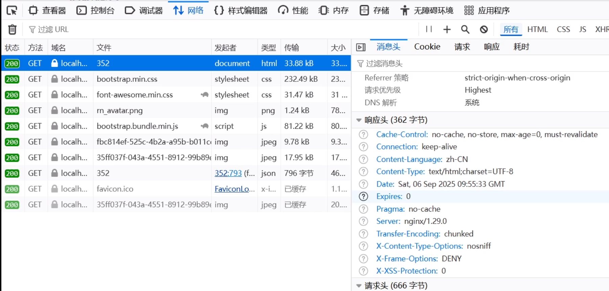
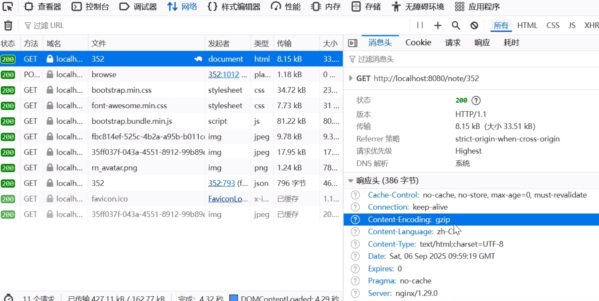

## 5.3 实战静态资源优化

### 配置Nginx启用Gzip压缩


修改 nginx.conf 增加如下配置：


```c
http {
    # ...为节约篇幅，此处省略非核心内容

    gzip on;                    # 启用压缩
    gzip_types text/css application/javascript image/svg+xml; # 压缩类型
    gzip_min_length 1k;         # 最小压缩文件大小
    gzip_comp_level 4;          # 压缩级别（1-9，4为平衡点）
    gzip_disable "MSIE [1-6]\."; # 禁用旧版IE压缩

    # ...为节约篇幅，此处省略非核心内容

}
```

测试方法：浏览器开发者工具查看是否有响应头 Content-Encoding: gzip。


下图是未启用Gzip压缩的HTML页面，网络传输大小是33.88kb。




下图是启用了Gzip压缩的HTML页面，网络传输大小是8.15kb。




