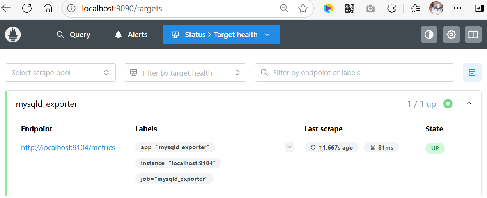

## 6.1 实战Prometheus监控MySQL


### 安装mysqld_exporter


从Prometheus官方下载页（<https://prometheus.io/download/#mysqld_exporter>）获取Windows版`mysqld_exporter`（例如`mysqld_exporter-0.17.2.windows-amd64.zip`），解压到指定目录（例如`D:\dev\monitor\mysqld_exporter-0.17.2.windows-amd64`）。  


### 配置mysqld_exporter

在安装目录下编写`my.cnf`配置文件，内容如下：  

```ini
[client]
host=127.0.0.1
port=3306
user=root
password=123456
```

### 启动mysqld_exporter

启动mysqld_exporter时指定配置文件：


```powershell
.\mysqld_exporter.exe --config.my-cnf=my.cnf
```


启动之后，会占用9104端口。浏览器访问<http://localhost:9104/metrics>，若能看到系统指标数据，则安装成功。

### 注册mysqld_exporter

在prometheus.yml配置中添加如下：

```yml
# ...为节约篇幅，此处省略非核心内容

scrape_configs:
  #  ...为节约篇幅，此处省略非核心内容

  - job_name: "mysqld_exporter"  # 指定Exporter名称

    static_configs:
      - targets: ["localhost:9104"]
        labels:
          app: "mysqld_exporter"
```


此时，重启Prometheus后，访问`http://localhost:9090/targets`，确认MySQL状态为`UP`，如下图6-1所示。





### 关键指标


- `mysql_global_status_connections`：总连接数。  
- `mysql_global_status_slow_queries`：慢查询次数。  
- `mysql_global_status_innodb_row_lock_waits`：行锁等待次数。
