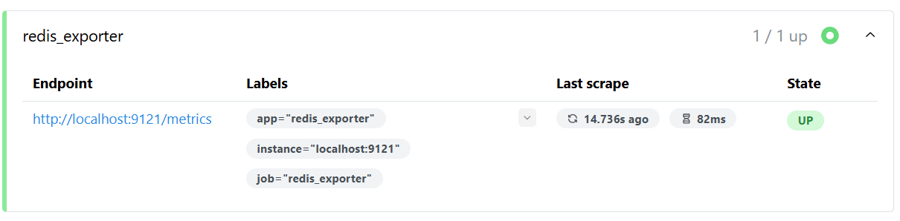

## 6.2 实战Prometheus监控Redis


### 安装redis_exporter


从redis_exporter社区官方下载页（<https://github.com/oliver006/redis_exporter/releases/>）获取Windows版`redis_exporter`（例如`redis_exporter-v1.74.0.windows-amd64.zip`），解压到指定目录（例如`D:\dev\monitor\redis_exporter-v1.74.0.windows-amd64`）。  


### 启动redis_exporter

启动redis_exporter时指定配置：


```powershell
.\redis_exporter.exe -redis.addr localhost:6379 -redis.password your_password  # 如需密码
```


启动之后，会占用9121端口。浏览器访问<http://localhost:9121/metrics>，若能看到系统指标数据，则安装成功。

### 注册redis_exporter

在prometheus.yml配置中添加如下：

```yml
# ...为节约篇幅，此处省略非核心内容

scrape_configs:
  #  ...为节约篇幅，此处省略非核心内容

  - job_name: "redis_exporter"  # 指定Exporter名称

    static_configs:
      - targets: ["localhost:9121"]
        labels:
          app: "redis_exporter"
```


此时，重启Prometheus后，访问`http://localhost:9090/targets`，确认Redis状态为`UP`，如下图6-2所示。





### 关键指标


- `redis_memory_used_bytes`：已用内存。  
- `redis_connected_clients`：连接客户端数。  
- `redis_commands_total`：命令执行总数。
