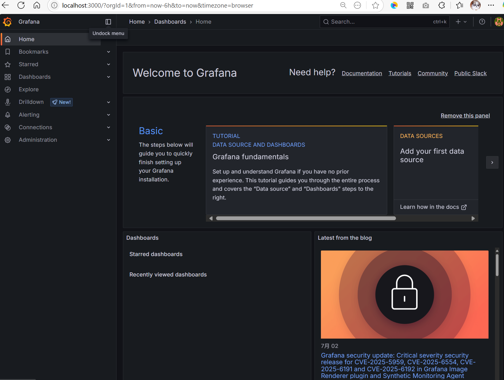
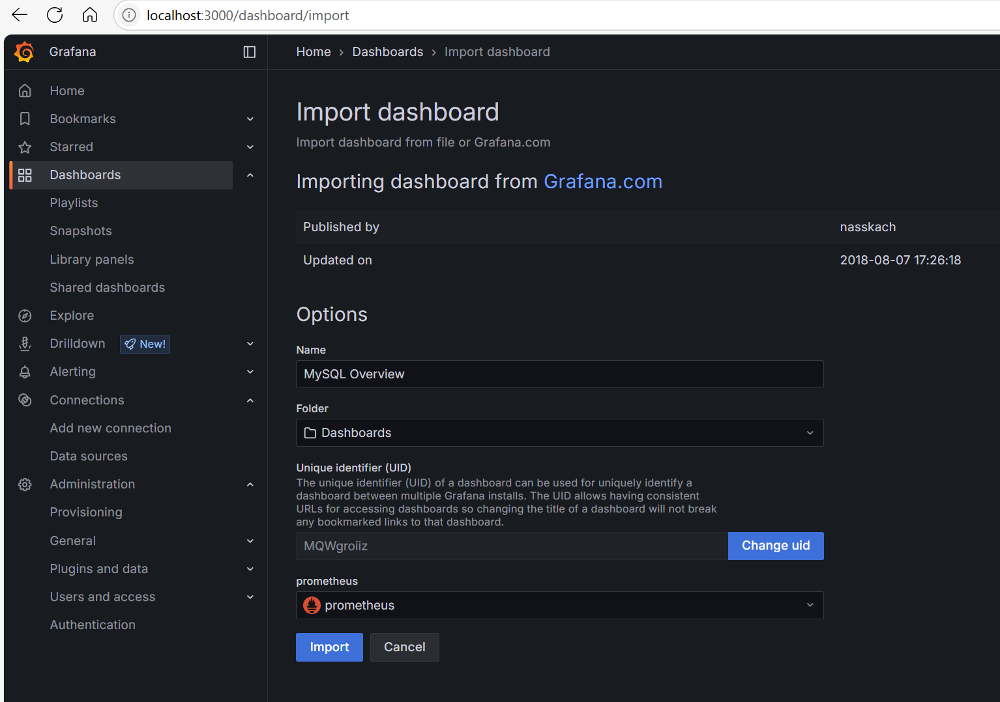
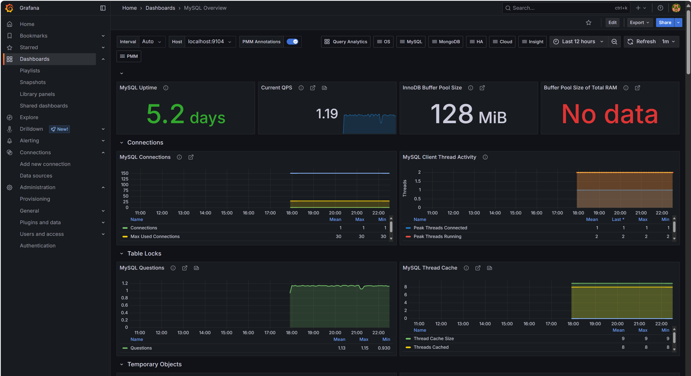
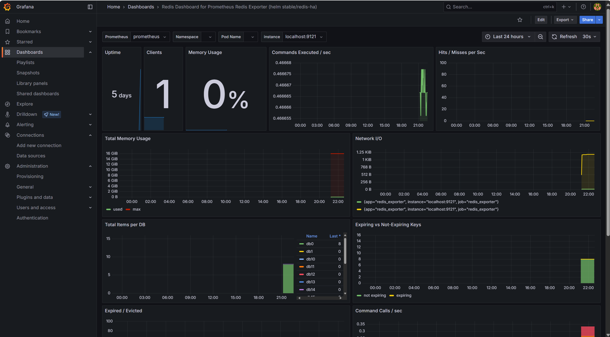

## 6.3 Grafana实现Prometheus监控统一可视化


### 安装Grafana


从Grafana社区官方下载页（<https://grafana.com/grafana/download/>）获取OSS的Windows版`Grafana`（例如`grafana-12.0.2.windows-amd64.zip`），解压到指定目录（例如`D:\dev\monitor\grafana-v12.0.2`）。  


### 启动Grafana

启动Grafana：


```powershell
cd D:\dev\monitor\grafana-v12.0.2\bin
.\grafana-server.exe
```


启动之后，会占用3000端口。浏览器访问<http://localhost:3000>，默认账号`admin/admin`。若能正常登录系统，则安装成功。





### 配置数据源

在菜单“Home > Connections > Data sources”下，添加Prometheus数据源，URL填写`http://localhost:9090`。

### 导入仪表盘


在菜单“Home > Dashboards > New dashboard”下，导入仪表盘。仪表盘模板可以在这个网址找到<https://grafana.com/grafana/dashboards/>。

#### 1. 导入MySQL仪表盘


导入仪表盘模板URL为<https://grafana.com/grafana/dashboards/7362-mysql-overview/>，选中Prometheus数据源，如下图所示：




导入完成之后，MySQL仪表盘效果如下图所示。





#### 2. 导入Redis仪表盘


导入仪表盘模板URL为<https://grafana.com/grafana/dashboards/11835-redis-dashboard-for-prometheus-redis-exporter-helm-stable-redis-ha/>，选中Prometheus数据源。


导入完成之后，Redis仪表盘效果如下图所示。





