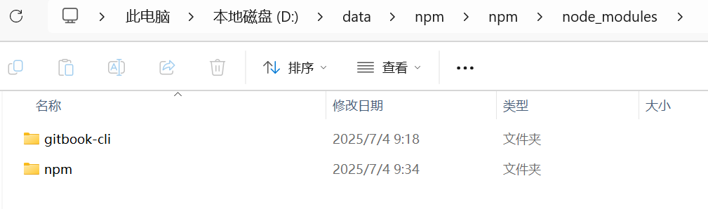

## 2.1 Vue.js必备环境Node.js安装

在Windows下以ZIP方式安装Node.js 22.17.0，需手动完成解压、环境变量配置及全局模块路径设置等步骤，以下是详细操作指南：

### 一、下载Node.js 22.17.0 ZIP包

1. **访问官网**：打开浏览器，访问Node.js官方网站：[https://nodejs.org/zh-cn/download/](https://nodejs.org/zh-cn/download/)。
2. **选择版本**：在下载页面中，找到“独立文件(.zip)”部分，选择适合您系统的版本（32位或64位），这里选择64位版本。
3. **下载ZIP包**：点击下载链接，将Node.js 22.17.0的ZIP包下载到本地。

### 二、解压ZIP包

1. **找到下载的ZIP包**：在文件资源管理器中，找到刚刚下载的Node.js 22.17.0 ZIP包（例如`node-v22.17.0-win-x64.zip`）。
2. **解压ZIP包**：右键点击ZIP包，选择“解压到当前文件夹”或使用解压软件（如WinRAR、7-Zip等）进行解压。解压后，您将得到一个包含Node.js文件的文件夹。

### 三、配置环境变量

1. **打开环境变量设置**：

	* 右键点击“此电脑”或“我的电脑”，选择“属性”。
	* 在系统属性窗口中，点击“高级系统设置”。
	* 在系统属性窗口中，点击“环境变量”按钮。
  * 新建环境变量`NODE_PATH`，值为Node.js的解压路径（如`D:\dev\web\node-v22.17.0-win-x64`），然后点击“确定”。

2. **编辑Path变量**：

	* 在环境变量窗口中，找到“Path”变量，并点击“编辑”。
	* 在编辑环境变量窗口中，点击“新建”按钮。
	* 输入`%NODE_PATH%`，点击“保存”按钮。

3. **验证环境变量配置**：

	* 打开命令提示符（CMD）或PowerShell。
	* 输入`node -v`和`npm -v`命令，验证Node.js和npm是否安装成功。如果命令行中显示出了Node.js和npm的版本号，说明环境变量配置成功。


```bash
C:\Users\wayla>node -v
v22.17.0

C:\Users\wayla>npm -v
11.4.2
```

### 四、设置全局模块安装路径（可选）

默认情况下，npm全局安装的模块会保存在用户目录下的`AppData\Roaming\npm`和`AppData\Roaming\npm-cache`中。为了更方便地管理这些模块，您可以设置自定义的全局模块安装路径和缓存路径。

1. **创建全局模块和缓存文件夹**：

	* 在Node.js的解压路径下（或您选择的任何位置），创建两个文件夹，分别命名为`npm`和`npm-cache`。

2. **配置npm的全局路径和缓存路径**：

	* 打开命令提示符（CMD）或PowerShell，以管理员身份运行（如果提示权限不够）。
	* 输入以下命令，将npm的全局路径和缓存路径设置为刚才新建的两个目录：

```bash
npm config set prefix "D:\data\npm\npm"
npm config set cache "D:\data\npm\npm-cache"
```


### 五、验证安装和配置

1. **安装一个全局模块进行测试**：

	* 打开命令提示符（CMD）或PowerShell。
	* 输入以下命令，安装一个常用的全局模块（如`gitbook-cli`或者`npm`）：

```bash
npm install gitbook-cli -g

npm install -g npm@11.4.2
```

2. **验证模块是否安装成功**：

	* 在全局模块路径下的`npm\node_modules`文件夹中，查看是否出现了`gitbook-cli`或者`npm`文件夹。
	* 如果出现了`gitbook-cli`或者`npm`文件夹，说明全局模块安装成功，且全局模块路径配置正确。



