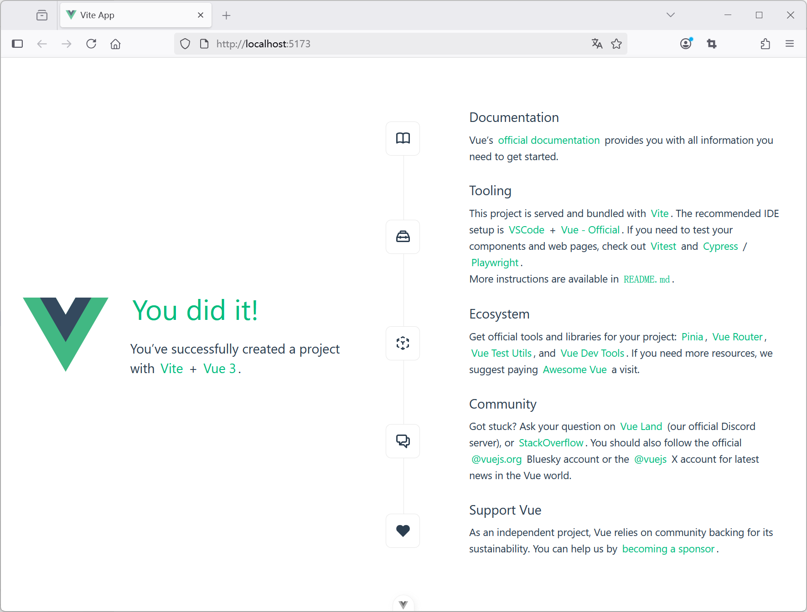

## 2.4 安装Vue.js建立现代化前端开发认知框架


### 安装Vue.js


在工作目录下，执行

```bash
npm create vue@latest
```

这一指令将会安装并执行 create-vue，它是 Vue 官方的项目脚手架工具。你将会看到一些诸如 TypeScript 和测试支持之类的可选功能提示：


```bash
npm>npm create vue@latest
Need to install the following packages:
create-vue@3.18.0
Ok to proceed? (y) y


> npx
> create-vue

T  Vue.js - The Progressive JavaScript Framework
|
o  请输入项目名称：
|  hello-world
|
o  请选择要包含的功能： (↑/↓ 切换，空格选择，a 全选，回车确认)
|  TypeScript
|
o  选择要包含的试验特性： (↑/↓ 切换，空格选择，a 全选，回车确认)
|  none
|
o  跳过所有示例代码，创建一个空白的 Vue 项目？
|  No

正在初始化项目 D:\workspace\gitee\java-full-stack-engineer-system-course-video\imooc\course17\ch2\hello-world...
|
—  项目初始化完成，可执行以下命令：

   cd hello-world
   npm install
   npm run dev

| 可选：使用以下命令在项目目录中初始化 Git：

   git init && git add -A && git commit -m "initial commit"
```

上面命令创建了一个名为“hello-world”，使用TypeScript功能的Vue.js项目。如果不确定是否要开启某个功能，你可以直接按下回车键选择 No。

### 启动开发服务器

在项目被创建后，通过以下步骤安装依赖并启动开发服务器：

```
cd hello-world
npm install
npm run dev
```

看到如下输出，则说明已经运行起来了你的第一个Vue.js项目了！

```bash
VITE v7.1.4  ready in 20203 ms

➜  Local:   http://localhost:5173/
➜  Network: use --host to expose
➜  Vue DevTools: Open http://localhost:5173/__devtools__/ as a separate window
➜  Vue DevTools: Press Alt(⌥)+Shift(⇧)+D in App to toggle the Vue DevTools
➜  press h + enter to show help
```  

项目默认运行在 `http://localhost:5173`，可以在浏览器中打开。





### 使用 VS Code 开发 Vue 项目


点击 VS Code 左侧资源管理器图标 → 点击“Open Folder” → 选择项目目录。

如果使用 VS Code 终端执行命令报如下错误：


```
npm : 无法加载文件 D:\dev\web\node-v22.17.0-win-x64\npm.ps1，因为在此系统上禁止运行脚本。有关详细信息，请参阅 https:/go.microsoft.com/fwlink/?LinkID=135170 中的 ab
out_Execution_Policies。
所在位置 行:1 字符: 1
+ npm install
+ ~~~
    + CategoryInfo          : SecurityError: (:) []，PSSecurityException
    + FullyQualifiedErrorId : UnauthorizedAccess
```    


这个错误是由于 **PowerShell 执行策略** 限制导致的，Windows 系统默认禁止运行未经签名的脚本（包括 `npm.ps1`）。以下是解决方案：

以管理员身份运行 PowerShell，设置为远程签名策略：

```powershell
Set-ExecutionPolicy -ExecutionPolicy RemoteSigned -Scope CurrentUser
```
- `RemoteSigned`：允许本地脚本运行，但要求网络下载的脚本需有签名。
- `CurrentUser`：仅对当前用户生效，不影响系统其他用户。

验证修改：

```powershell
Get-ExecutionPolicy -List
```

检查 `CurrentUser` 或 `Process` 的策略是否已更新。

### 项目结构解析


以 Vite 创建的 Vue 3 项目为例：


```
hello-world/
├── node_modules/       # 依赖包
├── public/             # 静态资源（如 favicon.ico）
├── src/
│   ├── assets/         # 图片、CSS 等静态资源
│   ├── components/     # Vue 组件
│   ├── App.vue         # 根组件
│   ├── main.ts         # 入口文件
├── index.html          # 入口 HTML 文件
├── package.json        # 项目配置和依赖
└── vite.config.ts      # Vite 配置文件
```

#### vite.config.ts


```ts
import { fileURLToPath, URL } from 'node:url'

import { defineConfig } from 'vite'
import vue from '@vitejs/plugin-vue'
import vueDevTools from 'vite-plugin-vue-devtools'

// https://vite.dev/config/
export default defineConfig({
  plugins: [
    vue(),
    vueDevTools(),
  ],
  resolve: {
    alias: {
      '@': fileURLToPath(new URL('./src', import.meta.url))
    },
  },
})
```


#### package.json

```json
{
  "name": "hello-world",
  "version": "0.0.0",
  "private": true,
  "type": "module",
  "scripts": {
    "dev": "vite",
    "build": "run-p type-check \"build-only {@}\" --",
    "preview": "vite preview",
    "build-only": "vite build",
    "type-check": "vue-tsc --build"
  },
  "dependencies": {
    "vue": "^3.5.17"
  },
  "devDependencies": {
    "@tsconfig/node22": "^22.0.2",
    "@types/node": "^22.15.32",
    "@vitejs/plugin-vue": "^6.0.0",
    "@vue/tsconfig": "^0.7.0",
    "npm-run-all2": "^8.0.4",
    "typescript": "~5.8.0",
    "vite": "^7.0.0",
    "vite-plugin-vue-devtools": "^7.7.7",
    "vue-tsc": "^2.2.10"
  }
}
```


#### index.html

```html
<!DOCTYPE html>
<html lang="">
  <head>
    <meta charset="UTF-8">
    <link rel="icon" href="/favicon.ico">
    <meta name="viewport" content="width=device-width, initial-scale=1.0">
    <title>Vite App</title>
  </head>
  <body>
    <div id="app"></div>
    <script type="module" src="/src/main.ts"></script>
  </body>
</html>
```

#### main.ts


```ts
import './assets/main.css'

import { createApp } from 'vue'
import App from './App.vue'

createApp(App).mount('#app')
```

* 每个 Vue 应用都是通过 createApp 函数创建一个新的 应用实例。
* 我们传入 createApp 的对象实际上是一个组件，每个应用都需要一个“根组件”，其他组件将作为其子组件。
* 挂载应用：应用实例必须在调用了 .mount() 方法后才会渲染出来。该方法接收一个“容器”参数，可以是一个实际的 DOM 元素或是一个 CSS 选择器字符串。


#### App.vue


```vue
<script setup lang="ts">
import HelloWorld from './components/HelloWorld.vue'
import TheWelcome from './components/TheWelcome.vue'
</script>

<template>
  <header>
    

    <div class="wrapper">
      <HelloWorld msg="You did it!" />
    </div>
  </header>

  <main>
    <TheWelcome />
  </main>
</template>

<style scoped>
header {
  line-height: 1.5;
}

.logo {
  display: block;
  margin: 0 auto 2rem;
}

@media (min-width: 1024px) {
  header {
    display: flex;
    place-items: center;
    padding-right: calc(var(--section-gap) / 2);
  }

  .logo {
    margin: 0 2rem 0 0;
  }

  header .wrapper {
    display: flex;
    place-items: flex-start;
    flex-wrap: wrap;
  }
}
</style>
```


根组件的模板`<template>`通常是组件本身的一部分。