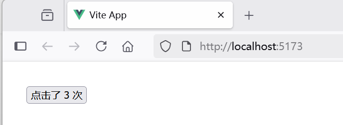

## 3.1 基础组件开发：实现代码复用率提升70%的底层逻辑


为了便于理解组件的基本概念，我们先从一个简单的示例“basic-component”入手。可以通过`create-vue`方式来初始化项目。


### 什么是组件

组件是Vue中的一个重要概念：它是一种抽象，可以将小型、自包含且通常可重用的组件组成一个大规模的应用。组件允许我们将 UI 划分为独立的、可重用的部分，并且可以对每个部分进行单独的思考。在实际应用中，组件常常被组织成一个层层嵌套的树状结构，如下图3-1所示。





这和我们嵌套 HTML 元素的方式类似，Vue 实现了自己的组件模型，使我们可以在每个组件内封装自定义内容与逻辑。Vue 同样也能很好地配合原生 Web Component。


在初始化“basic-component”示例中，App.vue在组件树中是根节点，而HelloWorld.vue、TheWelcome.vue都是App.vue的子节点。


### 定义一个组件​

当使用构建步骤时，我们一般会将 Vue 组件定义在一个单独的 .vue 文件中，这被叫做单文件组件 (简称 SFC)。例如，我们在`src\components`目录下，创建了一个组件BasicComponent.vue，内容如下：

```vue
<script setup lang="ts">
// 导入模板引用ref
import { ref } from 'vue'

// 使用 ref() 函数来声明响应式状态
const count = ref(0)

// 声明函数
function increment() {
  // 在 JavaScript 中需要 .value
  count.value++
}

</script>

<template>
    <button @click="increment">点击了 {{ count }} 次</button>
</template>
```


以在同一作用域内声明更改 ref 的函数increment，并将它们作为方法与状态一起公开。当点击按钮执行increment函数时，count会递增。

`<script setup lang="ts">` 中的顶层的导入、声明的变量和函数可在同一组件的模板中直接使用。你可以理解为模板是在同一作用域内声明的一个 TypeScript 函数——它自然可以访问与它一起声明的所有内容。


### 为什么要使用 ref？​

你可能会好奇：为什么我们需要使用带有 `.value` 的 ref，而不是普通的变量？为了解释这一点，我们需要简单地讨论一下 Vue 的响应式系统是如何工作的。

当你在模板中使用了一个 ref，然后改变了这个 ref 的值时，Vue 会自动检测到这个变化，并且相应地更新 DOM。这是通过一个基于依赖追踪的响应式系统实现的。当一个组件首次渲染时，Vue 会追踪在渲染过程中使用的每一个 ref。然后，当一个 ref 被修改时，它会触发追踪它的组件的一次重新渲染。

在标准的 JavaScript 中，检测普通变量的访问或修改是行不通的。然而，我们可以通过 getter 和 setter 方法来拦截对象属性的 get 和 set 操作。

该 `.value` 属性给予了 Vue 一个机会来检测 ref 何时被访问或修改。在其内部，Vue 在它的 getter 中执行追踪，在它的 setter 中执行触发。

另一个 ref 的好处是，与普通变量不同，你可以将 ref 传递给函数，同时保留对最新值和响应式连接的访问。当将复杂的逻辑重构为可重用的代码时，这将非常有用。


### 使用组件​


要使用一个子组件BasicComponent.vue，我们需要在父组件App.vue中导入它，这个组件将会以默认导出的形式被暴露给外部：


```vue
<script setup lang="ts">
// 导入组件
import BasicComponent from './components/BasicComponent.vue'
</script>

<template>
  <main>
    <BasicComponent />
  </main>
</template>
```


通过 `<script setup lang="ts">`，导入的组件都在模板`<template>`中直接可用。

### 运行调测


