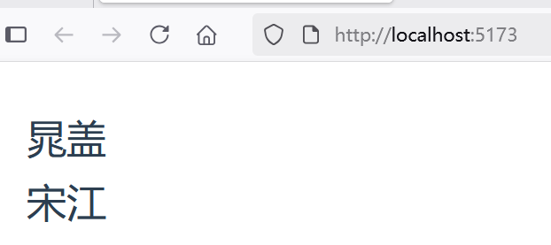

## 3.3 通过Props向下传递数据

Props 是一种特别的 attributes，你可以在组件上声明注册。从一个简单的示例“basic-component-reusable”入手。

在`src\components`目录下，创建了一个组件ChildComponent.vue，内容如下：

```vue
<script setup lang="ts">
defineProps<{
  msg: string
}>()
</script>

<template>
  <div>
    <h1>{{ msg }}</h1>
  </div>
</template>
```


defineProps 是一个仅 `<script setup lang="ts">` 中可用的编译宏命令，并不需要显式地导入。声明的 props 会自动暴露给模板。defineProps 会返回一个对象，其中包含了可以传递给组件的所有 props。

在父组件App.vue中导入子组件，并给子组件 attribute 赋值：


```vue
<script setup lang="ts">
import ChildComponent from './components/ChildComponent.vue'
</script>

<template>
  <main>
    <ChildComponent msg="晁盖" />

    <ChildComponent msg="宋江" />
  </main>
</template>
```

最终，界面效果如下。




根据子组件 msg 赋值不同，相同的组件显示出不同的效果。

