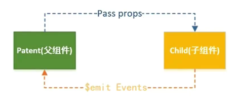
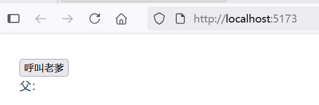
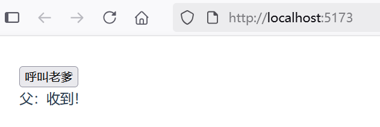

## 3.4 自定义事件向上通信

从上一节了解到，父组件如果要和子组件通信，通常是采用Prop的方式。而子组件如果要想和父组件通信，则往往是使用事件。图3-3展示了父子组件通信的示意图。




可以使用v-on指令（通常缩写为`@`符号）来监听DOM事件，并在触发事件时执行一些JavaScript操作。从一个简单的示例“listen-for-child-component-event”入手。

在`src\components`目录下，创建了一个组件ChildComponent.vue，内容如下：

```vue
<script setup lang="ts">
// defineEmits() 宏来声明它要触发的事件
const emit = defineEmits(['showMeTheMoneyEvent'])

// 声明函数
function callForFather() {
  // 使用 emit 方法触发自定义事件
  emit('showMeTheMoneyEvent')
}

</script>

<template>
  <button @click="callForFather">呼叫老爹</button>
</template>
```


defineEmits 仅可用于 `<script setup lang="ts">` 之中，并且不需要导入，它返回一个等同于 `$emit` 方法的 emit 函数。它可以被用于在组件的 `<script setup lang="ts">` 中抛出事件，因为此处无法直接访问 `$emit`。

在父组件App.vue中导入子组件，并监听子组件事件：


```vue
<script setup lang="ts">
import ChildComponent from './components/ChildComponent.vue'

// 导入模板引用ref
import { ref } from 'vue'

// 使用 ref() 函数来声明响应式状态
const msg = ref('')

// 声明函数
function handleEvent() {
  // 在 JavaScript 中需要 .value
  msg.value = '收到！'
}
</script>

<template>
  <main>
    <ChildComponent @show-me-the-money-event="handleEvent"/>

    <p>父：{{ msg }} </p>
  </main>
</template>
```

最终，在事件发送前的界面效果如下图3-4所示。




在事件发送前的界面效果如下图3-5所示。





