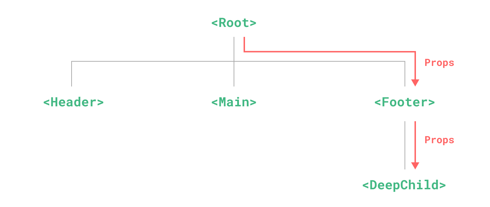
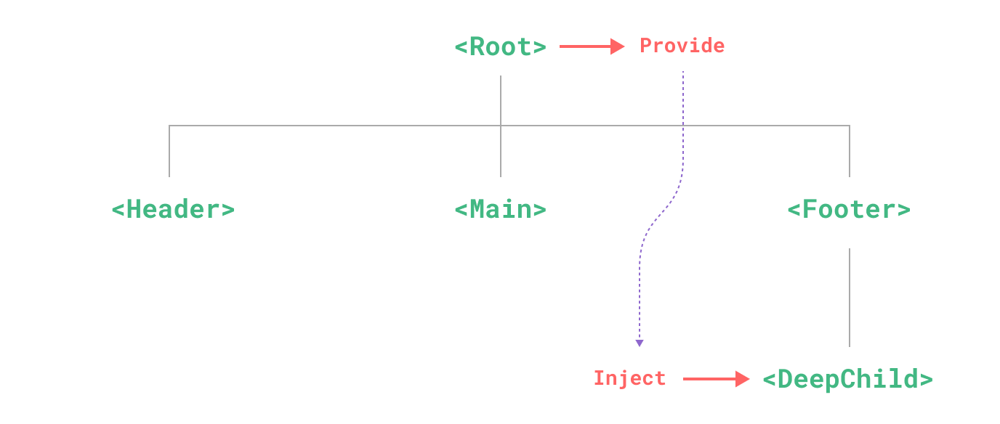
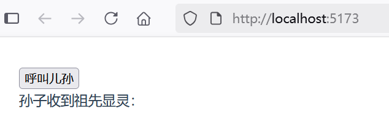
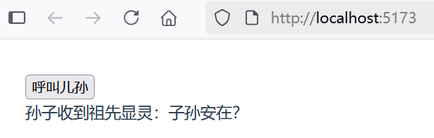

## 3.5 Provide/Inject跨层级传递


通常情况下，当我们需要从父组件向子组件传递数据时，会使用 props。想象一下这样的结构：有一些多层级嵌套的组件，形成了一棵巨大的组件树，而某个深层的子组件需要一个较远的祖先组件中的部分数据。在这种情况下，如果仅使用 props 则必须将其沿着组件链逐级传递下去，这会非常麻烦：





注意，虽然这里的 `<Footer>` 组件可能根本不关心这些 props，但为了使 `<DeepChild>` 能访问到它们，仍然需要定义并向下传递。如果组件链路非常长，可能会影响到更多这条路上的组件。这一问题被称为“prop 逐级透传”，显然是我们希望尽量避免的情况。

provide 和 inject 可以帮助我们解决这一问题。一个父组件相对于其所有的后代组件，会作为依赖提供者。任何后代的组件树，无论层级有多深，都可以注入由父组件提供给整条链路的依赖。





从一个简单的示例“provide-inject”入手。

在`src\components`目录下，创建了一个组件DeepChild.vue，内容如下：

```vue
<script setup lang="ts">
// inject() 函数注入上层组件提供的数据 
import { inject } from 'vue';
const msg = inject('msg', '暂无'); // 默认值'暂无'
</script>

<template>
  <p>孙子收到祖先显灵：{{ msg }}</p>
</template>
```


inject() 函数注入上层组件提供的数据。默认情况下，inject 假设传入的注入名会被某个祖先链上的组件提供。如果该注入名的确没有任何组件提供，则会抛出一个运行时警告。如果在注入一个值时不要求必须有提供者，那么我们应该声明一个默认值。


在`src\components`目录下，创建了一个组件Footer.vue作为DeepChild.vue的父组件，内容如下：

```vue
<script setup lang="ts">
import DeepChild from './DeepChild.vue'
</script>

<template>
  <DeepChild />
</template>
```


在祖先组件App.vue中导入Footer.vue组件：


```vue
<script setup lang="ts">
import Footer from './components/Footer.vue'

// 导入模板引用ref
import { ref } from 'vue'

// 要为组件后代提供数据，需要使用到 provide() 函数：
import { provide } from 'vue'

// 使用 ref() 函数来声明响应式状态
const msg = ref('')

// 提供注入名称及值
provide('msg', msg)

// 声明函数
function callForDescendant() {
  // 在 JavaScript 中需要 .value
  msg.value = '子孙安在？'
}
</script>

<template>
  <button @click="callForDescendant">呼叫儿孙</button>
  <Footer />
</template>
```


上述代码，使用到 provide() 函数为组件后代提供数据。当点击按钮“呼叫儿孙”时，提供的数据会发生变化，后代注入的数据也会跟着变化。

点击按钮前的界面效果如下图3-8所示。





点击按钮前的界面效果如下图3-9所示。



