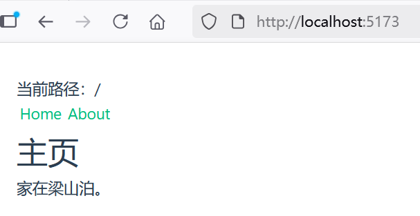
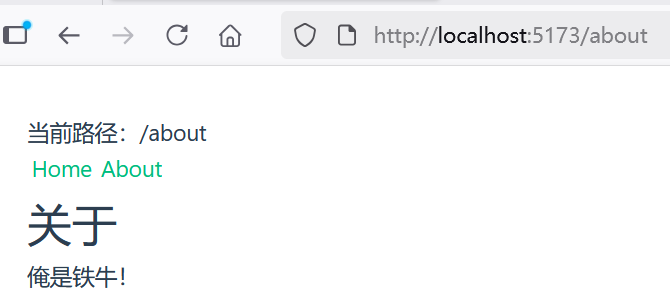

## 4.1 Vue Router深度实践：构建高体验单页应用（SPA）的核心

Vue Router 是 Vue.js 的官方路由。它与 Vue.js 核心深度集成，让用 Vue.js 构建单页应用变得轻而易举。功能包括：

* 嵌套路由映射
* 动态路由选择
* 模块化、基于组件的路由配置
* 路由参数、查询、通配符
* 展示由 Vue.js 的过渡系统提供的过渡效果
* 细致的导航控制
* 自动激活 CSS 类的链接
* HTML5 history 模式或 hash 模式
* 可定制的滚动行为
* URL 的正确编码

### 什么是Vue Router


Vue Router 是 Vue 官方的客户端路由解决方案。

客户端路由的作用是在单页应用 (SPA) 中将浏览器的 URL 和用户看到的内容绑定起来。当用户在应用中浏览不同页面时，URL 会随之更新，但页面不需要从服务器重新加载。

Vue Router 基于 Vue 的组件系统构建，你可以通过配置路由来告诉 Vue Router 为每个 URL 路径显示哪些组件。

### 安装Vue Router


对于一个现有的使用 JavaScript 包管理器的项目，你可以从 npm registry 中安装 Vue Router，可以使用以下命令：


```
npm install vue-router@4
```


如果你打算启动一个新项目，你可能会发现使用 create-vue 这个脚手架工具更容易，它能创建一个基于 Vite 的项目，并包含加入 Vue Router 的选项。


```
> npm create vue@latest

> npx
> create-vue

┌  Vue.js - The Progressive JavaScript Framework
│
◇  Project name (target directory):
│  routing-basic
│
◆  Select features to include in your project: (↑/↓ to navigate, space to select, a to toggle all, enter to confirm)
│  ◼ TypeScript
│  ◻ JSX Support
│  ◼ Router (SPA development)
│  ◻ Pinia (state management)
│  ◻ Vitest (unit testing)
│  ◻ End-to-End Testing
│  ◻ ESLint (error prevention)
│  ◻ Prettier (code formatting)
```


如上所示，创建化一个名为“routing-basic”并包含了Vue Router的应用作为演示。


### 创建视图


路由组件通常被称为视图，但本质上它们只是普通的 Vue 组件。我们创建两个组件来分别代表About页面和Home页面。

在`src\components`目录下，创建了一个组件About.vue，内容如下：


```vue
<template>
  <h1>关于</h1>
  <p>俺是铁牛！</p>
</template>
```

在`src\components`目录下，创建了一个组件Home.vue，内容如下：


```vue
<template>
  <h1>主页</h1>
  <p>家在梁山泊。</p>
</template>
```


### 创建路由


创建一个路由目录`src\router`，在该目录下创建路由文件index.ts代码如下：


```ts
import { createRouter, createWebHistory } from 'vue-router'
import Home from '../components/Home.vue'

const router = createRouter({
  history: createWebHistory(import.meta.env.BASE_URL),
  routes: [
    {
      path: '/',
      name: 'home',
      component: Home,
    },
    {
      path: '/about',
      name: 'about',
      // 路由级代码拆分
      // 这将为此路由生成一个单独的块（About.[hash].js）
      // 当访问该路线时，它被延迟加载
      component: () => import('../components/About.vue'),
    },
  ],
})

export default router
```


上述代码，设置了路由规则：

* 当访问/路径时，则会响应Home组件的内容
* 当访问/about路径时，则会响应About组件的内容
* createRouter方法用于实例化一个router，其中history选项控制了路由和 URL 路径是如何双向映射的。


### 路由参数history的3种模式


在创建路由器实例时，history 配置允许我们在不同的历史模式中进行选择。

#### Hash 模式

Hash 模式是用 createWebHashHistory() 创建的：

```ts
import { createRouter, createWebHashHistory } from 'vue-router'

const router = createRouter({
  history: createWebHashHistory(),
  routes: [
    //...
  ],
})
```

它在内部传递的实际 URL 之前使用了一个井号（`#`）。由于这部分 URL 从未被发送到服务器，所以它不需要在服务器层面上进行任何特殊处理。不过，它在 SEO 中确实有不好的影响。如果你担心这个问题，可以使用 HTML5 模式。


#### Memory 模式

Memory 模式不会假定自己处于浏览器环境，因此不会与 URL 交互也不会自动触发初始导航。这使得它非常适合 Node 环境和 SSR。它是用 createMemoryHistory() 创建的，并且需要你在调用 app.use(router) 之后手动 push 到初始导航。

```ts
import { createRouter, createMemoryHistory } from 'vue-router'
const router = createRouter({
  history: createMemoryHistory(),
  routes: [
    //...
  ],
})
```

虽然不推荐，你仍可以在浏览器应用程序中使用此模式，但请注意它不会有历史记录，这意味着你无法后退或前进。

#### HTML5 模式

用 createWebHistory() 创建 HTML5 模式，推荐使用这个模式：

```ts
import { createRouter, createWebHistory } from 'vue-router'

const router = createRouter({
  history: createWebHistory(),
  routes: [
    //...
  ],
})
```

当使用这种历史模式时，URL 会看起来很“正常”，例如 <https://example.com/user/id>。


### 如何使用路由


要使用上述index.ts路由规则，则需要在应用中修改两个地方。

#### 1. 修改main.ts文件


修改如下：

```ts
import './assets/main.css'

import { createApp } from 'vue'
import App from './App.vue'
import router from './router'

const app = createApp(App)

// 使用路由
app.use(router)

app.mount('#app')
```

上述修改，是将router.ts以插件方式引入到应用中。

#### 2. 修改App.vue


修改内容如下：


```ts
<script setup lang="ts">
import { RouterLink, RouterView } from 'vue-router'
</script>

<template>
  <P>当前路径：{{ $route.fullPath }}</P>
  <nav>
    <RouterLink to="/">Home</RouterLink>
    <RouterLink to="/about">About</RouterLink>
  </nav>

  <main>
    <RouterView />
  </main>
</template>
```


上述代码，

* RouterLink的to属性代表了对应的一条路由
* RouterView用于放置路由映射所对应的页面


### 运行调测


初次运行应用，可以看到界面效果如下图4-1所示。





可以看到，路径`/`是处于激活状态，所以路由响应的页面是Home组件的页面。

当点击About超链接时，界面效果如下图4-2所示。




此时，路由路径`/about`处于激活状态，此时响应的是About组件的页面。

