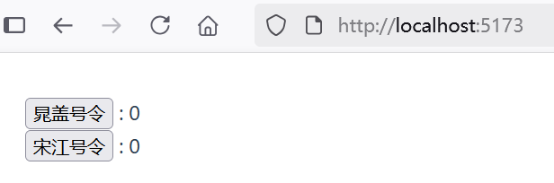
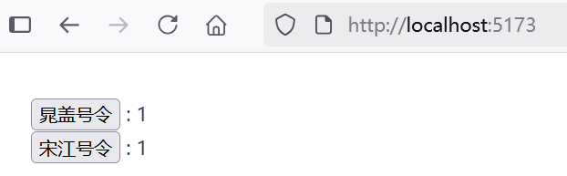
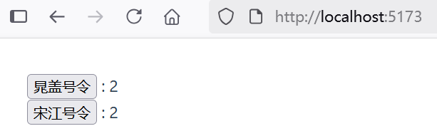

## 4.2 简单的store模式管理全局状态


### 什么是状态管理？​

理论上来说，每一个 Vue 组件实例都已经在“管理”它自己的响应式状态了。我们以示例“basic-component”为例：

```vue
<script setup lang="ts">
// 导入模板引用ref
import { ref } from 'vue'

// 使用 ref() 函数来声明响应式状态
const count = ref(0)

// 声明函数
function increment() {
  // 在 JavaScript 中需要 .value
  count.value++
}

</script>

<template>
    <button @click="increment">点击了 {{ count }} 次</button>
</template>
```


它是一个独立的单元，由以下几个部分组成：

* 状态：驱动整个应用的数据源；
* 视图：对状态的一种声明式映射；
* 交互：状态根据用户在视图中的输入而作出相应变更的可能方式。

下面是“单向数据流”这一概念的简单图示：


然而，当我们有多个组件共享一个共同的状态时，就没有这么简单了：

* 多个视图可能都依赖于同一份状态。
* 来自不同视图的交互也可能需要更改同一份状态。

对于情景 1，一个可行的办法是将共享状态“提升”到共同的祖先组件上去，再通过 props 传递下来。然而在深层次的组件树结构中这么做的话，很快就会使得代码变得繁琐冗长。这会导致另一个问题：Prop 逐级透传问题。

对于情景 2，我们经常发现自己会直接通过模板引用获取父/子实例，或者通过触发的事件尝试改变和同步多个状态的副本。但这些模式的健壮性都不甚理想，很容易就会导致代码难以维护。

一个更简单直接的解决方案是抽取出组件间的共享状态，放在一个全局单例中来管理。这样我们的组件树就变成了一个大的“视图”，而任何位置上的组件都可以访问其中的状态或触发动作。

通过定义和隔离状态管理中的各种概念并通过强制规则维持视图和状态间的独立性，我们的代码将会变得更结构化且易维护。


### 简单的 store 模式管理状态

用响应式 API 也能实现简单状态管理，这种方式成为​ store 模式。

如果你有一部分状态需要在多个组件实例间共享，你可以使用 reactive() 来创建一个响应式对象，并将它导入到多个组件中。我们通过一个示例“state-management-store-mode”来演示。

### 创建全局状态文件


创建一个全局状态目录`src\store`，在该目录下创建全局状态文件index.ts代码如下：


```ts
import { reactive } from 'vue'

export const store = reactive({
  count: 0,
  increment() {
    this.count++
  }
})
```


### 多个组件共享的持久化状态


在`src\components`目录下，创建组件ComponentA.vue和ComponentB.vue，并导入全局状态文件。


ComponentA.vue代码如下：


```vue
<script setup lang="ts">
import { store } from '../store/index.ts'
</script>

<template>
  <button @click="store.increment()">
    晁盖号令
  </button>
  : {{ store.count }}
</template>
```


ComponentB.vue代码如下：


```vue
<script setup lang="ts">
import { store } from '../store/index.ts'
</script>

<template>
  <button @click="store.increment()">
    宋江号令
  </button>
  : {{ store.count }}
</template>
```


现在每当 store 对象被更改时，`<ComponentA>` 与 `<ComponentB>` 都会自动更新它们的视图。任意一个导入了 store 的组件都可以随意修改它的状态。


### 根组件App.vue代码如下：


```vue
<script setup lang="ts">
import ComponentA from './components/ComponentA.vue'
import ComponentB from './components/ComponentB.vue'
</script>

<template>
  <main>
    <div>
      <ComponentA />
    </div>
    <div>
      <ComponentB />
    </div>
  </main>
</template>
```


### 运行调测

初次运行应用，可以看到界面效果如下图4-3所示。





当点击“晁盖号令”按钮时，界面效果如下图4-4所示。



当点击“宋江号令”按钮时，界面效果如下图4-6所示。




由此证实，无论哪个组件修改了 store 状态对象，其他任意导入了 store 的组件都可以会随之修改它的状态。

