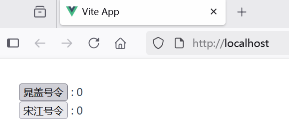

## 4.4 前端工程化：让打包体积减少50%的优化秘籍


通过 create-vue（基于 Vite）搭建的项目都已经预先做好了针对生产环境的配置。当需要将应用部署到生产环境时，只需运行按照本文执行。Vite 已作为一个本地开发依赖（dev dependency）安装在你的项目中，并且你已经在 package.json 中配置好了如下的 npm scripts：

```json
"scripts": {
  "dev": "vite",
  "build": "run-p type-check \"build-only {@}\" --",
  "preview": "vite preview",
  "build-only": "vite build",
  "type-check": "vue-tsc --build"
},
```


值得注意的是 vite preview 用作预览本地构建，而不应直接作为生产服务器。

### 构建应用
可以运行 npm run build 命令来执行应用的构建。

```bash
$ npm run build
```

默认情况下，构建会输出到 dist 文件夹中。你可以部署这个 dist 文件夹到任何你喜欢的平台。dist 文件夹内容如下：


```bash
dist
│  favicon.ico
│  index.html
│
└─assets
        index-BGqFjY-6.js
        index-zqIqfzzx.css
```        


### 本地测试应用


当你构建完成应用后，你可以通过运行 npm run preview 命令，在本地测试该应用。

```bash
$ npm run preview
```


vite preview 命令会在本地启动一个静态 Web 服务器，将 dist 文件夹运行在 http://localhost:4173。这样在本地环境下查看该构建产物是否正常可用就方便多了。


### 部署到Nginx

将Vue.js应用编译文件 dist 拷贝到Nginx安装目录的html目录下即可完成部署。

部署完成之后，启动Nginx服务器，可以看到界面效果如下图4-7所示。




