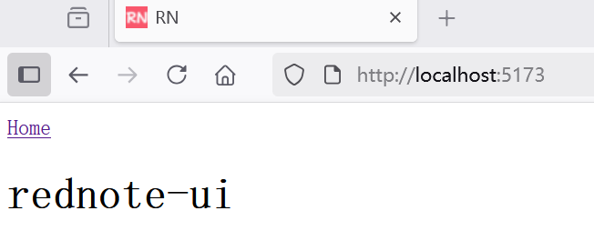

## 3.1 Vue.js初始化前端项目，快速实现标准化开发准备

### 初始化仿“小红书”前端项目


在工作目录下，执行

```bash
npm create vue@latest
```

这一指令将会安装并执行 create-vue，它是 Vue 官方的项目脚手架工具。创建过程中选择 TypeScript、Router、Pinia等功能：


```bash
3>npm create vue@latest

> npx
> create-vue

T  Vue.js - The Progressive JavaScript Framework
|
o  请输入项目名称：
|  rednote-ui
|
o  请选择要包含的功能： (↑/↓ 切换，空格选择，a 全选，回车确认)
|  TypeScript, Router（单页面应用开发）, Pinia（状态管理）
|
o  选择要包含的试验特性： (↑/↓ 切换，空格选择，a 全选，回车确认)
|  none

正在初始化项目 D:\workspace\gitee\java-full-stack-engineer-system-course-video\samples\course18\ch3\rednote-ui...
|
—  项目初始化完成，可执行以下命令：

   cd rednote-ui
   npm install
   npm run dev

| 可选：使用以下命令在项目目录中初始化 Git：

   git init && git add -A && git commit -m "initial commit"
```

上面命令创建了一个名为“rednote-ui”的Vue.js项目。

### 清理项目回归纯净


#### 清理资源文件

清理`src\assets`目录下的所有资源文件。

#### 清理组件文件

清理`src\components`目录下的所有组件文件。

#### 清理全局状态文件

清理`src\stores`目录下的所有全局状态文件。

#### 修改路由文件


修改`src\router\index.ts`，内容如下：


```ts
import { createRouter, createWebHistory } from 'vue-router'
import HomeView from '../views/HomeView.vue'

const router = createRouter({
  history: createWebHistory(import.meta.env.BASE_URL),
  routes: [
    {
      path: '/',
      name: 'home',
      component: HomeView,
    }
  ],
})

export default router
```

#### 修改视图


修改`src\views\HomeView.vue`，内容如下：


```vue
<script setup lang="ts">
</script>

<template>
  <main>
    <h1>rednote-ui</h1>
  </main>
</template>
```

#### 删除视图

删除视图`src\views\AboutView.vue`

#### 修改App.vue


修改`src\App.vue`，内容如下：


```vue
<script setup lang="ts">
import { RouterLink, RouterView } from 'vue-router'
</script>

<template>
  <header>
    <div class="wrapper">
      <nav>
        <RouterLink to="/">Home</RouterLink>
      </nav>
    </div>
  </header>

  <RouterView />
</template>
```


#### 修改main.ts


修改`src\main.ts`，内容如下：


```ts
import { createApp } from 'vue'
import { createPinia } from 'pinia'

import App from './App.vue'
import router from './router'

const app = createApp(App)

app.use(createPinia())
app.use(router)

app.mount('#app')
```


#### 修改index.html

修改`index.html`引入静态资源，内容如下：

```html
<!DOCTYPE html>
<html lang="">
  <head>
    <meta charset="UTF-8">
    <link rel="icon" href="/favicon.ico">
    <meta name="viewport" content="width=device-width, initial-scale=1.0">
    <title>RN</title>
    <!-- 引入 Bootstrap CSS -->
    <link href="/css/bootstrap.min.css" rel="stylesheet">
    <!-- 引入 Font Awesome -->
    <link href="/css/font-awesome.min.css" rel="stylesheet">
    
  </head>
  <body>
    <div id="app"></div>
    <!-- Bootstrap JS -->
    <script src="/js/bootstrap.bundle.min.js"></script>

    <script type="module" src="/src/main.ts"></script>
  </body>
</html>
```

#### 使用静态资源


将原rednote项目中的`src/main/resources/static`静态资源复制到rednote-ui项目`public`目录下。


###  安装 Axios


Axios 是一个基于 Promise 的 HTTP 客户端，专为浏览器和 Node.js 设计，具有以下特性：

- **功能全面**：支持 GET、POST、PUT、DELETE 等所有 HTTP 方法，提供请求/响应拦截器、取消请求、自动转换 JSON 数据等高级功能。
- **Promise API**：与 Vue 3 的 Composition API（如 `async/await`）完美兼容，代码简洁易读。
- **浏览器兼容性**：支持 IE10+ 及现代浏览器，自动处理跨域请求和错误码。
- **社区支持**：拥有庞大的社区和丰富的插件（如 `axios-retry`、`axios-mock-adapter`），问题解决效率高。

通过以下命令在项目中安装 Axios

```bash
npm install axios
```

### 启动开发服务器

在项目被创建后，通过以下步骤安装依赖并启动开发服务器：

```
cd rednote-ui
npm install
npm run dev
```

看到如下输出，则说明已经运行起来了你的第一个Vue.js项目了！

```bash
VITE v7.0.2  ready in 16458 ms

➜  Local:   http://localhost:5173/
➜  Network: use --host to expose
➜  Vue DevTools: Open http://localhost:5173/__devtools__/ as a separate window
➜  Vue DevTools: Press Alt(⌥)+Shift(⇧)+D in App to toggle the Vue DevTools
➜  press h + enter to show help
```  

项目默认运行在 `http://localhost:5173`，可以在浏览器中打开。





