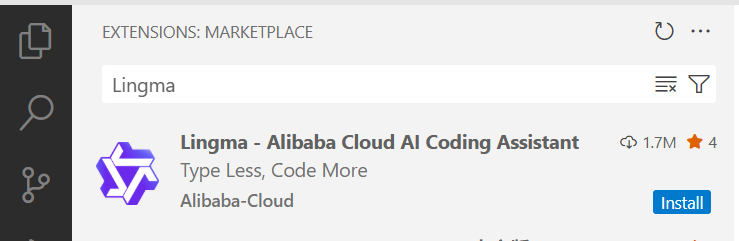
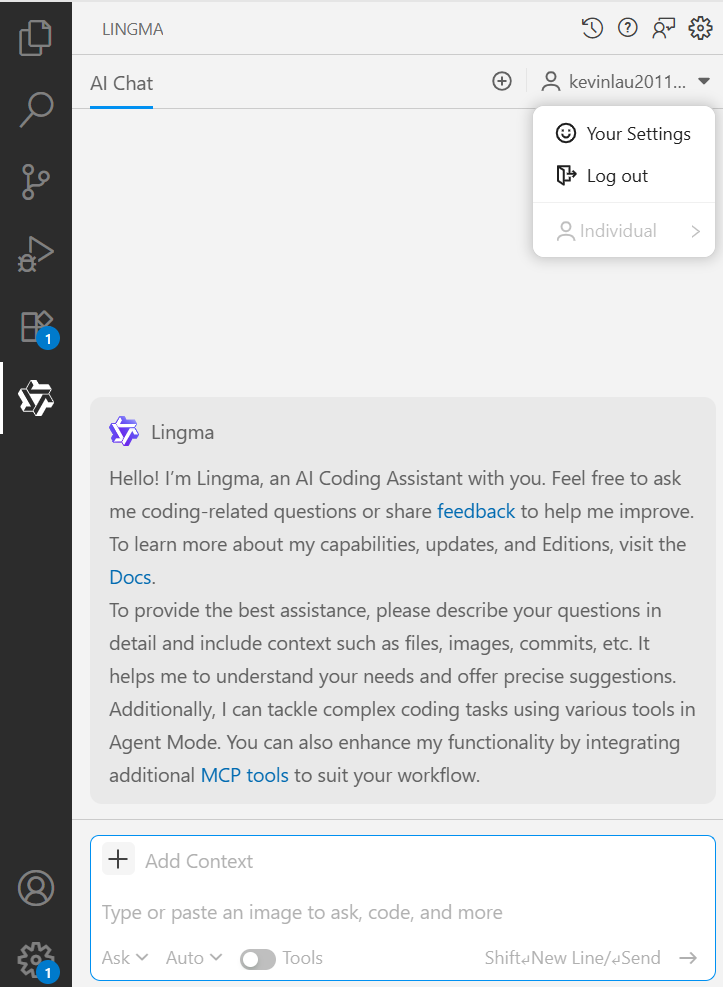

## 3.2 AI辅助编程工具成为Vue.js应用开发导师

本节介绍通AI辅助编程工具通义灵码在Visual Studio Code中的安装。让AI辅助编程工具成为Vue.js应用开发的导师。

手动安装步骤如下。

步骤1：已安装 Visual Studio Code 的情况下，在侧边导航上点击扩展。

步骤2：搜索通义灵码（TONGYI Lingma），找到通义灵码后点击安装。

步骤3：登录阿里云账号，即刻开启智能编码之旅。通义灵码界面如下。

