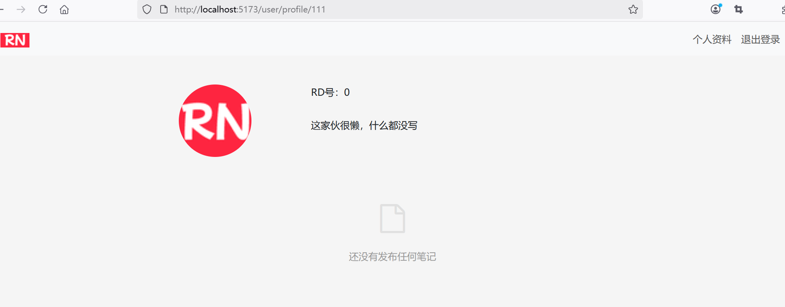
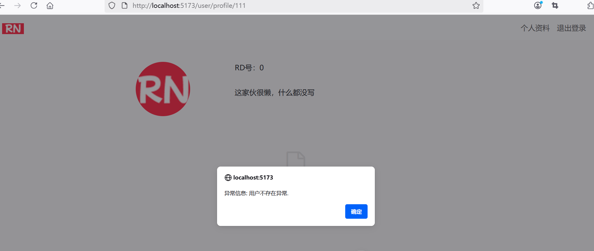

## 4.10 前后端分离架构下的全局错误异常处理

在前后端分离的架构中，传统的 Spring Boot `@ControllerAdvice` 全局异常处理需要结合前端错误拦截机制进行重构。以下是完整的解决方案。


### 改造前的效果


当试图访问一个不存在的用户ID的时候，比如ID为111，则界面效果如下图4-10所示。





该界面没有提示任何错误信息，用户也很难察觉后台实际上已经抛出了UserNotFoundException，只不过该异常并未i能反馈给前端应用。


### 后端GlobalExceptionHandler优化

#### 1. 统一 API 错误响应格式

新建 ErrorResponseDto：


```java
package com.waylau.rednote.dto;

import lombok.AllArgsConstructor;
import lombok.Getter;
import lombok.Setter;

/**
 * ErrorResponseDto 错误响应对象
 *
 * @author <a href="https://waylau.com">Way Lau</a>
 * @version 2025/07/08
 **/
@Getter
@Setter
@AllArgsConstructor
public class ErrorResponseDto {
    /**
     * HTTP状态码
     */
    private int code;
    /**
     * 信息
     */
    private String message;
}
```

#### 2. 重构 GlobalExceptionHandler

```java
package com.waylau.rednote.exception;

import com.waylau.rednote.dto.ErrorResponseDto;
import org.slf4j.Logger;
import org.slf4j.LoggerFactory;
import org.springframework.http.HttpStatus;
import org.springframework.http.ResponseEntity;
/*import org.springframework.ui.Model;*/
import org.springframework.web.bind.annotation.ControllerAdvice;
import org.springframework.web.bind.annotation.ExceptionHandler;
import org.springframework.web.multipart.MaxUploadSizeExceededException;


/**
 * GlobalExceptionHandler 全局异常处理
 *
 * @author <a href="https://waylau.com">Way Lau</a>
 * @version 2025/08/18
 **/
@ControllerAdvice
public class GlobalExceptionHandler {
    private static final Logger log = LoggerFactory.getLogger(GlobalExceptionHandler.class);

    @ExceptionHandler(MaxUploadSizeExceededException.class)
    /*public String handleMaxSizeException(MaxUploadSizeExceededException exc, Model model) {
        log.error("服务器异常：{}", exc.getMessage(), exc);

        model.addAttribute("errorCode", 400);
        model.addAttribute("errorMessage", "服务器异常：" + exc.getMessage());

        return "400-error";
    }*/
    public ResponseEntity<?> handleMaxSizeException(MaxUploadSizeExceededException exc) {
        log.error("服务器异常：{}", exc.getMessage(), exc);

        ErrorResponseDto errorResponseDto = new ErrorResponseDto(400, "服务器异常：" + exc.getMessage());

        return ResponseEntity.status(HttpStatus.BAD_REQUEST)
                .body(errorResponseDto);
    }

    // 用户不存在异常
    @ExceptionHandler(UserNotFoundException.class)
    /*public String handleUserNotFoundException(UserNotFoundException exc, Model model) {
        log.error("用户不存在异常：{}", exc.getMessage(), exc);

        model.addAttribute("errorCode", 404);
        model.addAttribute("errorMessage", "异常信息：" + exc.getMessage());

        return "400-error";
    }*/
    public ResponseEntity<?> handleUserNotFoundException(UserNotFoundException exc) {
        log.error("用户不存在异常：{}", exc.getMessage(), exc);

        ErrorResponseDto errorResponseDto = new ErrorResponseDto(404, "异常信息：" + exc.getMessage());

        return ResponseEntity.status(HttpStatus.NOT_FOUND)
                .body(errorResponseDto);
    }

    // 笔记不存在异常
    @ExceptionHandler(NoteNotFoundException.class)
    /*public String handleNoteNotFoundException(NoteNotFoundException exc, Model model) {
        log.error("笔记不存在异常：{}", exc.getMessage(), exc);

        model.addAttribute("errorCode", 404);
        model.addAttribute("errorMessage", "异常信息：" + exc.getMessage());

        return "400-error";
    }*/
    public ResponseEntity<?> handleNoteNotFoundException(NoteNotFoundException exc) {
        log.error("笔记不存在异常：{}", exc.getMessage(), exc);

        ErrorResponseDto errorResponseDto = new ErrorResponseDto(404, "异常信息：" + exc.getMessage());

        return ResponseEntity.status(HttpStatus.NOT_FOUND)
                .body(errorResponseDto);
    }

    // 评论不存在异常
    @ExceptionHandler(CommentNotFoundException.class)
    /*public String handleCommentNotFoundException(CommentNotFoundException exc, Model model) {
        log.error("评论不存在异常：{}", exc.getMessage(), exc);

        model.addAttribute("errorCode", 404);
        model.addAttribute("errorMessage", "异常信息：" + exc.getMessage());

        return "400-error";
    }*/
    public ResponseEntity<?> handleCommentNotFoundException(CommentNotFoundException exc) {
        log.error("评论不存在异常：{}", exc.getMessage(), exc);

        ErrorResponseDto errorResponseDto = new ErrorResponseDto(404, "异常信息：" + exc.getMessage());

        return ResponseEntity.status(HttpStatus.NOT_FOUND)
                .body(errorResponseDto);
    }
}
```


### 前端 axios 拦截器配置

#### 1. 创建 axios 实例并添加拦截器

新建`src\services\axios.ts`：

```ts
import axios from "axios"
import { useAuthStore } from "@/stores/auth"
import router from "@/router"

const service = axios.create({
  baseURL: import.meta.env.VITE_API_BASE_URL,
  timeout: 5000,
})

// 请求拦截器
service.interceptors.request.use(
  (config) => {
    const authStore = useAuthStore()
    if (authStore.getToken) {
      config.headers.Authorization = `Bearer ${authStore.getToken}`
    }
    return config
  },
  (error) => {
    console.error('请求错误：' + error)
    return Promise.reject(error)
  }
)

// 响应拦截器
service.interceptors.response.use(
  (response) => {
    return response
  },
  (error) => {
    console.error('响应错误：' + error)
    const { status, data } = error.response || {}

    // 根据状态码的不同处理不同的错误
    switch (status) {
      case 401:
        // 认证失败，跳转到登录页
        const authStore = useAuthStore()
        authStore.logout()
        router.push({ name: 'login', query: { redirect: router.currentRoute.value.fullPath } })
        break;
      case 403:
        // 权限不足，显示提示
        alert(data.message || '权限不足')
        break;
      case 404:
        // 资源不存在，显示提示
        alert(data.message || '资源不存在')
        break;
      case 500:
        // 服务器内部错误，显示提示
        alert(data.message || '服务器内部错误，请稍后再试')
        break;
      default:
        // 其他错误，显示提示
        alert(data.message || '未知错误，请稍后再试')
    }

    return Promise.reject(error)
  }
)

export default service
```

#### 2. 删除老的axios拦截器

原有的在`src\stores\auth.ts`的axios拦截器代码可以删除。


```ts
/*
// axios拦截器，自动刷新JWT
axios.interceptors.request.use((config) => { 
  const token = localStorage.getItem('token')
  if (token) {
    config.headers.Authorization = `Bearer ${token}`
  }

  return config
})
*/
```


#### 3. 使用 axios 实例

在其他组件中原有的使用axios的地方，改为使用`@/services/axios`中的 axios 实例。


```ts
/*import axios from "axios"*/
import axios from "@/services/axios"
```

以下三个地方：

* `src\views\UserProfile.vue`
* `src\views\RegistrationForm.vue`
* `src\stores\auth.ts`

后续如果有需要发起HTTP请求，都统一使用`@/services/axios`中的 axios 实例。


### 运行调测


当试图访问一个不存在的用户ID的时候，比如ID为111，则界面效果如下图4-11所示。





### 总结

通过以上重构，你可以实现：
1. **统一的错误响应格式**：后端返回标准化的错误结构
2. **全局错误拦截**：前端通过 axios 拦截器统一处理 HTTP 错误
3. **友好的用户提示**：根据不同错误类型显示适当的用户提示

这种架构既能保持后端的健壮性，又能提供良好的前端用户体验，是前后端分离架构下理想的异常处理方案。