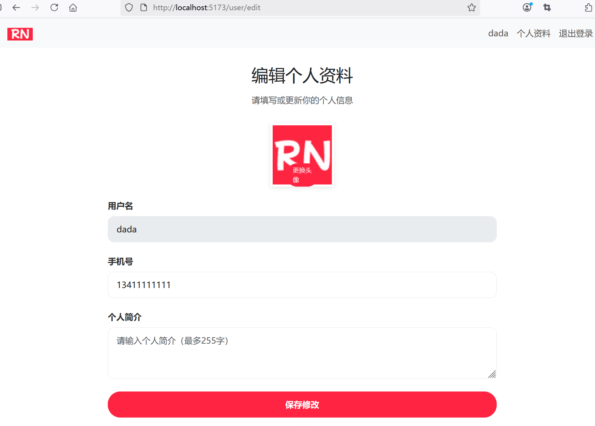
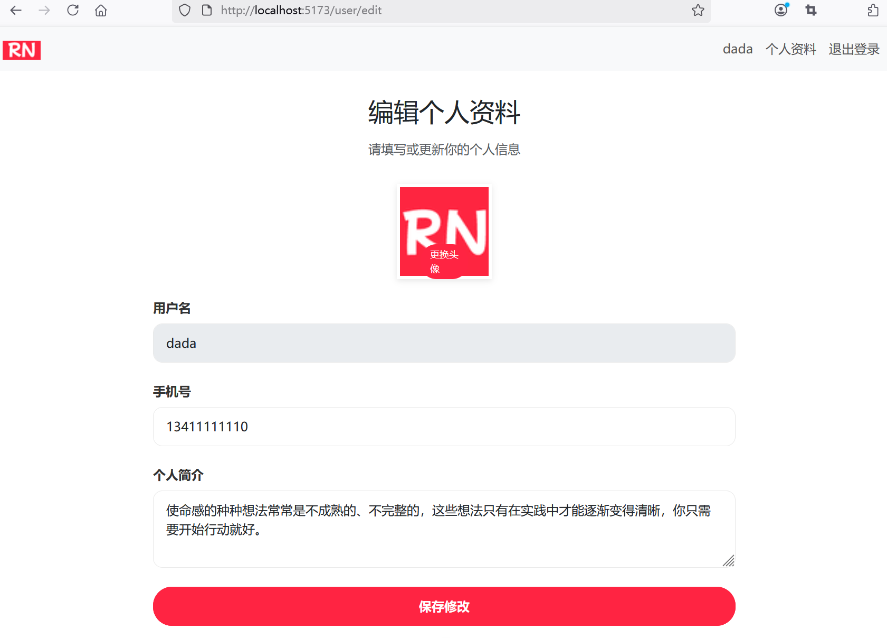
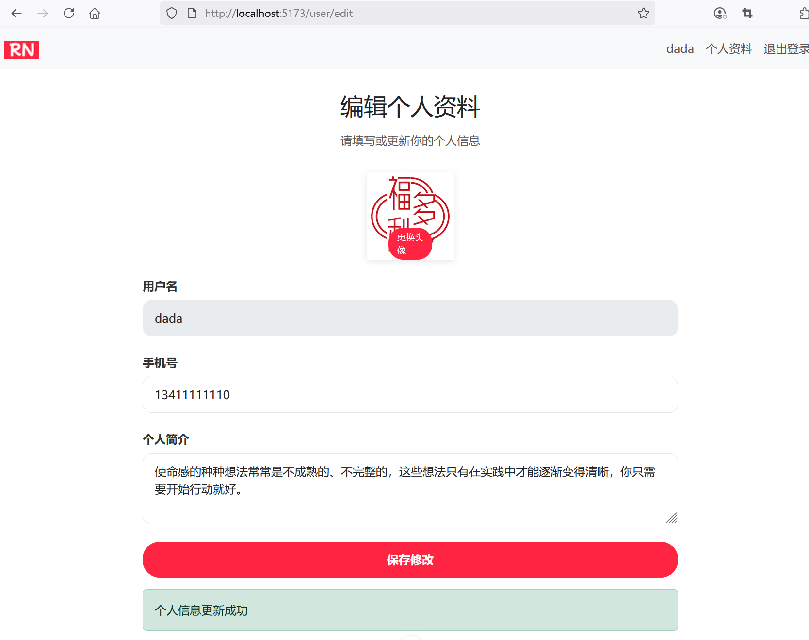

## 4.11 实现用户基本信息的编辑功能


### 后端接口改造


修改UserController：

```java
@GetMapping("/edit")
/*public String editProfile(Model model) {
    User user = userService.getCurrentUser();

    model.addAttribute("user", user);

    return "user-profile-edit";
}*/
public ResponseEntity<User> editProfile() {
    User user = userService.getCurrentUser();
    return ResponseEntity.ok(user);
}

@Transactional
@PostMapping("/edit")
/*
public String updateProfile(@ModelAttribute User user, RedirectAttributes redirectAttributes,
                            @RequestParam("avatarFile") MultipartFile avatarFile) {
    User currentUser = userService.getCurrentUser();
    String oldAvatar = currentUser.getAvatar();

    // 验证文件类型和大小
    if (avatarFile != null && !avatarFile.isEmpty()) {
        // 验证文件类型
        String contentType = avatarFile.getContentType();
        if (!contentType.startsWith("image/")) {
            redirectAttributes.addFlashAttribute("error", "请上传图片文件");

            return "redirect:/user/edit";
        }

        String fileId = gridFSStorageService.uploadImage(avatarFile);
        String fileUrl = MongoConfig.STATIC_PATH_PREFIX + fileId;

        currentUser.setAvatar(fileUrl);

        // 删除旧头像文件
        if (oldAvatar != null && !oldAvatar.isEmpty()) {
            String oldFileId = oldAvatar.substring(oldAvatar.lastIndexOf("/") + 1);
            gridFSStorageService.deleteImage(oldFileId);
        }
    }

    // 更新用户信息
    currentUser.setPhone(user.getPhone());
    currentUser.setBio(user.getBio());

    // 修改内容保存到数据库
    userService.updateUser(currentUser);

    // 重定向到指定页面，并传递参数
    redirectAttributes.addFlashAttribute("success", "个人信息更新成功");

    return "redirect:/user/profile";
}
*/
public ResponseEntity<?> updateProfile(@RequestParam(required = true) String phone,
                                        @RequestParam(required = false) String bio,
                                        @RequestParam(required = false, value = "avatarFile") MultipartFile avatarFile) {
    User currentUser = userService.getCurrentUser();
    String oldAvatar = currentUser.getAvatar();
    Map<String, String> map = new HashMap<>();

    // 验证文件类型和大小
    if (avatarFile != null && !avatarFile.isEmpty()) {
        // 验证文件类型
        String contentType = avatarFile.getContentType();
        if (!contentType.startsWith("image/")) {
            map.put("error", "请上传图片文件");
            return ResponseEntity.ok(map);
        }

        // 处理文件上传
        String fileId = gridFSStorageService.uploadImage(avatarFile);
        String fileUrl = MongoConfig.STATIC_PATH_PREFIX + fileId;

        currentUser.setAvatar(fileUrl);

        // 删除旧头像文件
        if (oldAvatar != null && !oldAvatar.isEmpty()) {
            String oldFileId = oldAvatar.substring(oldAvatar.lastIndexOf("/") + 1);
            gridFSStorageService.deleteImage(oldFileId);
        }
    }

    // 更新用户信息
    currentUser.setPhone(phone);
    currentUser.setBio(bio);

    // 修改内容保存到数据库
    userService.updateUser(currentUser);

    // 重定向到指定页面，并传递参数
    map.put("success", "个人信息更新成功");
    return ResponseEntity.ok(map);
}
```


### 前端组件设计


#### UserProfileEdit.vue

新增`src\views\UserProfileEdit.vue`：

```vue
<script setup lang="ts">
import { ref, onMounted } from 'vue'
import { useAuthStore } from '@/stores/auth'
import { User } from '@/dto/user'
import axios from "@/services/axios"
import { useRouter } from "vue-router"

const user = ref<User>(new User())
const authStore = useAuthStore()
const router = useRouter()
const success = ref('')
const error = ref('')
const selectedFile = ref(null)

onMounted(() => {
  // 获取用户信息
  fetchUserProfile()
})

const fetchUserProfile = async () => {
  try {
    const response = await axios.get(`/api/user/edit`)
    user.value = response.data
  } catch (error) {
    console.error('获取用户信息失败：' + error)
  }
}

// 注销
function logout() {
  authStore.logout()

  // 跳转到登录页面
  router.push({ name: 'login' })
}

const handleUserEdit = async () => {
  const formData = new FormData()

  if (selectedFile.value) {
    formData.append('avatarFile', selectedFile.value as File)
  }
  formData.append('phone', user.value.phone)
  formData.append('bio', user.value.bio)

  // 调用API编辑用户信息
  try {
    const response = await axios.post(`/api/user/edit`, formData, {
      headers: {
        'Content-Type': 'multipart/form-data'
      }
    })

    if (response.data['success']) {
      success.value = response.data['success']

      // 获取用户信息
      fetchUserProfile()
    } else if (response.data['error']) {
      error.value = response.data['error']
    }
  } catch (err) {
    console.error('获取用户信息失败：' + err)
    error.value = err + ''
  }
}

// 选中头像的处理
const handleFileUpload = (e: any) => {
  selectedFile.value = e.target.files[0]
}
</script>

<template>
  <!-- 导航栏 -->
  <nav class="navbar navbar-expand-lg navbar-light bg-light">
    <div class="container">
      <a class="navbar-brand" href="/">
        
      </a>
      <button class="navbar-toggler" type="button" data-bs-toggle="collapse" data-bs-target="#navbarNav"
        aria-controls="navbarNav" aria-expanded="false" aria-label="Toggle navigation">
        <span class="navbar-toggler-icon"></span>
      </button>
      <div class="collapse navbar-collapse" id="navbarNav">
        <ul class="navbar-nav ms-auto">
          <li class="nav-item">
            <a class="nav-link" href="#">
              {{ user.username }}
            </a>
          </li>
          <li class="nav-item">
            <a class="nav-link" href="/user/profile">个人资料</a>
          </li>
          <li class="nav-item">
            <!-- 注销 -->
            <a class="nav-link" href="#" @click="logout">退出登录</a>
          </li>
        </ul>
      </div>
    </div>
  </nav>

  <!-- 主体部分 -->
  <div class="profile-container">
    <!-- 编辑标题 -->
    <div class="profile-header">
      <h2 class="text-center">编辑个人资料</h2>
      <p>请填写或者更新你的个人信息</p>
    </div>

    <!-- 编辑表单 -->
    <form action="/user/edit" method="post" enctype="multipart/form-data" @submit.prevent="handleUserEdit">
      <!-- 头像 -->
      <div class="form-group position-relative">
        <div class="profile-avatar">
          
          <div class="avatar-upload">
            <!-- 文件上传 --->
            <input type="file" id="avatarFile" name="avatarFile" accept="image/*" class="d-none"
              @change="handleFileUpload"></input>
            <label for="avatarFile">更换头像</label>
          </div>
        </div>
      </div>

      <!-- 用户名（不可编辑）-->
      <div class="form-group">
        <label for="username" class="form-label">用户名</label>
        <input type="text" class="form-control" id="username" name="username" :value="user.username" disabled />
      </div>

      <!-- 手机号-->
      <div class="form-group">
        <label for="phone" class="form-label">手机号</label>
        <input type="text" class="form-control" id="phone" name="phone" v-model="user.phone" placeholder="请输入手机号" />
      </div>

      <!-- 个人简介 -->
      <div class="form-group">
        <label for="bio" class="form-label">个人简介</label>
        <textarea class="form-control" id="bio" name="bio" rows="3" v-model="user.bio"
          placeholder="请输入个人简介（最多255字）"></textarea>
      </div>

      <!-- 提交按钮 -->
      <button type="submit" class="btn btn-primary">保存修改</button>
    </form>

    <!-- 操作反馈 -->
    <div v-if="success" class="alert alert-success mt-3" role="alert">
      {{ success }}
    </div>
    <div v-if="error" class="alert alert-danger mt-3" role="alert">
      {{ error }}
    </div>
  </div>
</template>

<style setup>
.profile-container {
  max-width: 800px;
  margin: 0 auto;
  padding: 32px;
}

.profile-header {
  text-align: center;
  margin-bottom: 32px;
}

.profile-avatar {
  width: 120px;
  height: 120px;
  border-radius: 50%;
  margin: 0 auto 20px;
  position: relative;
}

.profile-avatar img {
  width: 100%;
  height: 100%;
  object-fit: cover;
  border: 4px solid white;
  box-shadow: 0 2px 8px rgba(0, 0, 0, 0.1);
}

.avatar-upload {
  position: absolute;
  bottom: 0;
  left: 50%;
  transform: translateX(-50%);
  background-color: #ff2442;
  color: white;
  padding: 4px 12px;
  border-radius: 20px;
  cursor: pointer;
  font-size: 12px;
  transition: background-color 0.3s;
}

.avatar-upload:hover {
  background-color: #e61e3a;
}

.form-group {
  margin-bottom: 24px;
}

.form-label {
  font-weight: 600;
  color: #333;
}

.form-control {
  border-radius: 12px;
  border: 1px solid #e8e8e8;
  padding: 12px 16px;
}

.form-control:focus {
  border-color: #ff2442;
  box-shadow: 0 0 0 2px rgba(255, 36, 66, 0.1);
}

.btn-primary {
  background-color: #ff2442;
  border-color: #ff2442;
  border-radius: 24px;
  padding: 12px 48px;
  font-weight: 600;
  width: 100%;
}

.btn-primary:hover {
  background-color: #e61e3a;
  box-shadow: 0 4px 12px rgba(255, 36, 66, 0.2);
}

.error-message {
  color: #ff2442;
  font-size: 12px;
  margin-top: 4px;
}
</style>
```


### 路由配置


```ts
const router = createRouter({
  history: createWebHistory(import.meta.env.BASE_URL),
  routes: [
    // ...为节约篇幅，此处省略非核心内容
    ,
    {
      path: '/user/edit',
      name: 'user-profile-edit',
      component: () => import('../views/UserProfileEdit.vue'),
      meta: {
        requiresAuth: true
      }
    },
  ],
})
```


### 运行调测

运行应用访问用户信息编辑页面，效果如下图4-12所示。





对用户信息进行编辑，效果如下图4-13所示。





用户信息编辑成功后刷新页面，效果如下图4-14所示。



