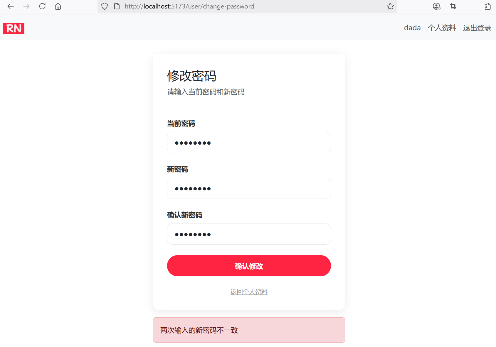
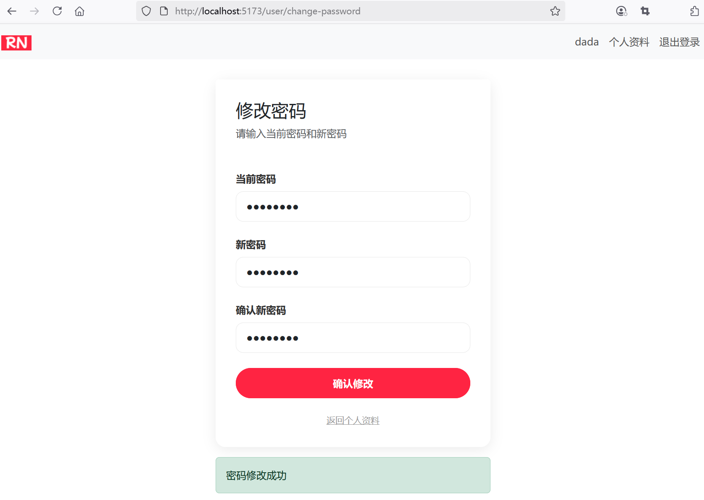

## 4.12 实现用户密码修改


### 后端接口改造


修改UserController：

```java
@GetMapping("/change-password")
/*public String changePasswordForm() {
    return "user-change-password";
}*/
public ResponseEntity<User> changePasswordForm() {
    User user = userService.getCurrentUser();
    return ResponseEntity.ok(user);
}

@PostMapping("/change-password")
/*public String changePassword(@RequestParam String oldPassword, @RequestParam String newPassword, @RequestParam String confirmPassword, RedirectAttributes redirectAttributes) {
    // 密码验证，验证两次输入的密码是否一致
    if (!newPassword.equals(confirmPassword)) {
        redirectAttributes.addFlashAttribute("error", "两次输入的密码不一致");
        return "redirect:/user/change-password";
    }

    // 密码旧密码是否正确
    if (!userService.verifyPassword(userService.getCurrentUser().getUsername(), oldPassword)) {
        redirectAttributes.addFlashAttribute("error", "旧密码错误");
        return "redirect:/user/change-password";
    }

    // 新密码强度验证
    if (!newPassword.matches("^[a-zA-Z0-9_]{8,20}$")) {
        redirectAttributes.addFlashAttribute("error", "新密码强度不够");
        return "redirect:/user/change-password";
    }

    // 更新密码到数据库
    userService.changePassword(userService.getCurrentUser().getUsername(), newPassword);
    redirectAttributes.addFlashAttribute("success", "密码修改成功");

    return "redirect:/user/change-password";
}*/
public ResponseEntity<?> changePassword(@RequestParam String oldPassword,
                                        @RequestParam String newPassword,
                                        @RequestParam String confirmPassword) {
    Map<String, String> map = new HashMap<>();

    // 密码验证，验证两次输入的密码是否一致
    if (!newPassword.equals(confirmPassword)) {
        map.put("error", "两次输入的密码不一致");
        return ResponseEntity.ok(map);
    }

    // 密码旧密码是否正确
    if (!userService.verifyPassword(userService.getCurrentUser().getUsername(), oldPassword)) {
        map.put("error", "旧密码错误");
        return ResponseEntity.ok(map);
    }

    // 新密码强度验证
    if (!newPassword.matches("^[a-zA-Z0-9_]{8,20}$")) {
        map.put("error", "新密码强度不够");
        return ResponseEntity.ok(map);
    }

    // 更新密码到数据库
    userService.changePassword(userService.getCurrentUser().getUsername(), newPassword);
    map.put("success", "密码修改成功");

    return ResponseEntity.ok(map);
}
```


### 前端组件设计


#### UserChangePassword.vue

新增`src\views\UserChangePassword.vue`：

```vue
<script setup lang="ts">
import { ref, onMounted } from 'vue'
import { useAuthStore } from '@/stores/auth'
import { User } from '@/dto/user'
import axios from "@/services/axios"
import { useRouter } from "vue-router"
import { UserChangePassword } from '@/dto/user-change-password'

const user = ref<User>(new User())
const authStore = useAuthStore()
const router = useRouter()
const success = ref('')
const error = ref('')
const userChangePassword = ref<UserChangePassword>(new UserChangePassword())

onMounted(() => {
  // 获取用户信息
  fetchUserProfile()
})

const fetchUserProfile = async () => {
  try {
    const response = await axios.get(`/api/user/change-password`)
    user.value = response.data
  } catch (error) {
    console.error('获取用户信息失败：' + error)
  }
}

// 注销
function logout() {
  authStore.logout()

  // 跳转到登录页面
  router.push({ name: 'login' })
}

const handleUserChangePassword = async () => {
  const formData = new FormData()

  formData.append('oldPassword', userChangePassword.value.oldPassword)
  formData.append('newPassword', userChangePassword.value.newPassword)
  formData.append('confirmPassword', userChangePassword.value.confirmPassword)

  // 调用API编辑用户信息
  try {
    const response = await axios.post(`/api/user/change-password`, formData)

    if (response.data['success']) {
      success.value = response.data['success']
    } else if (response.data['error']) {
      error.value = response.data['error']
    }
  } catch (err) {
    console.error('获取用户信息失败：' + err)
    error.value = err + ''
  }
}
</script>

<template>
  <!-- 导航栏 -->
  <nav class="navbar navbar-expand-lg navbar-light bg-light">
    <div class="container">
      <a class="navbar-brand" href="/">
        
      </a>
      <button class="navbar-toggler" type="button" data-bs-toggle="collapse" data-bs-target="#navbarNav"
        aria-controls="navbarNav" aria-expanded="false" aria-label="Toggle navigation">
        <span class="navbar-toggler-icon"></span>
      </button>
      <div class="collapse navbar-collapse" id="navbarNav">
        <ul class="navbar-nav ms-auto">
          <li class="nav-item">
            <a class="nav-link" href="#">
              {{ user.username }}
            </a>
          </li>
          <li class="nav-item">
            <a class="nav-link" href="/user/profile">个人资料</a>
          </li>
          <li class="nav-item">
            <!-- 注销 -->
            <a class="nav-link" href="#" @click="logout">退出登录</a>
          </li>
        </ul>
      </div>
    </div>
  </nav>

  <!-- 主体部分 -->
  <div class="password-container">
    <div class="card password-card">
      <!-- 编辑标题 -->
      <div class="card-header">
        <h2 class="text-center">修改密码</h2>
        <p>请输入当前密码和新密码</p>
      </div>

      <div class="card-body">
        <form action="/user/change-password" method="post" @submit.prevent="handleUserChangePassword">
          <!-- 当前密码 -->
          <div class="form-group">
            <label for="oldPassword" class="form-label">当前密码</label>
            <input type="password" class="form-control" id="oldPassword" name="oldPassword"
              v-model="userChangePassword.oldPassword" />
          </div>

          <!-- 新密码 -->
          <div class="form-group">
            <label for="newPassword" class="form-label">新密码</label>
            <input type="password" class="form-control" id="newPassword" name="newPassword"
              v-model="userChangePassword.newPassword" required />
          </div>

          <!-- 确认密码 -->
          <div class="form-group">
            <label for="confirmPassword" class="form-label">确认密码</label>
            <input type="password" class="form-control" id="confirmPassword" name="confirmPassword"
              v-model="userChangePassword.confirmPassword" required />
          </div>

          <!-- 提交按钮 -->
          <button type="submit" class="btn btn-primary">确认修改</button>
        </form>

        <!-- 返回个人资料 -->
        <a href="/user/profile" class="back-link">返回个人资料</a>
      </div>
    </div>

    <!-- 操作反馈 -->
    <div v-if="success" class="alert alert-success mt-3" role="alert">
      {{ success }}
    </div>
    <div v-if="error" class="alert alert-danger mt-3" role="alert">
      {{ error }}
    </div>
  </div>
</template>

<style setup>
.password-container {
  max-width: 500px;
  margin: 0 auto;
  padding: 32px;
}

.password-card {
  border-radius: 16px;
  box-shadow: 0 4px 20px rgba(0, 0, 0, 0.08);
  border: none;
}

.card-header {
  background-color: white;
  border-bottom: none;
  padding: 32px 32px 0;
}

.card-body {
  padding: 32px;
}

.form-group {
  margin-bottom: 24px;
}

.form-label {
  font-weight: 600;
  color: #333;
  margin-bottom: 8px;
}

.form-control {
  border-radius: 12px;
  border: 1px solid #e8e8e8;
  padding: 12px 16px;
  height: 48px;
}

.form-control:focus {
  border-color: #ff2442;
  box-shadow: 0 0 0 2px rgba(255, 36, 66, 0.1);
}

.btn-primary {
  background-color: #ff2442;
  border-color: #ff2442;
  border-radius: 24px;
  padding: 12px 48px;
  font-weight: 600;
  height: 48px;
  width: 100%;
  transition: all 0.3s ease;
}

.btn-primary:hover {
  background-color: #e61e3a;
  box-shadow: 0 4px 12px rgba(255, 36, 66, 0.2);
}

.error-message {
  color: #ff2442;
  font-size: 12px;
  margin-top: 4px;
}

.back-link {
  display: block;
  text-align: center;
  margin-top: 24px;
  color: #999;
  font-size: 14px;
}

.back-link:hover {
  color: #ff2442;
}
</style>
```

#### user-change-password.ts

新增`src\dto\user-change-password.ts`：


```ts
export class UserChangePassword {
  oldPassword: string = '';
  newPassword: string = '';
  confirmPassword: string = '';
}
```

### 路由配置


```ts
const router = createRouter({
  history: createWebHistory(import.meta.env.BASE_URL),
  routes: [
    // ...为节约篇幅，此处省略非核心内容

    ,
    {
      path: '/user/change-password',
      name: 'user-change-password',
      component: () => import('../views/UserChangePassword.vue'),
      meta: {
        requiresAuth: true
      }
    },
  ],
})
```


### 运行调测

运行应用对用户密码进行修改。修改失败效果如下图4-15所示。





运行应用对用户密码进行修改。修改成功效果如下图4-16所示。



