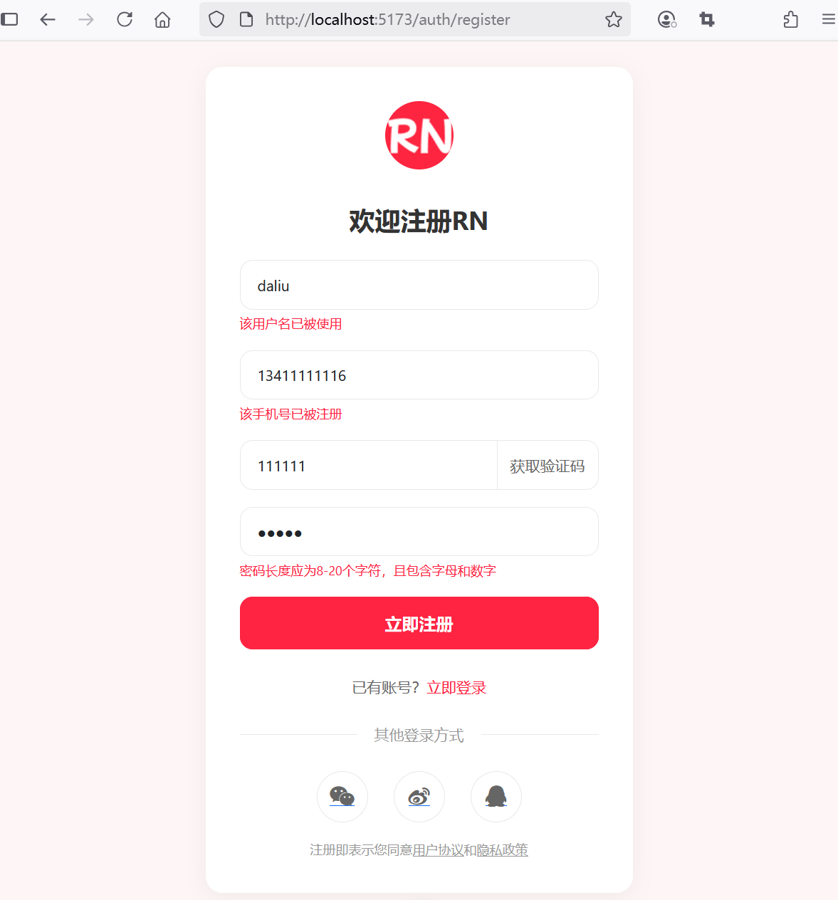
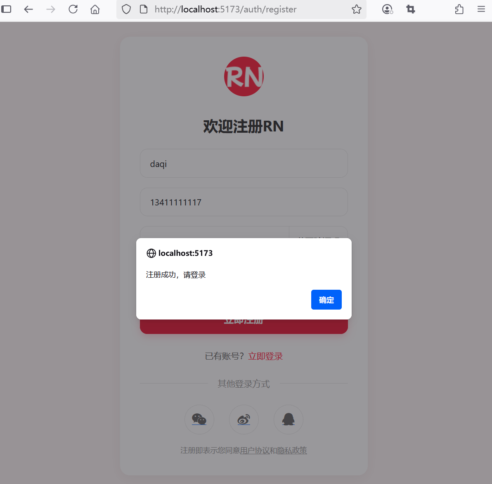

## 4.3 AI辅助编程快速实现注册页面及与后端API联调


### 前端新增错误验证接口类似


新建`src\errors\api-validation-error.ts`，代码如下：

```ts
export interface ApiValidationError {
  [field: string]: string;
}
```

### 前端新增注册表单组件


新建 `src\views\RegistrationForm.vue`，相关代码可以从后端应用的`src/main/resources/templates/registration-form.html`拷贝过来进行微调即可。调整后代码如下：

```vue
<script setup lang="ts">
import type { ApiValidationError } from '@/errors/api-validation-error'
import { ref, onUnmounted } from 'vue'
import axios, { AxiosError } from 'axios'
import { useRouter } from 'vue-router'

const form = ref({
  username: '',
  phone: '',
  verificationCode: '',
  password: ''
})

// 错误信息使用ApiValidationError类型
const errors = ref<ApiValidationError>({})

// 获取router实例
const router = useRouter()

// 注册逻辑
const handleRegister = async () => {
  // 重置错误信息
  errors.value = {}

  try {
    // 发送注册请求
    await axios.post('/api/auth/register', form.value)

    // 提示注册成功
    alert('注册成功，请登录')

    // 重置错误信息
    errors.value = {}

    // 跳转到登录页面
    router.push({ name: 'login' })
  } catch (error) {
    // 验证码发送失败
    if (error instanceof AxiosError) {
      // 获取错误信息
      const axiosError = error as AxiosError<ApiValidationError>
      if (axiosError.response?.status === 400 && axiosError.response.data) {
        // 绑定后端返回的错误信息到errors上
        errors.value = axiosError.response.data
      }
    }
  }
}

// 验证码倒计时相关状态
const countdown = ref(60)
const timer = ref<number | null>(null)
const isCounting = ref(false)

// 获取验证码倒计时函数
const startCountdown = () => {
  if (countdown.value === 60 && !isCounting.value) {
    isCounting.value = true
    timer.value = window.setInterval(() => {
      countdown.value--
      if (countdown.value === 0) {
        clearInterval(timer.value!)
        countdown.value = 60
        isCounting.value = false
      }
    }, 1000)
  }
}

// 组件卸载时清理定时器
onUnmounted(() => {
  if (timer.value) {
    clearInterval(timer.value)
  }
})

</script>
<template>
  <div class="container align-items-center min-vh-100 py-4">
    <div class="form-container">
      <!-- Logo -->
      <div class="logo">
        
      </div>

      <!-- 表单标题 -->
      <h2 class="form-title">欢迎注册RN</h2>

      <!-- 注册表单 -->
      <form id="registrationForm" method="post" @submit.prevent="handleRegister">
        <!-- 用户名输入框 -->
        <div class="mb-3">
          <input type="text" class="form-control" id="username" name="username" v-model="form.username"
            placeholder="请设置用户名" required>
          <div class="error-message" id="usernameError" v-if="errors.username">{{ errors.username }}</div>
        </div>

        <!-- 手机号输入框 -->
        <div class="mb-3">
          <input type="text" class="form-control" id="phone" name="phone" v-model="form.phone" placeholder="请输入手机号"
            required>
          <div class="error-message" id="phoneError" v-if="errors.phone">{{ errors.phone }}</div>
        </div>

        <!-- 验证码输入框 -->
        <div class="mb-3">
          <div class="input-group">
            <input type="text" class="form-control" id="verificationCode" name="verificationCode"
              v-model="form.verificationCode" placeholder="请输入验证码" required>
            <button type="button" class="btn btn-outline-secondary" id="getCodeBtn" @click="startCountdown"
              :disabled="isCounting">
              {{ isCounting ? countdown + '秒后重新获取' : '获取验证码' }}
            </button>
          </div>
          <div class="error-message" id="verificationCodeError" v-if="errors.verificationCode">{{
            errors.verificationCode }}</div>
        </div>

        <!-- 密码输入框 -->
        <div class="mb-3">
          <input type="password" class="form-control" id="password" name="password" v-model="form.password"
            placeholder="请设置密码" required>
          <div class="error-message" id="passwordError" v-if="errors.password">{{ errors.password }}</div>
        </div>

        <!--注册按钮 -->
        <button class="btn btn-primary w-100" type="submit">立即注册</button>
      </form>

      <!-- 已有账号 -->
      <div class="form-footer">
        已有账号？ <a href="/auth/login">立即登录</a>
      </div>

      <!-- 其他登录方式 -->
      <div class=" divider">
          <span>其他登录方式</span>
      </div>

      <!-- 社交登录 -->
      <div class="social-login">
        <a href="#" class="social-btn">
          <i class="fa fa-weixin"></i>
        </a>
        <a href="#" class="social-btn">
          <i class="fa fa-weibo"></i>
        </a>
        <a href="#" class="social-btn">
          <i class="fa fa-qq"></i>
        </a>
      </div>

      <!-- 用户协议、隐藏政策 -->
      <div class="policy">
        注册即表示同意<a href="#">用户协议</a>和<a href="#">隐藏政策</a>
      </div>
    </div>
  </div>
</template>
<style setup>
body {
  background-color: #fef6f6;
  font-family: -apple-system, BlinkMacSystemFont, "Segoe UI", Roboto, Helvetica, Arial, sans-serif;
}

.form-container {
  background-color: white;
  border-radius: 16px;
  box-shadow: 0 4px 20px rgba(0, 0, 0, 0.05);
  padding: 32px;
  max-width: 400px;
  margin: 0 auto;
}

.logo {
  text-align: center;
  margin-bottom: 32px;
}

.logo img {
  width: 64px;
  height: 64px;
}

.form-title {
  font-size: 24px;
  font-weight: 700;
  color: #333;
  margin-bottom: 24px;
  text-align: center;
}

.form-control {
  border-radius: 12px;
  border: 1px solid #e8e8e8;
  padding: 12px 16px;
  height: auto;
  font-size: 14px;
}

.form-control:focus {
  border-color: #ff2442;
  box-shadow: 0 0 0 2px rgba(255, 36, 66, 0.1);
}

.btn-primary {
  background-color: #ff2442;
  border-color: #ff2442;
  border-radius: 12px;
  padding: 12px;
  font-size: 16px;
  font-weight: 600;
  transition: all 0.3s ease;
}

.btn-primary:hover,
.btn-primary:focus {
  background-color: #e61e3a;
  border-color: #e61e3a;
  box-shadow: 0 4px 12px rgba(255, 36, 66, 0.2);
}

.btn-outline-secondary {
  border-radius: 12px;
  padding: 12px;
  font-size: 14px;
  color: #666;
  border-color: #e8e8e8;
}

.btn-outline-secondary:hover {
  background-color: #f8f8f8;
  border-color: #ddd;
}

.form-footer {
  text-align: center;
  margin-top: 24px;
  font-size: 14px;
  color: #666;
}

.form-footer a {
  color: #ff2442;
  text-decoration: none;
}

.form-footer a:hover {
  text-decoration: underline;
}

.divider {
  display: flex;
  align-items: center;
  margin: 24px 0;
  color: #999;
  font-size: 14px;
}

.divider::before,
.divider::after {
  content: '';
  flex: 1;
  border-bottom: 1px solid #e8e8e8;
}

.divider::before {
  margin-right: 16px;
}

.divider::after {
  margin-left: 16px;
}

.social-login {
  display: flex;
  justify-content: center;
  gap: 24px;
  margin-top: 24px;
}

.social-btn {
  width: 48px;
  height: 48px;
  border-radius: 50%;
  display: flex;
  align-items: center;
  justify-content: center;
  border: 1px solid #e8e8e8;
  transition: all 0.3s ease;
}

.social-btn:hover {
  background-color: #f8f8f8;
  transform: translateY(-2px);
}

.social-btn i {
  font-size: 20px;
  color: #666;
}

.policy {
  font-size: 12px;
  color: #999;
  text-align: center;
  margin-top: 16px;
}

.policy a {
  color: #999;
  text-decoration: underline;
}

.error-message {
  color: #ff2442;
  font-size: 12px;
  margin-top: 4px;
  /* display: none; */
}
</style>
```


### 设置反向代理


```ts
// 设置反向代理
server: {
  host: 'localhost',
  port: 5173, // Vue开发端口
  proxy: {
    '/api': {
      // 指向Spring Boot后端地址（假设后端运行在8080端口）
      target: 'http://localhost:8080',
      changeOrigin: true,
      rewrite: (path) => path.replace(/^\/api/, '')
    }
  }
}
```

配置说明

* `/api`：代理路径前缀，前端请求以`/api`开头的 URL 会被转发
* target：Spring Boot 后端的基础地址
* changeOrigin：设置为 true 以支持跨域请求
* rewrite：去除 URL 中的`/api`前缀，确保后端正确接收路径

### 修改路由


修改路由文件`src\router\index.ts`，内容如下：


```ts
import { createRouter, createWebHistory } from 'vue-router'
import HomeView from '../views/HomeView.vue'

const router = createRouter({
  history: createWebHistory(import.meta.env.BASE_URL),
  routes: [
    {
      path: '/',
      name: 'home',
      component: HomeView,
    },
    {
      path: '/auth/register',
      name: 'register',
      // 当访问该路径时，它被延迟加载
      component: () => import('../views/RegistrationForm.vue'),
    },
  ],
})

export default router
```

### 修改App.vue

修改`src\App.vue`文件，删除`<header>`，内容如下：


```ts
<script setup lang="ts">
import { RouterLink, RouterView } from 'vue-router'
</script>

<template>
  <!--
  <header>
    <div class="wrapper">
      <nav>
        <RouterLink to="/">Home</RouterLink>
      </nav>
    </div>
  </header>
  -->
  <RouterView />
</template>
```


### 运行调测

运行应用执行注册，注册失败界面效果如下图4-1所示。





注册成功界面效果如下图4-2所示。





通过以上改造，用户注册功能将从后端渲染转变为前端渲染，实现更流畅的交互体验和更好的可维护性。关键是要处理好前后端分离后的安全机制、表单验证和用户体验优化。