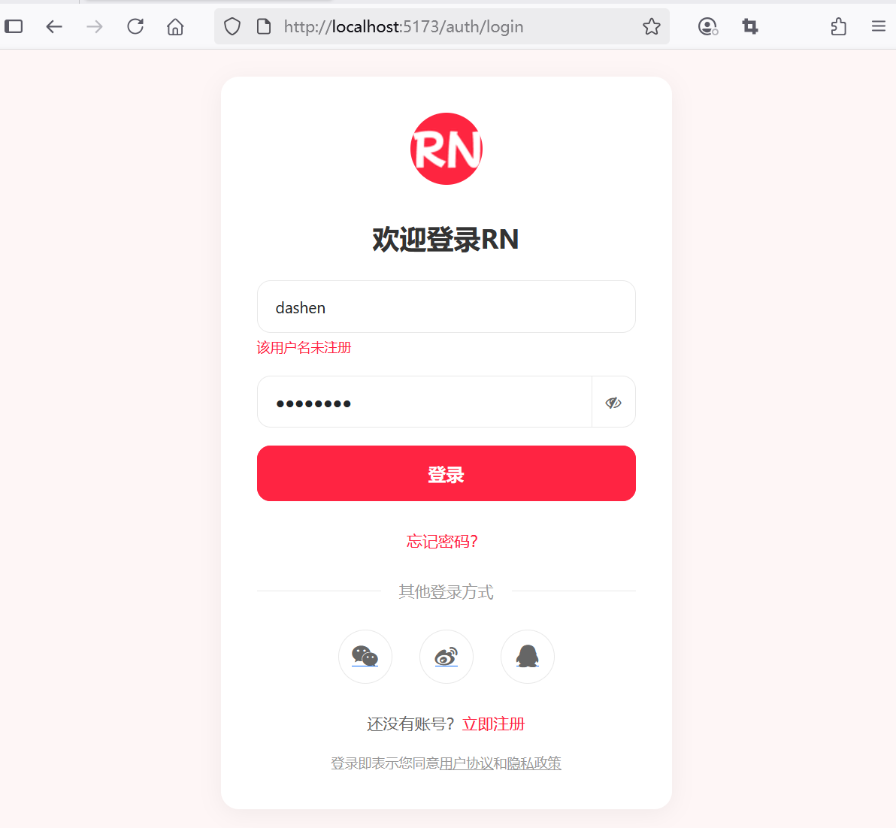
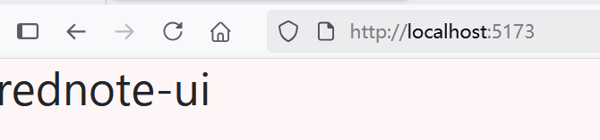

## 4.5 AI辅助编程快速实现登录页面及与后端API联调


### 前端新增登录表单组件


新建 `src\views\LoginForm.vue`，相关代码可以从后端应用的`src/main/resources/templates/login-form.html`拷贝过来进行微调即可调整后代码如下：


```vue
<script setup lang="ts">
import type { ApiValidationError } from '@/errors/api-validation-error'
import { ref } from 'vue'
import axios, { AxiosError } from 'axios'
import { useRouter } from 'vue-router'

const form = ref({
  username: '',
  password: ''
})

// 错误信息使用ApiValidationError类型
const errors = ref<ApiValidationError>({})

// 获取router实例
const router = useRouter()

// 登录逻辑
const handleLogin = async () => {
  // 重置错误信息
  errors.value = {}

  try {
    // 发送登录请求
    const response = await axios.post('/api/auth/login', form.value)

    // 存储JWT到localStorage中
    localStorage.setItem('token', response.data)

    // 重置错误信息
    errors.value = {}

    // 跳转到主页页面
    router.push({ name: 'home' })
  } catch (error) {
    // 登录失败
    if (error instanceof AxiosError) {
      // 获取错误信息
      const axiosError = error as AxiosError<ApiValidationError>
      if (axiosError.response?.status === 400 && axiosError.response.data) {
        // 绑定后端返回的错误信息到errors上
        errors.value = axiosError.response.data
      }
    }
  }
}

const showPassword = ref(false)

</script>
<template>
  <div class="container align-items-center min-vh-100 py-4">
    <div class="form-container">
      <!-- Logo -->
      <div class="logo">
        
      </div>

      <!-- 表单标题 -->
      <h2 class="form-title">欢迎登录RN</h2>

      <!-- 注册表单 -->
      <form id="loginForm" method="post" @submit.prevent="handleLogin">
        <!-- 用户名输入框 -->
        <div class="mb-3">
          <input type="text" class="form-control" id="username" name="username" v-model="form.username"
            placeholder="请输入用户名" required>
          <div class="error-message" id="usernameError" v-if="errors.username">{{ errors.username }}</div>
        </div>

        <!-- 密码输入框 -->
        <div class="mb-3">
          <div class="input-group">
            <input :type="showPassword ? 'text' : 'password'" class="form-control" id="password" name="password"
              v-model="form.password" placeholder="请设置密码" required>
            <!-- 切换密码显示模式 -->
            <button type="button" class="btn btn-outline-secondary" id="togglePassword"
              @click="showPassword = !showPassword">
              <i :class="showPassword ? 'fa fa-eye' : 'fa fa-eye-slash'"></i>
            </button>
          </div>

          <div class="error-message" id="passwordError" v-if="errors.password">{{ errors.password }}</div>
        </div>

        <!-- 记住我 -->
        <div class="form-check mb-3">
          <input type="checkbox" class="form-check-input" id="rememberMe" name="remember-me">
          <label class="form-check-label" for="rememberMe">记住我</label>
        </div>

        <!--登录按钮 -->
        <button class="btn btn-primary w-100" type="submit">登录</button>
      </form>


    </div>
    <!-- 忘记密码 -->
    <div class="form-footer">
      <a href="#">忘记密码</a>
    </div>

    <!-- 其他登录方式 -->
    <div class="divider">
      <span>其他登录方式</span>
    </div>

    <!-- 社交登录 -->
    <div class="social-login">
      <a href="#" class="social-btn">
        <i class="fa fa-weixin"></i>
      </a>
      <a href="#" class="social-btn">
        <i class="fa fa-weibo"></i>
      </a>
      <a href="#" class="social-btn">
        <i class="fa fa-qq"></i>
      </a>
    </div>

    <!-- 注册链接 -->
    <div class="form-footer">
      还没有账号？ <a href="/auth/register">立即注册</a>
    </div>

    <!-- 用户协议、隐藏政策 -->
    <div class="policy">
      注册即表示同意<a href="#">用户协议</a>和<a href="#">隐藏政策</a>
    </div>
  </div>
</template>
<style setup>
body {
  background-color: #fef6f6;
  font-family: -apple-system, BlinkMacSystemFont, "Segoe UI", Roboto, Helvetica, Arial, sans-serif;
}

.form-container {
  background-color: white;
  border-radius: 16px;
  box-shadow: 0 4px 20px rgba(0, 0, 0, 0.05);
  padding: 32px;
  max-width: 400px;
  margin: 0 auto;
}

.logo {
  text-align: center;
  margin-bottom: 32px;
}

.logo img {
  width: 64px;
  height: 64px;
}

.form-title {
  font-size: 24px;
  font-weight: 700;
  color: #333;
  margin-bottom: 24px;
  text-align: center;
}

.form-control {
  border-radius: 12px;
  border: 1px solid #e8e8e8;
  padding: 12px 16px;
  height: auto;
  font-size: 14px;
}

.form-control:focus {
  border-color: #ff2442;
  box-shadow: 0 0 0 2px rgba(255, 36, 66, 0.1);
}

.btn-primary {
  background-color: #ff2442;
  border-color: #ff2442;
  border-radius: 12px;
  padding: 12px;
  font-size: 16px;
  font-weight: 600;
  transition: all 0.3s ease;
}

.btn-primary:hover,
.btn-primary:focus {
  background-color: #e61e3a;
  border-color: #e61e3a;
  box-shadow: 0 4px 12px rgba(255, 36, 66, 0.2);
}

.btn-outline-secondary {
  border-radius: 12px;
  padding: 12px;
  font-size: 14px;
  color: #666;
  border-color: #e8e8e8;
}

.btn-outline-secondary:hover {
  background-color: #f8f8f8;
  border-color: #ddd;
}

.form-footer {
  text-align: center;
  margin-top: 24px;
  font-size: 14px;
  color: #666;
}

.form-footer a {
  color: #ff2442;
  text-decoration: none;
}

.form-footer a:hover {
  text-decoration: underline;
}

.divider {
  display: flex;
  align-items: center;
  margin: 24px 0;
  color: #999;
  font-size: 14px;
}

.divider::before,
.divider::after {
  content: '';
  flex: 1;
  border-bottom: 1px solid #e8e8e8;
}

.divider::before {
  margin-right: 16px;
}

.divider::after {
  margin-left: 16px;
}

.social-login {
  display: flex;
  justify-content: center;
  gap: 24px;
  margin-top: 24px;
}

.social-btn {
  width: 48px;
  height: 48px;
  border-radius: 50%;
  display: flex;
  align-items: center;
  justify-content: center;
  border: 1px solid #e8e8e8;
  transition: all 0.3s ease;
}

.social-btn:hover {
  background-color: #f8f8f8;
  transform: translateY(-2px);
}

.social-btn i {
  font-size: 20px;
  color: #666;
}

.policy {
  font-size: 12px;
  color: #999;
  text-align: center;
  margin-top: 16px;
}

.policy a {
  color: #999;
  text-decoration: underline;
}

.error-message {
  color: #ff2442;
  font-size: 12px;
  margin-top: 4px;
  /* display: none; */
}
</style>
```


### 修改路由


修改路由文件`src\router\index.ts`，内容如下：


```ts
import { createRouter, createWebHistory } from 'vue-router'
import HomeView from '../views/HomeView.vue'

const router = createRouter({
  history: createWebHistory(import.meta.env.BASE_URL),
  routes: [
    // ...为节约篇幅，此处省略非核心内容
    ,
    {
      path: '/auth/login',
      name: 'login',
      component: () => import('../views/LoginForm.vue'),
    },
  ],
})

export default router
```


### 运行调测

运行应用执行登录，登录失败界面效果如下图4-3所示。





登录成功界面效果如下图4-4所示。





通过以上改造，用户登录功能将从后端渲染转变为前端渲染，实现更流畅的交互体验和更好的可维护性。关键是要处理好前后端分离后的安全机制、状态管理和用户体验优化。

