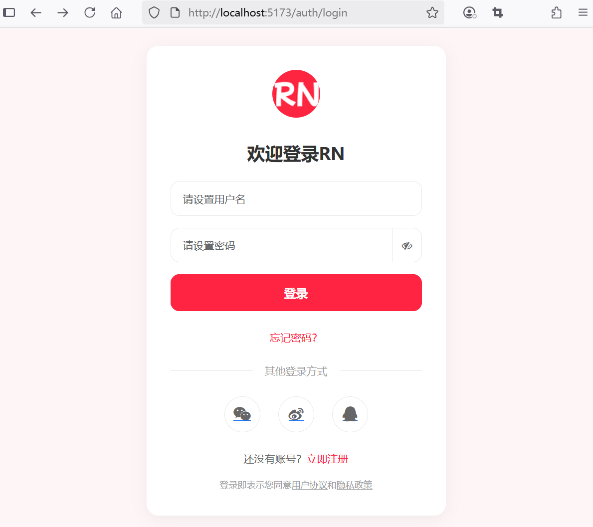

## 4.6 前端全局认证状态管理与路由守卫


### 后端接口改造


UserController 接口改造如下：

```java
@GetMapping("/profile")
/*public String profile(Model model) {
    // 获取当前用户信息
    User user = userService.getCurrentUser();

    *//*model.addAttribute("user", user);

    return "user-profile";*//*

    // 重定向
    return "redirect:/user/profile/" + user.getUserId();
}*/
public ResponseEntity<User> profile() {
    // 获取当前用户信息
    User user = userService.getCurrentUser();

    return ResponseEntity.ok(user);
}
```


### 使用 Pinia 管理认证状态

新建认证状态管理文件`src\stores\auth.ts`：

```ts
import { defineStore } from "pinia"
import { useRouter } from "vue-router"
import axios from "axios"

export const useAuthStore = defineStore("auth", {
  state: () => ({
    user: null,
    token: localStorage.getItem("token") || null,
    isAuthenticated: false,
  }),
  getters: {
    getUser: (state) => state.user,
    getToken: (state) => state.token,
    getIsAuthenticated: (state) => state.isAuthenticated,
  },
  actions: {
    // 登录
    async login(username: string, password: string) {
      try {
        const response = await axios.post("/api/auth/login", {
          username,
          password,
        })
        this.token = response.data

        if (this.token) {
          localStorage.setItem("token", this.token)
          this.isAuthenticated = true
          axios.defaults.headers.common['Authorization'] = `Bearer ${this.token}`

          // 获取用户信息
          await this.fetchUser()

          return true;
        } else {
          localStorage.removeItem("token")
          this.isAuthenticated = false

          return false;
        }
      } catch (error) {
        this.logout()
        throw error
      }
    },
    // 获取用户信息
    async fetchUser() {
      try {
        const response = await axios.get("/api/user/profile")
        this.user = response.data
      } catch (error) {
        this.logout()
        throw error
      }
    },
    // 注销
    logout() {
      this.user = null
      this.token = null
      this.isAuthenticated = false;
      localStorage.removeItem('token')
      axios.defaults.headers.common['Authorization'] = null

      // 跳转到登录页面
      const router = useRouter()
      router.push({ name: 'login' })
    },
    // 检查认证状态（比如页面刷新后恢复）
    async checkAuth() {
      const storedToken = localStorage.getItem('token')
      if (storedToken) {
        this.token = storedToken
        this.isAuthenticated = true
        await this.fetchUser()
      }
    }
  }
})

```


### 在组件中使用认证状态

修改 `src\views\LoginForm.vue`：

```ts
import { useAuthStore } from '@/stores/auth'

// 获取useAuthStore实例
const authStore = useAuthStore()

// ...为节约篇幅，此处省略非核心内容

// 登录逻辑
const handleLogin = async () => {
  // 重置错误信息
  errors.value = {}

  try {
    // 发送登录请求
    /*
    const response = await axios.post('/api/auth/login', form.value)

    // 存储JWT到localStorage中
    localStorage.setItem('token', response.data)
    */
    await authStore.login(form.value.username, form.value.password)

    // 重置错误信息
    errors.value = {}

    // 跳转到主页页面
    router.push({ name: 'home' })
  } catch (error) {
    // ...为节约篇幅，此处省略非核心内容
  }
}
```

### 路由守卫配置


修改路由文件`src\router\index.ts`，内容如下：


```ts
import { createRouter, createWebHistory } from 'vue-router'
import HomeView from '../views/HomeView.vue'
import { useAuthStore } from '@/stores/auth'

const router = createRouter({
  history: createWebHistory(import.meta.env.BASE_URL),
  routes: [
    {
      path: '/',
      name: 'home',
      component: HomeView,
      // 需要认证的路由
      meta: {
        requiresAuth: true
      }
    },
    {
      path: '/auth/register',
      name: 'register',
      // 当访问该路径时，它被延迟加载
      component: () => import('../views/RegistrationForm.vue'),
    },
    {
      path: '/auth/login',
      name: 'login',
      component: () => import('../views/LoginForm.vue'),
    },
  ],
})

// 全局前置守卫
router.beforeEach(async (to, from, next) => {
  // 获取useAuthStore实例
  const authStore = useAuthStore()

  // 检查是否需要认证
  if (to.meta.requiresAuth && !authStore.getIsAuthenticated) {
    // 跳转到登录页面
    return next({ name: 'login' })
  } 

  console.log('authStore.getUser', authStore.getUser)
  console.log('authStore.getIsAuthenticated', authStore.getIsAuthenticated)
  // 如果用户已登录，但没有加载用户信息，则先加载用户信息
  if (authStore.getIsAuthenticated && !authStore.getUser) {
    try {
      await authStore.fetchUser()
      next()
    } catch (error) {
      authStore.logout()
      next({ name: 'login' })
    }
  } else {
    next()
  }
})

export default router

```

### 自动刷新令牌

修改认证状态管理文件`src\stores\auth.ts`，增加如下内容：


```ts
// ...为节约篇幅，此处省略非核心内容

// axios拦截器，自动刷新JWT
axios.interceptors.request.use((config) => { 
  const token = localStorage.getItem('token')
  if (token) {
    config.headers.Authorization = `Bearer ${token}`
  }

  return config
})
```


### 应用启动时恢复认证状态

修改`src\App.vue`：


```ts
<script setup lang="ts">
import { RouterLink, RouterView } from 'vue-router'
import { useAuthStore } from '@/stores/auth'

// 应用启动时检查用户是否已登录
const authStore = useAuthStore()
authStore.checkAuth()
</script>

// ...为节约篇幅，此处省略非核心内容
```


### 运行调测

运行应用在未执行登录的情况下访问首页，则会直接重定向到登录界面，效果如下图4-5所示。



