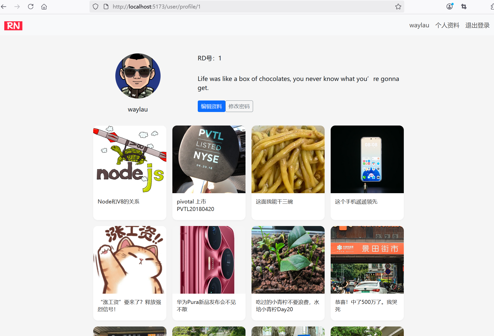
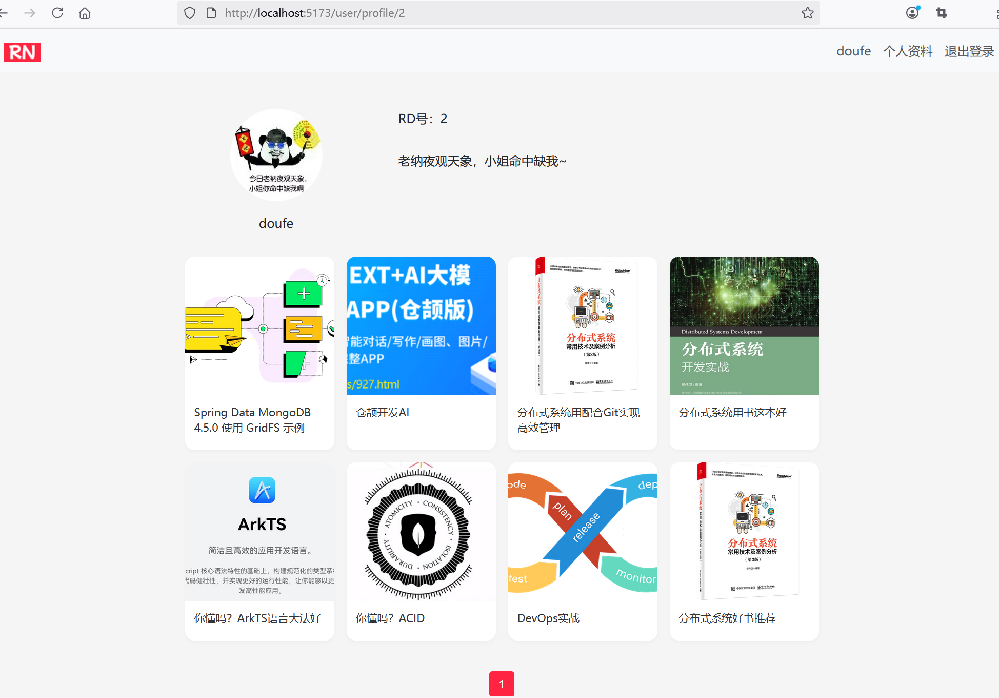
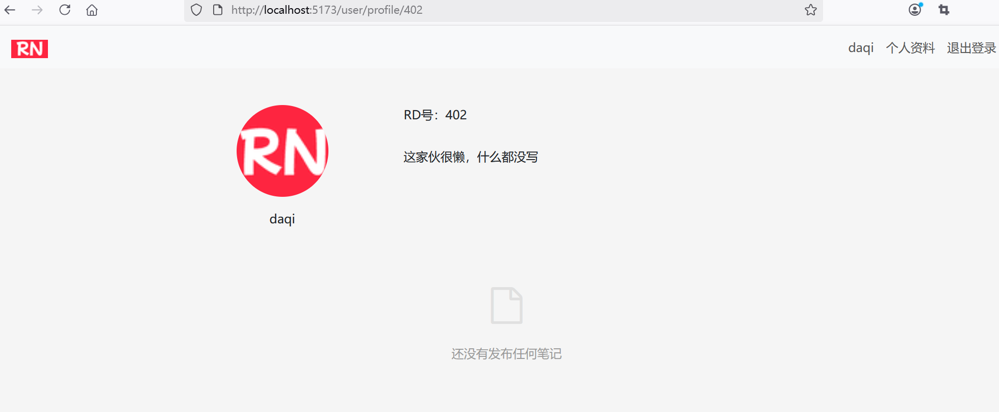
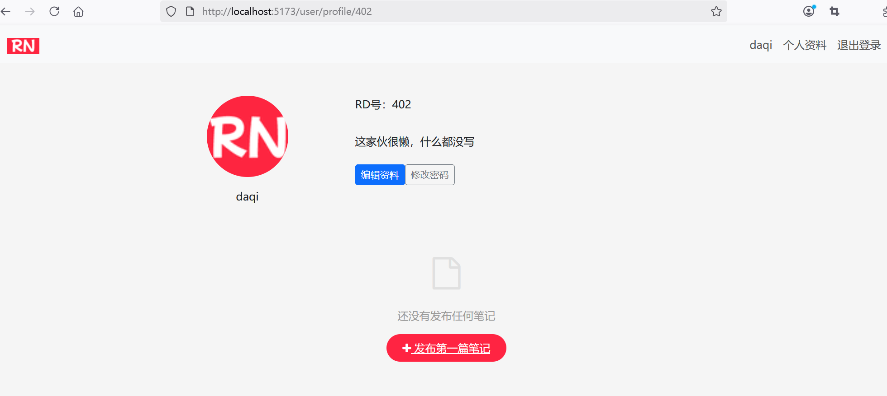

## 4.9 路由配置和全局前置守卫实现页面重定向


### 路由配置和全局前置守卫实现重定向


在 Vue 3 中实现从 `/user/profile` 到 `/user/profile/:userId` 的重定向，需要结合路由配置和全局前置守卫。以下是具体实现方法：
 
```ts
const router = createRouter({
  history: createWebHistory(import.meta.env.BASE_URL),
  routes: [
    // ...为节约篇幅，此处省略非核心内容

    {
      path: '/user/profile',
      // 重定向到指定用户ID的页面
      redirect: to => {
        // 获取用户ID需要到全局守卫中处理
        return { name: 'profile-placeholder'}
      },
      meta: {
        requiresAuth: true
      }
    },
    // 临时占位路由，用于在全局守卫中处理重定向
    {
      path: '/user/profile-placeholder',
      name: 'profile-placeholder',
      component: { template: '<div>Loading...</div>' },
      meta: {
        requiresAuth: true
      }
    },
    {
      path: '/user/profile/:userId',
      name: 'user-profile',
      component: () => import('../views/UserProfile.vue'),
      meta: {
        requiresAuth: true
      }
    },
  ],
})

// 全局前置守卫
router.beforeEach(async (to, from, next) => {
  // ...为节约篇幅，此处省略非核心内容

  // 如果用户已登录，但没有加载用户信息，则先加载用户信息
  if (authStore.getIsAuthenticated && !authStore.getUser) {
    try {
      await authStore.fetchUser()
    } catch (error) {
      authStore.logout()
      next({ name: 'login' })
    }
  }

  // 获取用户ID
  if (to.name === 'profile-placeholder' && authStore.getUser) {
    next({ name: 'user-profile', params: { userId: (authStore.getUser as any).userId } })
  } else {
    next()
  }

})

export default router
```


### 运行调测

运行应用在登录账号的情况下访问自己的用户信息首页，效果如下图4-6所示。





访问其他人的用户信息首页，效果如下图4-7所示。与上述界面的差异点在于少了“编辑资料”“修改密码”。





如果某个用户未发表过笔记，则效果如下图4-8所示。





如果是自己未发表过笔记，则效果如下图4-9所示。与上述界面的差异点在于少了“发布第一篇笔记”。





通过以上改造，用户信息管理功能将从后端渲染转变为前端渲染，实现更流畅的交互体验和更好的可维护性。关键是要处理好前后端分离后的API设计、状态管理和用户体验优化。


