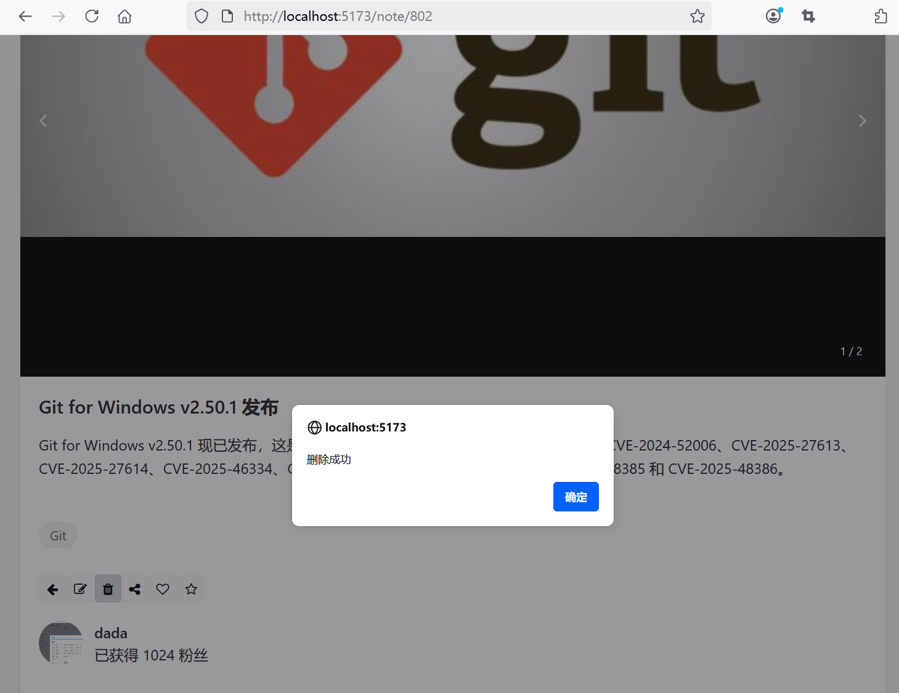

## 5.7 全栈实战笔记删除功能


### 后端接口

NoteController删除接口已经适配，无需调整。


```java
/**
 * 处理删除笔记的请求
 */
@DeleteMapping("/{noteId}")
@PreAuthorize("@noteServiceImpl.isAuthor(#noteId, authentication.name)")
public ResponseEntity<DeleteResponseDto> deleteNote(@PathVariable Long noteId) {
    // 检查笔记是否存在
    Optional<Note> optionalNote = noteService.findNoteById(noteId);
    if (!optionalNote.isPresent()) {
        throw new NoteNotFoundException("");
    }

    Note note = optionalNote.get();

    // 使用服务删除笔记
    noteService.deleteNote(note);

    // 返回响应的内容
    DeleteResponseDto deleteResponseDto = new DeleteResponseDto();
    deleteResponseDto.setMessage("笔记删除成功");
    deleteResponseDto.setRedirectUrl("/user/profile");

    return ResponseEntity.ok(deleteResponseDto);
}
```

### 前端组件设计
 

修改`src\views\NoteDetail.vue`，增加如下函数：

```ts
// 删除笔记
const deleteNote = async () => {
  try {
    if (confirm('确定要删除该笔记吗？')) {
      await axios.delete(`/api/note/${noteId.value}`);

      alert('删除成功');

      // 跳转到用户信息页面
      router.push({ name: 'profile-placeholder' });
    }
  }
  catch (error) {
    console.error('删除失败：', error);
  }
}

// ...为节约篇幅，此处省略非核心内容

<!-- 删除 -->
<button class="btn btn-light btn-sm" v-if="me.username === note.username" @click="deleteNote">
  <i class="fa fa-trash"></i>
</button>
```


注意，跳转的是用户信息页面，路由的名称是“profile-placeholder”，而非“user-profile”。


### 运行调测

运行应用访问笔记详情页面进行删除操作，操作成功界面效果如下图5-7所示。





点击“确定”按钮之后，就能跳转到用户信息页面。