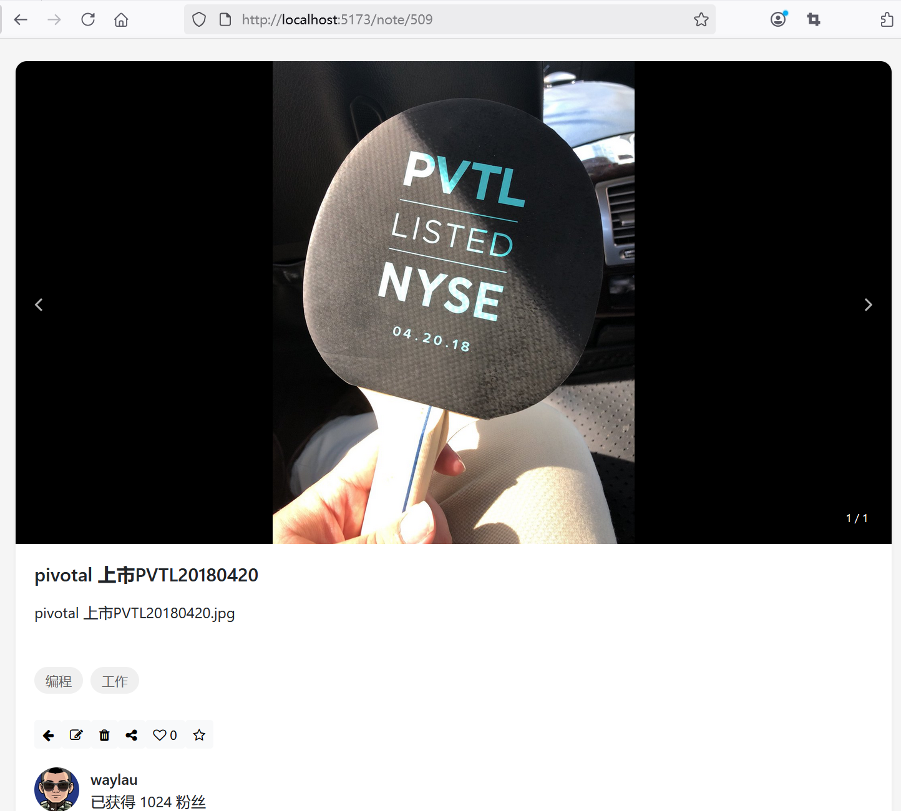
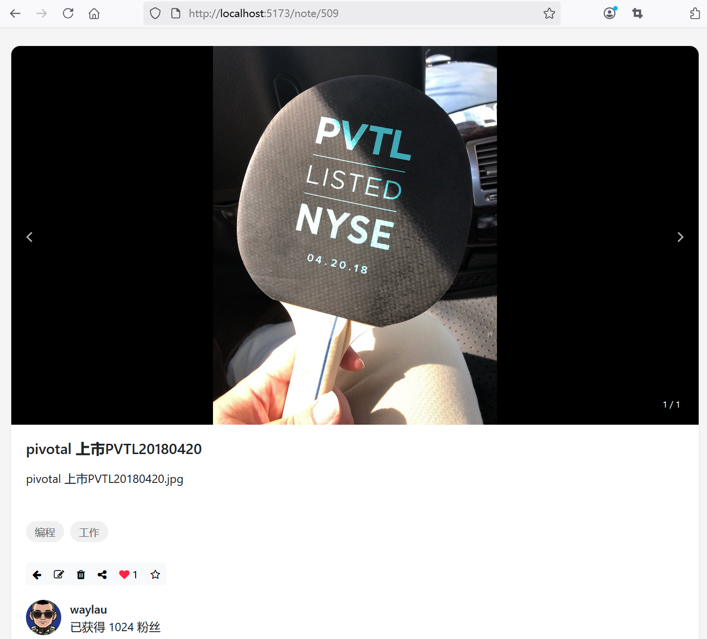

## 6.2 全栈实战点赞功能：掌握缓存与状态管理协同策略

### 后端接口

LikeController点赞接口已经适配，无需调整。


```java
/**
 * 处理点赞、取消点赞请求
 *
 * @param noteId
 * @return
 */
@PostMapping("/{noteId}")
public ResponseEntity<LikeResponseDto> toggleLike(@PathVariable Long noteId) {
    User currentUser = userService.getCurrentUser();

    boolean isLiked = likeService.toggleLike(noteId, currentUser);
    long likeCount = likeService.getLikeCount(noteId);

    return ResponseEntity.ok(new LikeResponseDto(isLiked, likeCount));
}
```


### 前端组件设计
 
#### 定义DTO对象

新增`src\dto\like-response-dto.ts`：

```
export class LikeResponseDto {
  likeCount: number = 0;
  liked: boolean = false;
}
```

#### 增加点赞事件处理

修改`src\views\NoteDetail.vue`，增加如下函数：

```ts
import { LikeResponseDto } from '@/dto/like-response-dto';

// 点赞状态
const likeResponseDto = ref<LikeResponseDto>(new LikeResponseDto());

// 点赞
const handleLike = async () => {
  try {
    const response = await axios.post(`/api/like/${noteId.value}`)
    likeResponseDto.value = response.data
  } catch (error) {
    console.error('点赞错误：', error)
  }
}

// ...为节约篇幅，此处省略非核心内容

<!-- 点赞 -->
<button class="btn btn-light btn-sm" @click="handleLike">
 <i :class="likeResponseDto.liked ? 'fa fa-heart liked' : 'fa fa-heart-o'"></i>
 {{ likeResponseDto.likeCount }}
</button>
```


#### 处理点赞状态

初始化笔记数据时，刷新点赞状态。

```ts
const fetchNote = async (noteId: any) => {
  try {
    const response = await axios.get(`/api/note/${noteId}`);
    note.value = response.data;

    // 刷新点赞状态
    likeResponseDto.value.likeCount = note.value.likeCount;
    likeResponseDto.value.liked = note.value.liked;
  } catch (error) {
    console.error('获取笔记详情失败：' + error);
  }
}
```


### 运行调测

运行应用访问笔记详情页面进行点赞操作，未点赞前界面效果如下图6-1所示。





点赞后界面效果如下图6-2所示。



