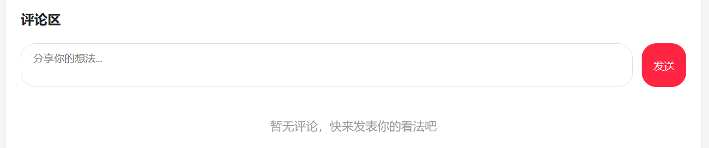
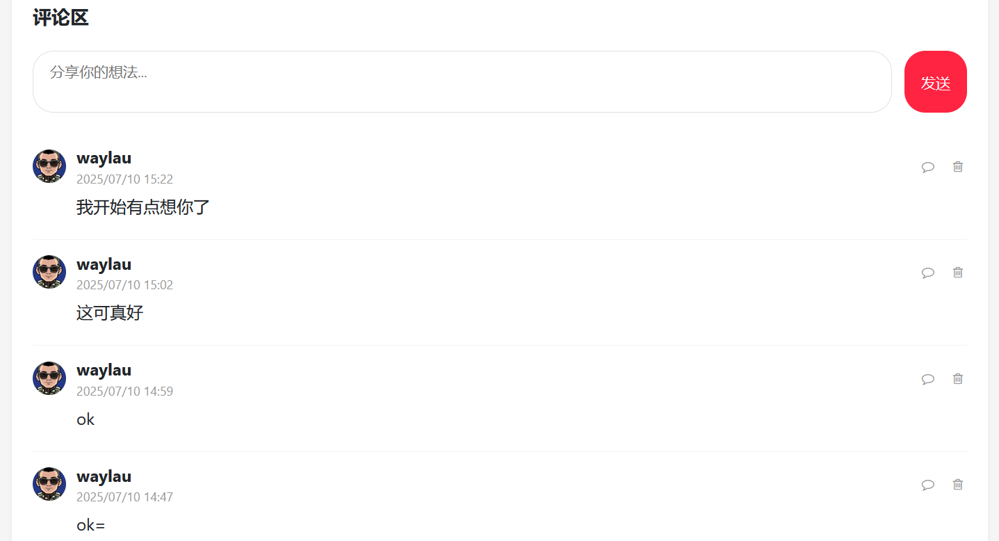

## 7.3 实战无刷新查询评论列表功能


### 处理评论列表状态

初始化笔记数据时，刷新评论列表状态

```ts
onMounted(() => {
    // ...为节约篇幅，此处省略非核心内容

    // 加载笔记评论
    fetchNoteComments()
});

// 加载笔记评论
const fetchNoteComments = async () => {
  try {
    const response = await axios.get(`/api/comment/${noteId.value}`)
    commentResponseDtoArray.value = response.data
  } catch (error) {
    console.error('获取笔记评论错误：', error)
  }
}
```

### 编写模板内容


```html
<!-- 评论列表 -->
<div class="comment-list" id="commentList">
    <!-- 评论列表为空的处理 -->
    <p class="empty-comments" v-if="commentResponseDtoArray.length === 0">
    暂无评论，快来发表你的看法吧
    </p>

    <!-- 评论列表不为空的处理 -->
    <div class="comment-item" v-for="comment in commentResponseDtoArray" :key="comment.commentId">
    <!-- 评论头 -->
    <div class="comment-header">
        <!-- 作者信息 -->
        <!-- 点击用户头像跳转到用户详情页 -->
        <a :href="`/user/profile/${comment.userId}`">
        
        </a>
        <div class="comment-user-info">
        <div class="comment-username">{{ comment.username }}</div>
        <div class="comment-time">{{ comment.createdAt }}</div>
        </div>

        <!-- 回复评论按钮 -->
        <button class="reply-btn">
        <i class="fa fa-comment-o"></i>
        </button>

        <!-- 删除评论按钮 -->
        <button class="delete-comment">
        <i class="fa fa-trash-o"></i>
        </button>
    </div>

    <!-- 评论内容 -->
    <div class="comment-content">
        {{ comment.content }}
    </div>

    <!-- 回复列表 -->
    <div class="reply-list">
    </div>
    </div>
</div>
```

### 运行调测

运行应用访问笔记详情页面，未发布评论界面效果如下图7-1所示。





发布评论后评论列表界面效果如下图7-2所示。


### 时间格式化

在时间显示上，需要做格式化处理。


```ts
// 格式化日期
const formatDate = (dateString: string) => {
  const date = new Date(dateString);
  const formattedDate = date.toLocaleString();
  return formattedDate
}
```

在模板上使用上述函数即可：

```html
<div class="comment-time">{{ formatDate(comment.createAt) }}</div>
```

时间格式化后的评论列表界面效果如下图7-3所示。



