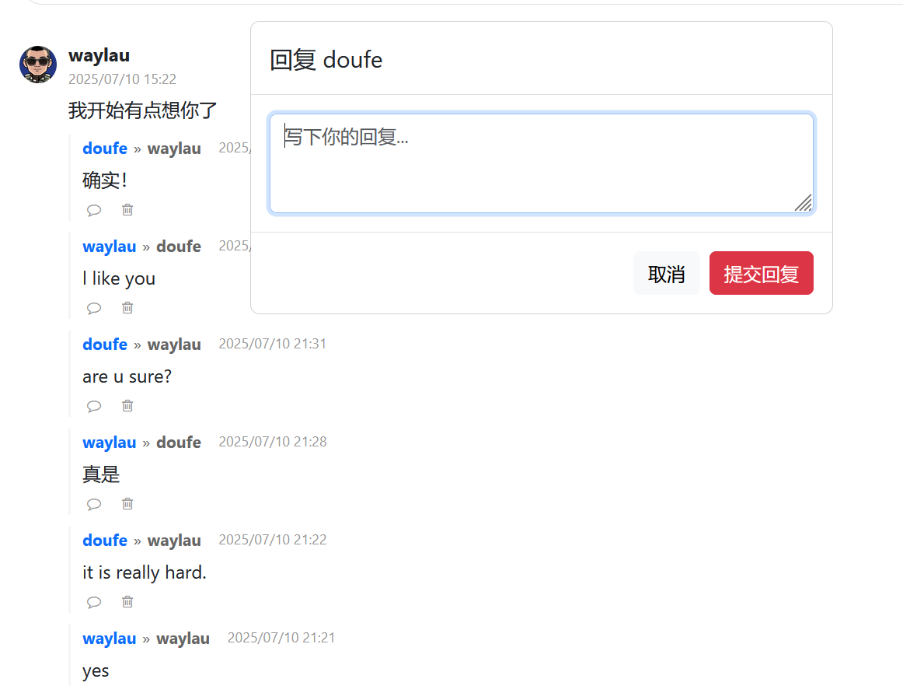
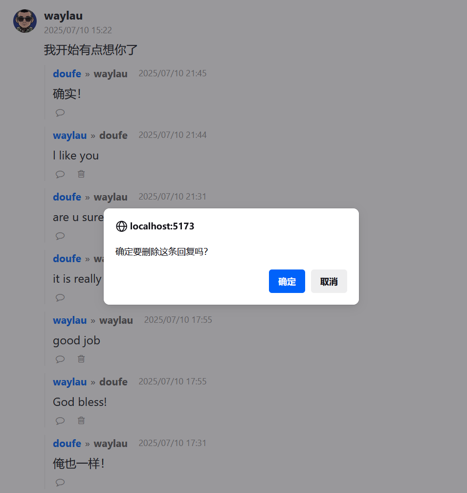

## 7.6 实战评论树的遍历渲染方案及无刷新删除回复


### 针对回复的回复处理


针对回复，也是可以继续进行回复。处理逻辑类似，因此可以复用相关的代码：

```html
<!-- 回复回复的按钮-->
<button class="reply-btn" @click="handleReplyComment(reply)">
    <i class="fa fa-comment-o"></i>
</button>
```

不过，评论和回复的存储结构是不同的，因此，需要对submitReply函数进行抽痛，以适配具有树形结构回复内容的场景。


```ts
// 提交回复
const submitReply = async () => {
  const replyContent = replyContentRef.value

  if (!replyContent) {
    return
  }

  try {
    const parentCommentId = replyToCommentResponseDto.value.commentId

    const response = await axios.post(`/api/comment/${noteId.value}/reply/${parentCommentId}`,
      // 传递文本内容
      replyContentRef.value?.value.trim(),
      {
        headers: {
          'Content-Type': 'text/plain'
        }
      }
    )

    // 回复添加到父级评论的回复列表中
    /*const commentIndex = commentResponseDtoArray.value.findIndex(item => item.commentId === parentCommentId)
    if (commentIndex !== -1) { 
      if (!commentResponseDtoArray.value[commentIndex].replies) { 
        commentResponseDtoArray.value[commentIndex].replies = []
      }
      commentResponseDtoArray.value[commentIndex].replies.unshift(response.data)
    }*/
    commentResponseDtoArray.value.forEach(root => {
      deepTraverse(root, response.data, root.replies)
    })

    // 关闭回复框
    hideReplyModal()
  } catch (error) {
    console.error('提交回复失败：' + error)
  }
}

// 先遍历找根评论，再找子回复
const deepTraverse = (root: CommentResponseDto, response: CommentResponseDto, replies: Array<CommentResponseDto>) => {
  if (root.commentId === response.parentCommentId) {
    root.replies.unshift(response)
    return
  } else {
    for (const node of replies) {
      if (node.commentId === response.parentCommentId) {
        // 子节点的评论也算在根节点头上
        root.replies.unshift(response)
        break
      }
    }
  }
}
```


### 运行调测

运行应用访问笔记详情页面，评论树的界面效果如下图7-4所示。





### 处理删除回复的事件

删除请求发送成功后，执行无刷新删除回复。

```ts
// 删除回复
const deleteReply = async (commentId: number) => {
  if (!confirm('确定要删除这条回复吗？')) {
    return
  }

  try {
    await axios.delete(`/api/comment/${commentId}`)

    // 从列表中删除回复
    commentResponseDtoArray.value = commentResponseDtoArray.value.filter(comment => {
      comment.replies = comment.replies.filter(reply => reply.commentId !== commentId)
      return comment.replies
    })
  } catch (error) {
    console.error('删除回复失败：' + error)
  }
}
```

### 编写模板内容


```html
<!-- 删除回复的按钮-->
<button class="delete-comment" v-if="me.username === reply.username"
  @click="deleteReply(reply.commentId)">
  <i class="fa fa-trash-o"></i>
</button>
```

确保是回复的作者自己，才能看到删除回复的按钮。


### 运行调测

运行应用访问笔记详情页面，删除回复时的界面效果如下图7-5所示。



