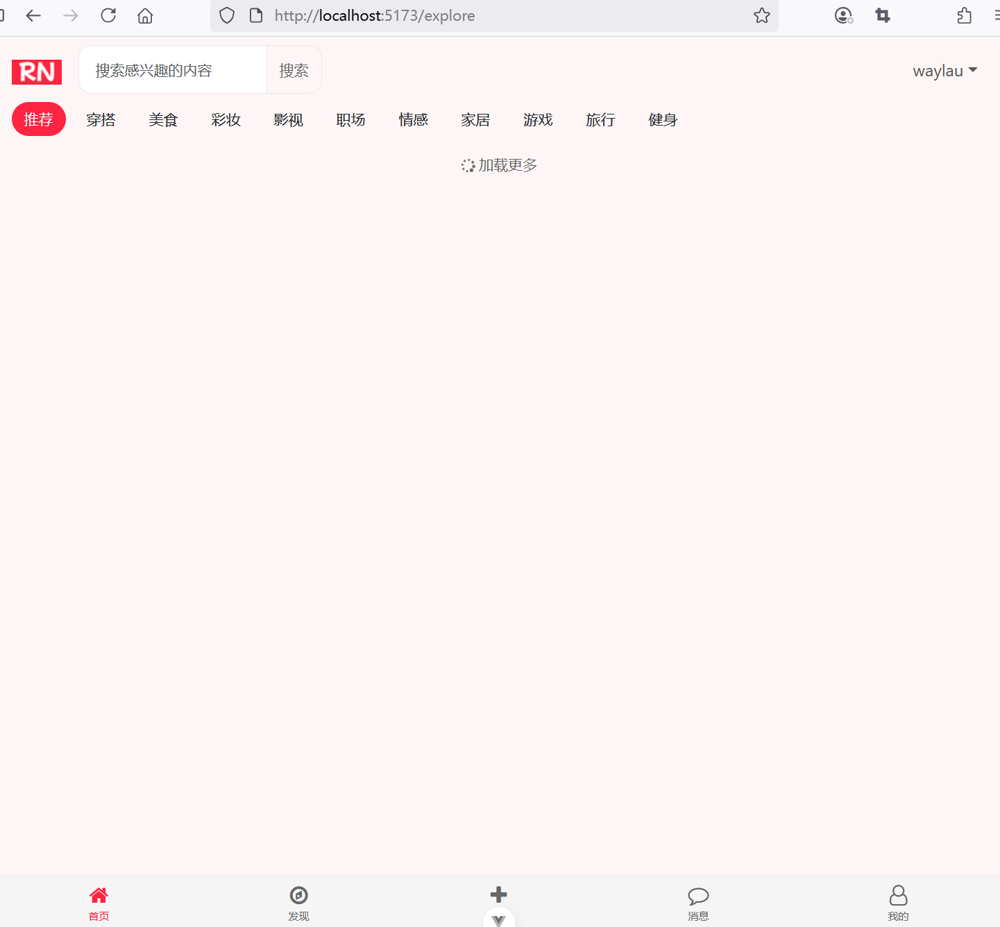

## 8.2 首页模块整体布局升级至Vue 3架构

### 后端接口

ExploreController返回首页笔记探索页面的笔记数据接口已经适配，无需调整。

```java
/**
 * 处理笔记探索页面的数据加载的请求
 */
@GetMapping("/note")
public ResponseEntity<NoteResponseDto> getNotesByCategory(@RequestParam(defaultValue = "1") int page,
                                                          @RequestParam(required = false) String category,
                                                          @RequestParam(required = false) String query) {
    // 注意：把分类“推荐”当成null
    if (DEFAULT_CATEGORY.equals(category)) {
        category = null;
    }

    // 分页查询笔记
    Page<Note> notes = null;
    // 判定query是否为空
    if (query != null && query.trim().length() > 0) {
        notes = noteService.getNotesByPageAndQuery(page, PAGE_SIZE, category, query);
    } else {
        notes = noteService.getNotesByPage(page, PAGE_SIZE, category);
    }

    NoteResponseDto noteResponseDto = new NoteResponseDto();
    noteResponseDto.setHasMore(notes.hasNext());

    User user = userService.getCurrentUser();

    // 处理序列化问题
    List<NoteExploreDto> noteExploreDtoLst = new ArrayList<>();
    for (Note note : notes.getContent()) {
        noteExploreDtoLst.add(NoteExploreDto.toExploreDto(note, user));
    }
    noteResponseDto.setNotes(noteExploreDtoLst);

    return ResponseEntity.ok(noteResponseDto);
}
```

### 前端组件设计


#### Explore.vue

新增`src\views\Explore.vue`：

```vue
<script setup lang="ts">
import { User } from '@/dto/user';
import { useAuthStore } from '@/stores/auth';
import { ref, onMounted } from 'vue'
import { useRouter } from 'vue-router';

const me = ref<User>(new User())
const authStore = useAuthStore()
const router = useRouter()

onMounted(() => { 
  me.value = authStore.getUser ? authStore.getUser : new User()
})  

// 注销
function logout() {
  authStore.logout()

  // 跳转到登录页面
  router.push({ name: 'login' })
}
</script>

<template>
  <!-- 顶部导航栏 -->
  <header>
    <nav class="navbar navbar-expand-lg">
      <div class="container">
        <a class="navbar-brand" href="/">
          
        </a>

        <!-- 搜索框-->
        <div class="col-md-3">
          <div class="input-group">
            <input class="form-control" type="text" placeholder="搜索感兴趣的内容" aria-label="Search" id="searchInput">
            <button class="btn btn-outline-secondary" type="button" id="searchButton">
              搜索
            </button>
          </div>
        </div>

        <button class="navbar-toggler" type="button" data-bs-toggle="collapse" data-bs-target="#navbarNav"
          aria-controls="navbarNav" aria-expanded="false" aria-label="Toggle navigation">
          <span class="navbar-toggler-icon"></span>
        </button>

        <div class="collapse navbar-collapse" id="navbarNav">
          <ul class="navbar-nav me-auto">
          </ul>

          <ul class="navbar-nav mb-2 mb-lg-0">
            <li class="nav-item dropdown">
              <a class="nav-link dropdown-toggle" href="#" data-bs-target="dropdown" data-bs-toggle="dropdown"
                aria-expanded="false">
                {{ me.username}}
              </a>

              <ul class="dropdown-menu" id="dropdown">
                <li class="dropdown-item">
                  <a class="nav-link" href="/user/profile">个人资料</a>
                </li>
                <li class="dropdown-item">
                  <a class="nav-link" href="#" @click="logout">退出登录</a>
                </li>
              </ul>
            </li>

          </ul>

        </div>
      </div>
    </nav>
  </header>

  <!-- 分类导航 -->
  <header>
    <div class="container">
      <div class="category-item active">推荐</div>
      <div class="category-item">穿搭</div>
      <div class="category-item">美食</div>
      <div class="category-item">彩妆</div>
      <div class="category-item">影视</div>
      <div class="category-item">职场</div>
      <div class="category-item">情感</div>
      <div class="category-item">家居</div>
      <div class="category-item">游戏</div>
      <div class="category-item">旅行</div>
      <div class="category-item">健身</div>
    </div>
  </header>

  <main>
    <div class="container">
      <!-- 笔记卡片网格 -->
      <div class="masonry" id="notesGrid">
        <!-- 笔记卡片是通过JavaScript动态生成 -->
      </div>
      <!-- 加载更多内容提示 -->
      <div class="load-more" id="loadMore">
        <i class="fa fa-spinner fa-spin"></i>加载更多
      </div>
      <!-- 没有更多内容提示 -->
      <div class="no-more" id="noMoreContent">
        <p>已经到底啦~</p>
      </div>
    </div>
  </main>
  <footer>
    <!-- 底部导航栏 -->
    <div class="container bottom-nav">
      <div class="nav-item active" onclick="navigateTo('home')">
        <i class="fa fa-home nav-icon"></i>
        <span class="nav-text">首页</span>
      </div>
      <div class="nav-item" onclick="navigateTo('discover')">
        <i class="fa fa-compass nav-icon"></i>
        <span class="nav-text">发现</span>
      </div>
      <div class="nav-item" onclick="navigateTo('publish')">
        <i class="fa fa-plus nav-icon"></i>
        <span class="nav-text">发布</span>
      </div>
      <div class="nav-item" onclick="navigateTo('message')">
        <i class="fa fa-comment-o nav-icon"></i>
        <span class="nav-text">消息</span>
      </div>
      <div class="nav-item" onclick="navigateTo('profile')">
        <i class="fa fa-user-o nav-icon"></i>
        <span class="nav-text">我的</span>
      </div>
    </div>
  </footer>

</template>
<style setup>
/* 全局样式 */
body {
  font-family: -apple-system, BlinkMacSystemFont, "Segoe UI", Roboto, "Helvetica Neue", Arial, sans-serif;
  background-color: #f5f5f5;
}

/* 分类导航 */
.category-nav {
  background-color: white;
  padding: 8px 0;
  overflow-x: auto;
  white-space: nowrap;
  -webkit-overflow-scrolling: touch;
}

.category-item {
  display: inline-block;
  padding: 6px 12px;
  margin-right: 8px;
  border-radius: 20px;
  font-size: 14px;
  cursor: pointer;
  transition: background-color 0.2s;
}

.category-item.active {
  background-color: #ff2442;
  color: white;
}

/* 笔记卡片网格 */
.notes-grid {
  display: grid;
  grid-template-columns: repeat(auto-fill, minmax(180px, 1fr));
  gap: 8px;
  padding: 8px;
}

.note-card {
  background-color: white;
  border-radius: 8px;
  overflow: hidden;
  box-shadow: 0 1px 2px rgba(0, 0, 0, 0.05);
}

.note-image-container {
  position: relative;
  padding-bottom: 100%;
  /* 保持正方形比例 */
  overflow: hidden;
  border-radius: 12px;
}

.note-image {
  position: absolute;
  top: 0;
  left: 0;
  width: 100%;
  height: 100%;
  object-fit: cover;
}

.note-tag {
  position: absolute;
  bottom: 8px;
  left: 8px;
  background-color: rgba(0, 0, 0, 0.5);
  color: white;
  padding: 2px 8px;
  border-radius: 10px;
  font-size: 12px;
}

.note-content {
  padding: 8px;
}

.note-title {
  font-size: 14px;
  font-weight: 500;
  margin-bottom: 4px;
  line-height: 1.4;
  overflow: hidden;
  text-overflow: ellipsis;
  display: -webkit-box;
  -webkit-line-clamp: 2;
  -webkit-box-orient: vertical;
}

.note-author {
  display: flex;
  align-items: center;
  margin-bottom: 4px;
}

.author-avatar {
  width: 20px;
  height: 20px;
  border-radius: 50%;
  margin-right: 6px;
}

.author-name {
  font-size: 12px;
  color: #666;
}

.note-author-stats {
  display: flex;
  justify-content: space-between;
}

.note-stats {
  display: flex;
  align-items: center;
  font-size: 12px;
  color: #999;
}

.stat-item {
  margin-right: 12px;
}

/* 加载更多 */
.load-more {
  text-align: center;
  padding: 16px 0;
  color: #666;
  font-size: 14px;
}

/* 没有更多 */
.no-more {
  text-align: center;
  padding: 0 0 50px 0;
  color: #666;
  font-size: 14px;
  display: none;
}

/* 底部导航栏 */
.bottom-nav {
  position: fixed;
  bottom: 0;
  left: 0;
  right: 0;
  display: flex;
  justify-content: space-around;
  padding: 8px 0;
  box-shadow: 0 -1px 2px rgba(0, 0, 0, 0.05);
  z-index: 100;
  background-color: #f5f5f5;
}

.nav-item {
  display: flex;
  flex-direction: column;
  align-items: center;
  color: #666;
  cursor: pointer;
}

.nav-item.active {
  color: #ff2442;
}

.nav-icon {
  font-size: 20px;
  margin-bottom: 2px;
}

.nav-text {
  font-size: 10px;
}

/* 去掉下划线 */
a {
  text-decoration: none;
}

/* 瀑布流布局 */
.masonry {
  column-count: 4;
  column-gap: 1em;
  padding: 10;
}

.masonry-item {
  display: inline-block;
  margin: 0 0 1.5em;
  width: 100%;
}

.masonry-note-image {
  border-radius: 12px;
  width: 100%;
  height: auto;
}

@media only screen and (max-width: 320px) {
  .masonry {
    column-count: 1;
  }
}

@media only screen and (min-width: 321px) and (max-width: 768px) {
  .masonry {
    column-count: 2;
  }
}

@media only screen and (min-width: 769px) and (max-width: 1200px) {
  .masonry {
    column-count: 3;
  }
}

@media only screen and (min-width: 1201px) {
  .masonry {
    column-count: 4;
  }
}

/* 点赞按钮样式 */
.liked {
  color: #ff2442;
}

.like-btn {
  cursor: pointer;
}
</style>
```

### 路由配置


```ts
const router = createRouter({
  history: createWebHistory(import.meta.env.BASE_URL),
  routes: [
    // ...为节约篇幅，此处省略非核心内容

    ,
    {
      path: '/explore',
      name: 'explore',
      component: () => import('../views/Explore.vue'),
      meta: { requiresAuth: true },
    }
  ],
})
```


同时，全局前置守卫还要处理`/home`到`/explore`的重定向

```ts
// 全局前置守卫
router.beforeEach(async (to, from, next) => {
  // ...为节约篇幅，此处省略非核心内容

  // 获取用户ID
  if (to.name === 'profile-placeholder' && authStore.getUser) {
    next({ name: 'user-profile', params: { userId: (authStore.getUser as any).userId } })
  } else if (to.name === 'home') {
    // 跳转从Home到Explore页面
    next({ name: 'explore'})
  } else {
    next()
  }

})
```


### 运行调测

运行应用访问首页，可以看到界面效果如下图8-1所示。



