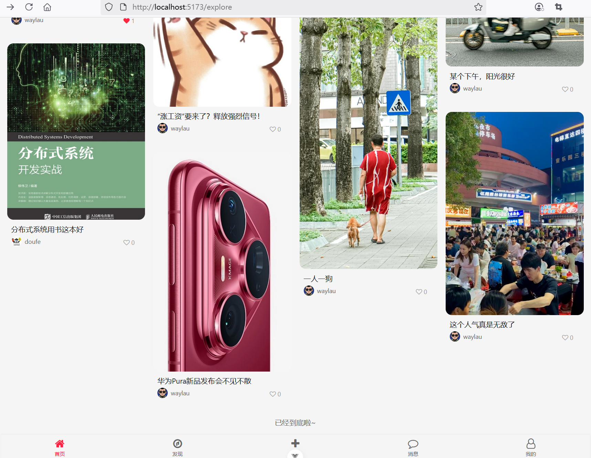

## 8.3 全栈实战瀑布流布局的核心要点


### 业务逻辑

```ts
// ...为节约篇幅，此处省略非核心内容`
const noteList = ref<Array<NoteExploreDto>>([])
const isLoading = ref(false)
const hasMore = ref(true)
const loadMoreRef = ref<HTMLDivElement | null>(null)
const noMoreContentRef = ref<HTMLDivElement | null>(null)
const category = ref('')
const page = ref(1)
const query = ref('')

onMounted(() => { 
  me.value = authStore.getUser ? authStore.getUser : new User()

  // 加载笔记数据
  loadMoreNotes()

  // 监听滚动事件
  window.addEventListener('scroll', () => { 
    const scrollTop = window.pageYOffset || document.documentElement.scrollTop;
    const windowHeight = window.innerHeight;
    const documentHeight = document.documentElement.scrollHeight;

    console.log('scrollTop: ' + scrollTop);
    console.log('windowHeight: ' + windowHeight);
    console.log('documentHeight: ' + documentHeight);

    if (scrollTop + windowHeight >= documentHeight - 300) {
        loadMoreNotes();
    }
  })
})  

// 数字格式化，转为k/w单位``````````````````````````````````````````````````````````````````````````````````````
function formateNumber(num: number) {
  if (num >= 10000) {
    return (num / 10000).toFixed(1) + 'w'
  } else if (num >= 1000) {
    return (num / 1000).toFixed(1) + 'k'
  } else {
    return num
  }
}

// 加载更多笔记数据
const loadMoreNotes = async () => {
  if (isLoading.value || !hasMore.value) {
    // 隐藏“加载”
    hideLoadMore()
    
    // 显示“没有更多”
    showNoMoreContent()
    return
  }

  isLoading.value = true
  // 显示“加载”
  showLoadMore()

  // 获取当前分类
  category.value = document.querySelector('.category-item.active')?.textContent?.trim() ?? '推荐'

  try { 
    // 发送API请求
    const response = await axios.get(`/api/explore/note?page=${page.value}&category=${category.value}&query=${query.value}`)
    const data = response.data
    if (data.notes && data.notes.length > 0) { 
      page.value++
      noteList.value = noteList.value.concat(data.notes)
      hasMore.value = data.hasMore
    } else { 
      hasMore.value = false
    }

    isLoading.value = false
    
    // 隐藏“加载”
    hideLoadMore()

    if (!hasMore.value) {
      // 显示“没有更多”
      showNoMoreContent()
    }
  } catch (error) { 
    console.log('加载更多笔记失败', error)
    isLoading.value = false
    // 隐藏“加载”
    hideLoadMore()
  }
}

function hideLoadMore() {
  if (loadMoreRef.value) { 
    loadMoreRef.value.style.display = 'none'
  }
}

function showNoMoreContent() {
  if (noMoreContentRef.value) { 
    noMoreContentRef.value.style.display = 'block'
  }
}

function showLoadMore() {
  if (loadMoreRef.value) { 
    loadMoreRef.value.style.display = 'block'
  }
}
```

### 模板


```html
<!-- 笔记卡片网格 -->
<div class="masonry" id="notesGrid">
  <!-- 笔记卡片是通过Vue动态生成 -->
  <div class="masonry-item" v-for="note in noteList">
      <!-- 点击跳转到笔记详情页 -->
      <a :href="`/note/${note.noteId}`">
          
      </a>
      <div class="note-content">
          <div class="note-title">{{ note.title }}</div>
          <div class="note-author-stats">
              <!-- 点击跳转到用户详情页 -->
              <a :href="`/user/profile/${note.userId}`">
                  <div class="note-author">
                      
                      <span class="author-name">{{ note.username }}</span>
                  </div>
              </a>

              <div class="note-stats">
                  <div class="stat-item">
                      <i :class="note.liked ? 'fa fa-heart liked' : 'fa fa-heart-o'"
                          onclick="handleLike(this)">{{ formateNumber(note.likeCount) }}</i>
                  </div>
              </div>
          </div>
      </div>
  </div>
</div>
<!-- 加载更多内容提示 -->
<div class="load-more" id="loadMore" ref="loadMoreRef">
  <i class="fa fa-spinner fa-spin"></i>加载更多
</div>
<!-- 没有更多内容提示 -->
<div class="no-more" id="noMoreContent" ref="noMoreContentRef">
  <p>已经到底啦~</p>
</div>
```


### 运行调测

运行应用访问首页，可以看到界面效果如下图8-2所示。


页面向下滑动，可以继续加载后续笔记内容，界面效果如下图8-3所示。



