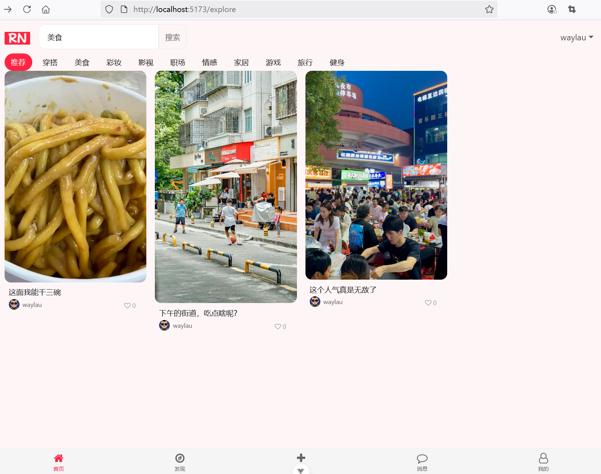
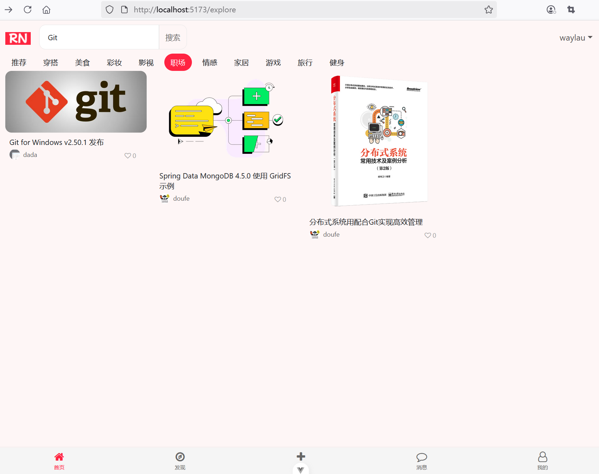
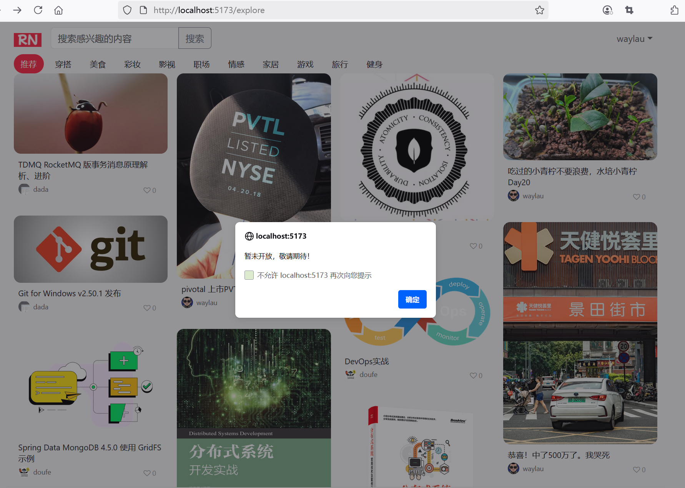

## 8.4 全栈实战分页搜索功能的核心要点

### 为分类导航添加点击事件

```ts
onMounted(() => {
  // ...为节约篇幅，此处省略非核心内容
  
  // 分类导航设置点击事件
  document.querySelectorAll('.category-item').forEach(item => {
    item.addEventListener('click', () => {
      // 移除所有active类
      document.querySelectorAll('.category-item').forEach(i => {
        i.classList.remove('active');
      });

      // 添加active类
      item.classList.add('active');

      // 执行搜索
      performSearch()
    })
  })
})

// 执行搜索
function performSearch() {
  // 重置笔记网格数据
  noteList.value = [];
  page.value = 1;
  isLoading.value = false;
  hasMore.value = true;

  loadMoreNotes();
}
```


### 为搜索输入框绑定模型

```html
<input class="form-control" type="text" placeholder="搜索感兴趣的内容" aria-label="Search" id="searchInput"
  v-model="query">
```

### 为搜索按钮设置点击事件处理


```ts
// 点击搜索
function handleSearch() {
  // 执行搜索
  performSearch()
}

// ...为节约篇幅，此处省略非核心内容
<button class="btn btn-outline-secondary" type="button" id="searchButton" @click="handleSearch">
  搜索
</button>
```


### 底部导航栏设置点击事件

```ts
// 底部导航
function navigateTo(page: string) {
  console.log('navigateTo: ' + page);

  if (page === 'home') {
    window.location.href = '/';
  } else if (page === 'publish') {
    window.location.href = '/note/publish';
  } else if (page === 'profile') {
    window.location.href = '/user/profile';
  } else {
    // 待实现的功能页面
    alert('暂未开放，敬请期待！');

    return;
  }
}

// ...为节约篇幅，此处省略非核心内容

<!-- 底部导航栏 -->
<div class="container bottom-nav">
  <div class="nav-item active" @click="navigateTo('home')">
    <i class="fa fa-home nav-icon"></i>
    <span class="nav-text">首页</span>
  </div>
  <div class="nav-item" @click="navigateTo('discover')">
    <i class="fa fa-compass nav-icon"></i>
    <span class="nav-text">发现</span>
  </div>
  <div class="nav-item" @click="navigateTo('publish')">
    <i class="fa fa-plus nav-icon"></i>
    <span class="nav-text">发布</span>
  </div>
  <div class="nav-item" @click="navigateTo('message')">
    <i class="fa fa-comment-o nav-icon"></i>
    <span class="nav-text">消息</span>
  </div>
  <div class="nav-item" @click="navigateTo('profile')">
    <i class="fa fa-user-o nav-icon"></i>
    <span class="nav-text">我的</span>
  </div>
</div>
```

### 设置点赞处理事件


```ts
import type { LikeResponseDto } from '@/dto/like-response-dto';

// 点赞
const handleLike = async (note: NoteExploreDto) => {
  try {
    // 调用API提交点赞
    const response = await axios.post(`/api/like/${note.noteId}`);
    const likeResponseDto: LikeResponseDto = response.data;

    note.likeCount = likeResponseDto.likeCount;
    note.liked = likeResponseDto.liked;
  } catch (error) {
    console.error('点赞错误：', error)
  }
}

// ...为节约篇幅，此处省略非核心内容

<div class="note-stats">
  <div class="stat-item">
    <i :class="note.liked ? 'fa fa-heart liked like-btn' : 'fa fa-heart-o like-btn'"
      @click="handleLike(note)">{{
        formateNumber(note.likeCount) }}</i>
  </div>
</div>
```


### 运行调测

运行应用访问首页进行关键字搜索，看到界面效果如下图8-4所示。





点击分类后进行关键字搜索，界面效果如下图8-5所示。




点击底部导航未完成项目的按钮，界面效果如下图8-6所示。



