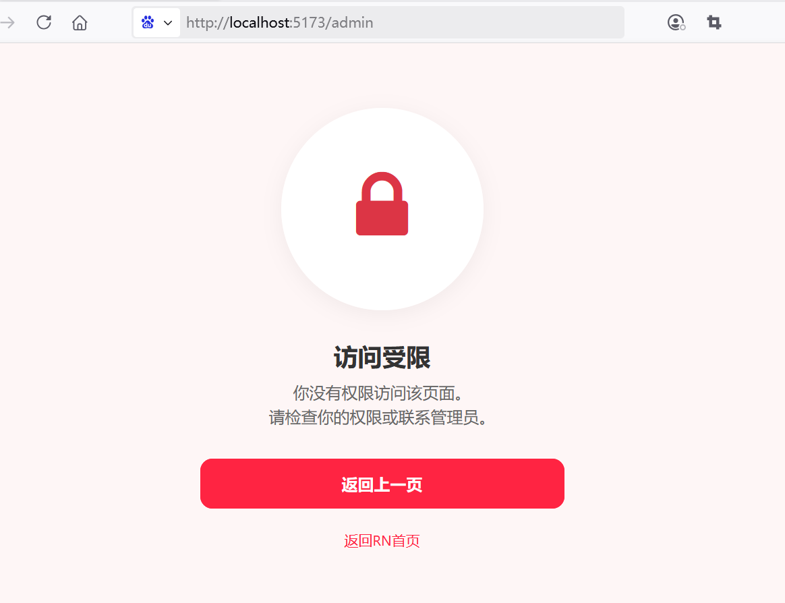
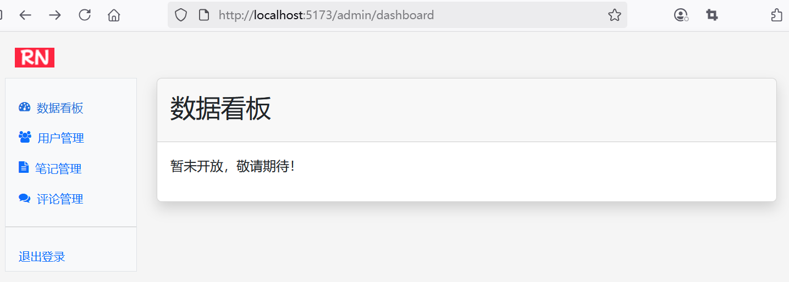

## 9.2 全栈实战基于角色的权限控制及后台管理模块整体框架

### 前端路由与权限控制


1. 增加了requiresRole属性，以校验角色权限。其中，访问后台管理`/admin`页面必须要有ADMIN角色权限；
2. 增加了403-error页面，以响应没有权限的访问；
3. 针对后台管理`/admin`页面，启用了嵌套路由功能。

```ts
const router = createRouter({
  history: createWebHistory(import.meta.env.BASE_URL),
  routes: [
    // ...为节约篇幅，此处省略非核心内容

    {
      path: '/note/publish',
      name: 'note-publish',
      component: () => import('../views/NotePublish.vue'),
      meta: {
        requiresAuth: true,
        requiresRole: 'USER'
      }
    },
    {
      path: '/note/:noteId',
      name: 'note-detail',
      component: () => import('../views/NoteDetail.vue'),
      meta: {
        requiresAuth: true,
        requiresRole: 'USER'
      }
    },
    {
      path: '/note/:noteId/edit',
      name: 'note-edit',
      component: () => import('../views/NoteEdit.vue'),
      meta: {
        requiresAuth: true,
        requiresRole: 'USER'
      }
    },
    {
      path: '/explore',
      name: 'explore',
      component: () => import('../views/Explore.vue'),
      meta: {
        requiresAuth: true,
        requiresRole: 'USER'
      }
    },
    {
      path: '/403-error',
      name: 'forbidden',
      component: () => import('../views/Forbidden.vue')
    },
    {
      path: '/admin',
      name: 'admin',
      component: () => import('../views/AdminView.vue'),
      meta: {
        requiresAuth: true,
        requiresRole: 'ADMIN'
      },
      children: [
        {
          path: '', 
          name: 'admin-redirect-dashboard',
          redirect: '/admin/dashboard'
        },
        {
          path: 'dashboard',
          name: 'admin-dashboard',
          component: () => import('../components/AdminDashboard.vue'),
        },
        {
          path: 'user',
          name: 'admin-user',
          component: () => import('../components/AdminUser.vue'),
        },
        {
          path: 'note',
          name: 'admin-note',
          component: () => import('../components/AdminNote.vue'),
        },
        {
          path: 'comment',
          name: 'admin-comment',
          component: () => import('../components/AdminComment.vue'),
        }
      ]
    },
  ],
})


// 全局前置守卫
router.beforeEach(async (to, from, next) => {
  // ...为节约篇幅，此处省略非核心内容

  // 校验角色
  if(to.meta.requiresRole && !authStore.hasRole(to.meta.requiresRole)) {
    next({ name: 'forbidden' })
  }

  // 获取用户ID
  if (to.name === 'profile-placeholder' && authStore.getUser) {
    next({ name: 'user-profile', params: { userId: (authStore.getUser as any).userId } })
  } else if (to.name === 'home' && authStore.hasRole('USER')) {
    // 跳转从Home到Explore页面
    next({ name: 'explore'})
  } else if (to.name === 'home' && authStore.hasRole('ADMIN')) {
    // 跳转从Home到Admin页面
    next({ name: 'admin'})
  } else {
    next()
  }

})
```


### 修改auth.ts


修改`src\stores\auth.ts`，检查是否具备指定角色：


```ts
export const useAuthStore = defineStore("auth", {
  
  // ...为节约篇幅，此处省略非核心内容

  actions: {
    // ...为节约篇幅，此处省略非核心内容
    
    ,
    // 检查是否具备指定角色
    hasRole(role: any) {
      if (!this.getUser) return false

      return (this.getUser as User).role === (role as string)
    },
  }
})
```

### 新增Forbidden.vue

新增`src\views\Forbidden.vue`


```vue
<script setup lang="ts">
import { useRouter } from 'vue-router';

const router = useRouter();

// 返回
function goBack() {
  router.back();
}
</script>
<template>
  <div class="container align-items-center min-vh-100 py-4">
    <div class="error-container">
      <!-- 错误图标 -->
      <div class="error-image">
        <i class="fa fa-lock fa-5x text-danger"></i>
      </div>

      <!-- 错误标题 -->
      <h2 class="error-title">访问受限</h2>

      <!-- 错误信息 -->
      <p class="error-message">
        你没有权限访问此页面。<br>
        请检查你的权限或联系管理员。
      </p>

      <!-- 返回按钮 -->
      <button class="btn btn-primary" @click="goBack">返回上一页</button>

      <!-- 跳转到首页 -->
      <p class="back-home">
        <a href="/">返回RN首页</a>
      </p>
    </div>
  </div>
</template>
<style setup>
body {
  background-color: #fef6f6;
  font-family: -apple-system, BlinkMacSystemFont, "Segoe UI", Roboto, Helvetica, Arial, sans-serif;
}

.error-container {
  max-width: 400px;
  margin: 0 auto;
  padding: 40px 20px;
  text-align: center;
}

.error-icon {
  font-size: 80px;
  color: #ff2442;
  margin-bottom: 20px;
}

.error-title {
  font-size: 24px;
  font-weight: 700;
  color: #333;
  margin-bottom: 10px;
}

.error-message {
  font-size: 16px;
  color: #666;
  margin-bottom: 30px;
}

.btn-primary {
  background-color: #ff2442;
  border-color: #ff2442;
  border-radius: 12px;
  padding: 12px;
  font-size: 16px;
  font-weight: 600;
  transition: all 0.3s ease;
  width: 100%;
}

.btn-primary:hover,
.btn-primary:focus {
  background-color: #e61e3a;
  border-color: #e61e3a;
  box-shadow: 0 4px 12px rgba(255, 36, 66, 0.2);
}

.back-home {
  margin-top: 20px;
  font-size: 14px;
  color: #999;
}

.back-home a {
  color: #ff2442;
  text-decoration: none;
}

.back-home a:hover {
  text-decoration: underline;
}

.error-image {
  width: 200px;
  height: 200px;
  margin: 0 auto 30px;
  background-color: #fff;
  border-radius: 50%;
  display: flex;
  align-items: center;
  justify-content: center;
  box-shadow: 0 4px 20px rgba(0, 0, 0, 0.05);
}

.error-image img {
  width: 120px;
  height: 120px;
}
</style>
```

### 后台管理模块整体框架


#### 主体框架AdminView.vue


新增`src\views\AdminView.vue`:


```vue
<script setup lang="ts">
import { useAuthStore } from '@/stores/auth'
import { useRouter } from "vue-router"

const authStore = useAuthStore()
const router = useRouter()

// 注销
function logout() {
  authStore.logout()

  // 跳转到登录页面
  router.push({ name: 'login' })
}
</script>
<template>
  <!--导航栏-->
  <header class="navbar navbar-expand-lg">
    <div class="container">
      <a class="navbar-brand" href="/">
        
      </a>

      <button class="navbar-toggler" type="button" data-bs-toggle="collapse" data-bs-target="#sidebarMenu"
        aria-controls="navbarNav" aria-expanded="false" aria-label="Toggle navigation">
        <span class="navbar-toggler-icon"></span>
      </button>
    </div>
  </header>

  <div class="container">
    <div class="row">
      <!--菜单-->
      <div class="sidebar border border-right col-md-3 col-lg-2 p-0 bg-body-tertiary">
        <div class="offcanvas-md offcanvas-end bg-body-tertiary" tabindex="-1" id="sidebarMenu"
          aria-labelledby="sidebarMenuLabel">
          <div class="offcanvas-body d-md-flex flex-column p-0 pt-lg-3 overflow-y-auto">
            <ul class="nav flex-column">
              <li class="nav-item">
                <a class="nav-link d-flex align-items-center gap-2 active" aria-current="page" href="/admin/dashboard">
                  <i class="fa fa-tachometer"></i>
                  数据看板
                </a>
              </li>
              <li class="nav-item">
                <a class="nav-link d-flex align-items-center gap-2" aria-current="page" href="/admin/user">
                  <i class="fa fa-users"></i>
                  用户管理
                </a>
              </li>
              <li class="nav-item">
                <a class="nav-link d-flex align-items-center gap-2" aria-current="page" href="/admin/note">
                  <i class="fa fa-file-text"></i>
                  笔记管理
                </a>
              </li>
              <li class="nav-item">
                <a class="nav-link d-flex align-items-center gap-2" aria-current="page" href="/admin/comment">
                  <i class="fa fa-comments"></i>
                  评论管理
                </a>
              </li>
            </ul>
            <hr class="my-3">
            <ul class="nav flex-column mb-auto">
              <li class="nav-item">
                  <a class="nav-link" href="#" @click="logout">退出登录</a>
              </li>
            </ul>
          </div>
        </div>
      </div>
      <!--内容区域-->
      <main class="col-md-9 ms-sm-auto col-lg-10 px-md-4">
        <!--代码片段-->
        <RouterView />
      </main>
    </div>
  </div>
</template>
<style setup>
/* 全局样式 */
body {
  font-family: -apple-system, BlinkMacSystemFont, "Segoe UI", Roboto, "Helvetica Neue", Arial, sans-serif;
  background-color: #f5f5f5;
}

.bi {
  display: inline-block;
  width: 1rem;
  height: 1rem;
}

/*
        * Sidebar
        */
@media (min-width: 768px) {
  .sidebar .offcanvas-lg {
    position: -webkit-sticky;
    position: sticky;
    top: 48px;
  }

  .navbar-search {
    display: block;
  }

  .sidebar .nav-link {
    font-size: .875rem;
    font-weight: 500;
  }

  .sidebar .nav-link.active {
    color: #2470dc;
  }

  .sidebar-heading {
    font-size: .75rem;
  }
}
</style>
```

其中，`<RouterView />`可以根据子路由的路径，动态替换AdminDashboard.vue、AdminUser.vue、、AdminNote.vue以及AdminComment.vue组件。

#### AdminDashboard.vue

```vue
<script setup lang="ts">
</script>
<template>
  <div class="card shadow mb-4">
    <div class="card-header py-3">
      <h2>数据看板</h2>
    </div>
    <div class="card-body">
      <p>暂未开放，敬请期待！</p>
    </div>
  </div>
</template>
```
#### AdminUser.vue

```vue
<script setup lang="ts">
</script>
<template>
  <div class="card shadow mb-4">
    <div class="card-header py-3">
      <h2>用户管理</h2>
    </div>
    <div class="card-body">
      <p>暂未开放，敬请期待！</p>
    </div>
  </div>
</template>
```

#### AdminNote.vue

```vue
<script setup lang="ts">
</script>
<template>
  <div class="card shadow mb-4">
    <div class="card-header py-3">
      <h2>笔记管理</h2>
    </div>
    <div class="card-body">
      <p>暂未开放，敬请期待！</p>
    </div>
  </div>
</template>
```

#### AdminComment.vue

```vue
<script setup lang="ts">
</script>
<template>
  <div class="card shadow mb-4">
    <div class="card-header py-3">
      <h2>评论管理</h2>
    </div>
    <div class="card-body">
      <p>暂未开放，敬请期待！</p>
    </div>
  </div>
</template>
```


### 运行调测

运行应用，当普通用户访问后台管理`/admin`页面时，可以看到访问受限的提示效果如下图9-1所示。





当管理员用户访问后台管理`/admin`页面时，可以看到能够正常访问，界面效果如下图9-2所示。




