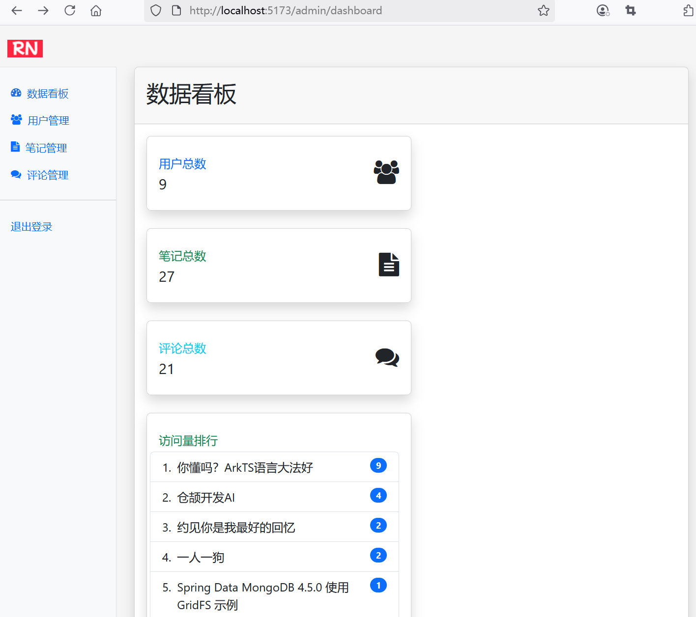
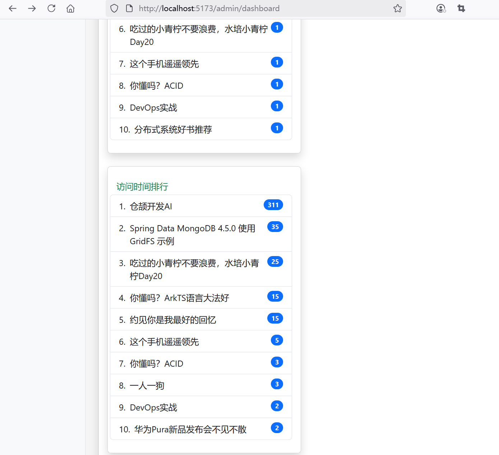

## 9.3 全栈实战数据看板功能及前端埋点


### 后端接口改造

AdminController返回数据看板的数据接口调整如下。

```java
@GetMapping("/dashboard")
/*public String dashboard(Model model) {
    // 统计数据
    long userCount = userService.countUsers();
    long noteCount = noteService.countNotes();
    long commentCount = commentService.countComments();
    List<NoteBrowseCountDto> noteBrowseCountDtoList =  noteService.getNoteByBrowseCount(1, 10);
    List<NoteBrowseTimeDto> noteBrowseTimeDtoList =  noteService.getNoteByBrowseTime(1, 10);

    model.addAttribute("userCount", userCount);
    model.addAttribute("noteCount", noteCount);
    model.addAttribute("commentCount", commentCount);

    model.addAttribute("noteBrowseCountDtoList", noteBrowseCountDtoList);
    model.addAttribute("noteBrowseTimeDtoList", noteBrowseTimeDtoList);

    model.addAttribute("contentFragment", "admin-dashboard");

    return "admin";
}*/
public ResponseEntity<?> dashboard() {
    // 统计数据
    long userCount = userService.countUsers();
    long noteCount = noteService.countNotes();
    long commentCount = commentService.countComments();
    List<NoteBrowseCountDto> noteBrowseCountDtoList =  noteService.getNoteByBrowseCount(1, 10);
    List<NoteBrowseTimeDto> noteBrowseTimeDtoList =  noteService.getNoteByBrowseTime(1, 10);

    Map<String, Object> map = new HashMap<>();
    map.put("userCount", userCount);
    map.put("noteCount", noteCount);
    map.put("commentCount", commentCount);
    map.put("noteBrowseCountDtoList", noteBrowseCountDtoList);
    map.put("noteBrowseTimeDtoList", noteBrowseTimeDtoList);

    return ResponseEntity.ok(map);
}
```


### 前端DTO设计

#### 新增note-browse-count-dto.ts

新增`src\dto\note-browse-count-dto.ts`


```ts
export interface NoteBrowseCountDto {
  noteId: number;
  title: string;
  browseCount: number;
}
```

#### 新增note-browse-time-dto.ts

新增`src\dto\note-browse-time-dto.ts`


```ts
export interface NoteBrowseTimeDto {
  noteId: number;
  title: string;
  browseTime: number;
}
```

#### 新增admin-dashboard-dto.ts

新增`src\dto\admin-dashboard-dto.ts`


```ts
export interface AdminDashboardDto {
  userCount: number;
  noteCount: number;
  commentCount: number;
  noteBrowseCountDtoList: Array<NoteBrowseCountDto>;
  noteBrowseTimeDtoList: Array<NoteBrowseTimeDto>;
}
```


### 前端获取数据


```vue
<script setup lang="ts">
import { ref, onMounted } from 'vue';
import axios from '@/services/axios';
import type { AdminDashboardDto } from '@/dto/admin-dashboard-dto';

const adminDashboardDto = ref<AdminDashboardDto>({
  userCount: 0,
  noteCount: 0,
  commentCount: 0,
  noteBrowseCountDtoList: [],
  noteBrowseTimeDtoList: [],
});

onMounted(() => {
  // 获取数据看板的数据
  fetchDashboard();
});

const fetchDashboard = async () => {
  try {
    // 调用API获取用户数据
    const response = await axios.get(`/api/admin/dashboard`);
    console.log('response.json:', response.data);
    adminDashboardDto.value = await response.data as AdminDashboardDto;
    // 处理用户数据
  } catch (error) {
    console.error('获取用户数据失败:', error);
  }
};
</script>
```


### 编写模板


```vue
<template>
  <main>
    <div class="card shadow mb-4">
      <div class="card-header py-3">
        <h2>数据看板</h2>
      </div>
      <div class="card-body">
        <!-- 统计卡片 -->
        <div class="col-xl-3 col-md-6 mb-4">
          <div class="card border-left-primary shadow h-100 py-2">
            <div class="card-body">
              <div class="row no-gutters align-items-center">
                <div class="col mr-2">
                  <div class="text-xs font-weight-bold text-primary text-uppercase mb-1">用户总数</div>
                  <div class="h5 mb-0 font-weight-bold text-gray-800">{{ adminDashboardDto.userCount }}</div>
                </div>
                <div class="col-auto">
                  <i class="fa fa-users fa-2x text-gray-300"></i>
                </div>
              </div>
            </div>
          </div>
        </div>

        <div class="col-xl-3 col-md-6 mb-4">
          <div class="card border-left-success shadow h-100 py-2">
            <div class="card-body">
              <div class="row no-gutters align-items-center">
                <div class="col mr-2">
                  <div class="text-xs font-weight-bold text-success text-uppercase mb-1">笔记总数</div>
                  <div class="h5 mb-0 font-weight-bold text-gray-800">{{ adminDashboardDto.noteCount }}</div>
                </div>
                <div class="col-auto">
                  <i class="fa fa-file-text fa-2x text-gray-300"></i>
                </div>
              </div>
            </div>
          </div>
        </div>

        <div class="col-xl-3 col-md-6 mb-4">
          <div class="card border-left-info shadow h-100 py-2">
            <div class="card-body">
              <div class="row no-gutters align-items-center">
                <div class="col mr-2">
                  <div class="text-xs font-weight-bold text-info text-uppercase mb-1">评论总数</div>
                  <div class="h5 mb-0 font-weight-bold text-gray-800">{{ adminDashboardDto.commentCount }}
                  </div>
                </div>
                <div class="col-auto">
                  <i class="fa fa-comments fa-2x text-gray-300"></i>
                </div>
              </div>
            </div>
          </div>
        </div>


        <div class="col-xl-3 col-md-6 mb-4">
          <div class="card border-left-info shadow h-100 py-2">
            <div class="card-body">
              <div class="row no-gutters align-items-center">
                <div class="col mr-2">
                  <div class="text-xs font-weight-bold text-success text-uppercase mb-1">访问量排行</div>
                </div>

                <ol class="list-group list-group-numbered">
                  <li class="list-group-item d-flex justify-content-between align-items-start"
                    v-for="note in adminDashboardDto.noteBrowseCountDtoList">
                    <div class="ms-2 me-auto">{{ note.title }}
                    </div>
                    <span class="badge text-bg-primary rounded-pill">{{ note.browseCount }}
                    </span>
                  </li>
                </ol>

              </div>
            </div>
          </div>
        </div>


        <div class="col-xl-3 col-md-6 mb-4">
          <div class="card border-left-info shadow h-100 py-2">
            <div class="card-body">
              <div class="row no-gutters align-items-center">
                <div class="col mr-2">
                  <div class="text-xs font-weight-bold text-success text-uppercase mb-1">访问时间排行</div>
                </div>

                <ol class="list-group list-group-numbered">
                  <li class="list-group-item d-flex justify-content-between align-items-start"
                    v-for="note in adminDashboardDto.noteBrowseTimeDtoList">
                    <div class="ms-2 me-auto">{{ note.title }}
                    </div>
                    <span class="badge text-bg-primary rounded-pill">{{ note.browseTime }}
                    </span>
                  </li>
                </ol>

              </div>
            </div>
          </div>
        </div>
      </div>
    </div>
  </main>
</template>
```


### 前端埋点统计浏览时长

在离开当前页面时，统计访问时长，并发送到后端API。

```ts
import { onBeforeRouteLeave, useRoute } from 'vue-router';

// 埋点
// 记录开始时间
const startTime = ref<number>(Date.now())

// 统计浏览时长
const handleBrowseTime = async() => {
  // 获取浏览时长
  const browseTime = Date.now() - startTime.value
  
  // 发送API请求
  try {
    // 使用axios发送浏览事件到后端
    await axios.post('/api/log/browse', 
    {
      userId: me.value.userId,
      noteId: parseInt(noteId.value.toString()),
      browseTime: browseTime,
      userAgent: navigator.userAgent
    }, {
      headers: {
        'Content-Type': 'application/json'
      }
    }
  )
  } catch (error) {
    console.error('埋点上报失败:', error)
  }
}

// 导航离开该组件的对应路由时调用
onBeforeRouteLeave((to, from, next) => {
  // 统计浏览时长
  handleBrowseTime()

  next()
})
```


onBeforeRouteLeave 是 Vue 3 中的组合式 API，用于在组件即将离开当前路由时执行逻辑。

### 更改跳转到笔记详情页的路由方式

设置通过router来路由页面，而非a href的方式。这样，Vue的路由才能获取到note-detail的相关信息。

```ts
function gotoNoteDetail(noteId: number) {
  router.push({
    name: 'note-detail',
    params: {
      noteId: noteId
    }
  });
}

<!-- ...为节约篇幅，此处省略非核心内容 -->

<!-- 点击跳转到笔记详情页 -->
<!-- <a :href="`/note/${note.noteId}`">-->
<a href="#" @click="gotoNoteDetail(note.noteId)">
  
</a>
```


### 运行调测

当管理员用户访问后台管理`/admin`页面时，可以看到界面效果如下图9-3、图9-4所示。








