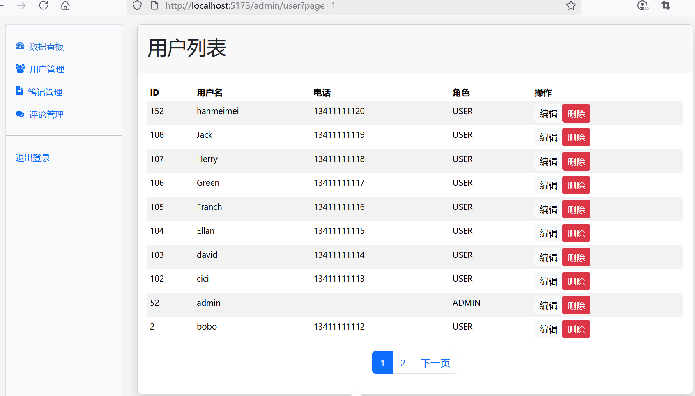

## 9.4 全栈实战用户管理获取用户列表功能


### 后端接口改造

AdminController返回用户分页数据的接口调整如下。

```java
/**
 * 显示用户管理界面
 */
@GetMapping("/user")
/*public String user(Model model, @RequestParam(defaultValue = "1") int page) {
    // 分页查询所有用户数据
    Page<User> userPage = userService.getAllUsers(page, PAGE_SIZE);

    model.addAttribute("userPage", userPage);
    model.addAttribute("contentFragment", "admin-user");
    return "admin";
}*/
public ResponseEntity<?> user(@RequestParam(defaultValue = "1") int page) {
    // 分页查询所有用户数据
    Page<User> userPage = userService.getAllUsers(page, PAGE_SIZE);

    Map<String, Object> map = new HashMap<>();
    map.put("userList", userPage.getContent());
    map.put("currentPage", page);
    map.put("totalPages", userPage.getTotalPages());

    return ResponseEntity.ok(map);
}
```


### 前端组件设计


修改`src\components\AdminUser.vue`：

```vue
<script setup lang="ts">
import type { User } from '@/dto/user';
import axios from '@/services/axios';
import { onMounted, ref } from 'vue';
import { useRoute } from 'vue-router';

const route = useRoute()

// 用户分页
const userList = ref<Array<User>>([])
const totalPages = ref(0)
const currentPage = ref(1)

// 查询参数，默认第1页
const pageIndex = ref(route.query.page || 1)

onMounted(() => {
  // 获取用户列表
  fetchUserList()
})

// 获取用户列表
const fetchUserList = async () => {
  try {
    const response = await axios.get(`/api/admin/user?page=${pageIndex.value}`)
    userList.value = response.data['userList']
    totalPages.value = response.data['totalPages']
    currentPage.value = response.data['currentPage']
  } catch (error) {
    console.error('获取用户列表失败：' + error)
  }
}
</script>
<template>
  <div class="card shadow mb-4">
    <div class="card-header py-3">
      <h2>用户列表</h2>
    </div>
    <div class="card-body">
      <div class="table-responsive small">
        <table class="table table-striped table-sm">
          <thead>
            <tr>
              <th>ID</th>
              <th>用户名</th>
              <th>电话</th>
              <th>角色</th>
              <th>操作</th>
            </tr>
          </thead>
          <tbody>
            <tr v-for="user in userList">
              <td>{{ user.userId }}</td>
              <td>{{ user.username }}</td>
              <td>{{ user.phone }}</td>
              <td>{{ user.role }}</td>
              <td>
                <button class="btn btn-sm btn-light">
                  编辑
                </button>
                <button class="btn btn-sm btn-danger">
                  删除
                </button>
              </td>
            </tr>
          </tbody>
        </table>
      </div>

      <!-- 分页控件 -->
      <div class="d-flex justify-content-center">
        <nav>
          <ul class="pagination" v-if="totalPages > 0">
            <li class="page-item" v-if="currentPage > 1">
              <a class="page-link" :href="`/admin/user?page=${currentPage - 1}`">
                上一页
              </a>
            </li>
            <li class="page-item" v-for="pageNum in Array.from({ length: totalPages }, (_, i) => i + 1)"
              :class="{ active: pageNum === currentPage }">
              <a class="page-link" :href="`/admin/user?page=${pageNum}`">
                {{ pageNum }}
              </a>
            </li>
            <li class="page-item" v-if="currentPage < totalPages">
              <a class="page-link" :href="`/admin/user?page=${currentPage + 1}`">
                下一页
              </a>
            </li>
          </ul>
        </nav>
      </div>
    </div>
  </div>
</template>
```


### 运行调测

当管理员用户访问用户管理`/admin/user`页面时，可以看到界面效果如下图9-5所示。





