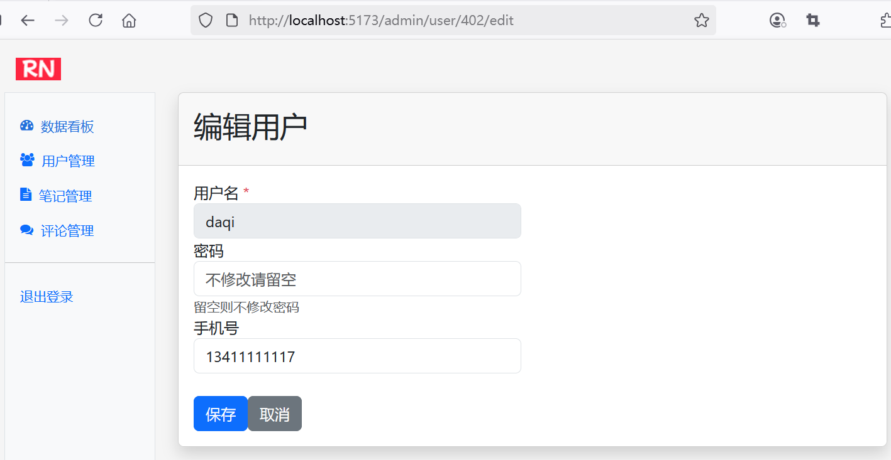

## 9.5 全栈实战用户管理编辑用户


### 后端编辑用户接口改造

AdminController编辑用户相关的接口调整如下。

```java
/**
 * 显示用户编辑界面
 */
@GetMapping("/user/{userId}/edit")
/*public String editUser(@PathVariable Long userId, Model model) {
    // 判定用户是否存在，不存在则抛出异常
    Optional<User> optionalUser = userService.findByUserId(userId);
    if (!optionalUser.isPresent()) {
        throw new UserNotFoundException("");
    }

    model.addAttribute("user", optionalUser.get());
    model.addAttribute("contentFragment", "admin-user-edit");

    return "admin";
}*/
public ResponseEntity<?> editUser(@PathVariable Long userId) {
    // 判定用户是否存在，不存在则抛出异常
    Optional<User> optionalUser = userService.findByUserId(userId);
    if (!optionalUser.isPresent()) {
        throw new UserNotFoundException("");
    }

    return ResponseEntity.ok(optionalUser.get());
}

/**
 * 处理保存用户的请求
 */
@PostMapping("/user")
/*public String updateUser(@ModelAttribute User user) {
    // 判定用户是否存在，不存在则抛出异常
    Optional<User> optionalUser = userService.findByUserId(user.getUserId());
    if (!optionalUser.isPresent()) {
        throw new UserNotFoundException("");
    }

    User oldUser = optionalUser.get();

    // 更新用户
    userService.updateUserByAdmin(oldUser, user);
    return "redirect:/admin/user";
}*/
public ResponseEntity<?> updateUser(@ModelAttribute User user) {
    // 判定用户是否存在，不存在则抛出异常
    Optional<User> optionalUser = userService.findByUserId(user.getUserId());
    if (!optionalUser.isPresent()) {
        throw new UserNotFoundException("");
    }

    User oldUser = optionalUser.get();

    // 更新用户
    userService.updateUserByAdmin(oldUser, user);
    return ResponseEntity.ok("更新成功");
}
```


### 前端编辑用户组件设计


修改`src\components\AdminUser.vue`：

```ts
import { useRouter } from 'vue-router';

const router = useRouter();


// 路由到编辑用户界面
function handleEdit(userId: number) {
  router.push({ path: `/admin/user/${userId}/edit` })
}

// ...为节约篇幅，此处省略非核心内容

<button class="btn btn-sm btn-light" @click="handleEdit(user.userId)">
  编辑
</button>
```


### 设置路由

设置`/admin/user/:userId/edit`路径，以便跳转到用户编辑界面：

```ts
const router = createRouter({
  history: createWebHistory(import.meta.env.BASE_URL),
  routes: [
    // ...为节约篇幅，此处省略非核心内容
    ,
    {
      path: '/admin',
      name: 'admin',
      component: () => import('../views/AdminView.vue'),
      meta: {
        requiresAuth: true,
        requiresRole: 'ADMIN'
      },
      children: [
        // ...为节约篇幅，此处省略非核心内容
        ,
        {
          path: 'user/:userId/edit',
          name: 'admin-user-edit',
          component: () => import('../components/AdminUserEdit.vue'),
        }
      ]
    }
  ],
})
```

### 新增AdminUserEdit.vue


新增`src\components\AdminUserEdit.vue`：


```ts
<script setup lang="ts">
import { User } from '@/dto/user';
import axios from '@/services/axios';
import { onMounted, ref } from 'vue';
import { useRouter, useRoute } from 'vue-router';


const formRef = ref<HTMLFormElement | null>(null);
const user = ref<User>(new User());
const router = useRouter();
const route = useRoute();

// 动态路由参数
const userId = ref(route.params.userId)

onMounted(() => {
  // 获取用户信息
  fetchUser()
});

// 获取用户信息
const fetchUser = async () => { 
  // 发送API请求
  try {
    // 使用axios发送请求到后端
    const response = await axios.get(`/api/admin/user/${userId.value}/edit`)
    user.value = response.data
  } catch (error) {
    console.error('用户更新失败:', error)
  }
};

// 取消编辑
function cancelEdit() {
  // 确认是否要取消
  if (confirm('确定要取消编辑吗？')) {
    router.back()
  }
}

// 保存用户信息
const handleEdit = async () => { 
  if (formRef.value) { 
    const formData = new FormData(formRef.value);

    // 发送API请求
    try {
      // 使用axios发送用户信息到后端
      await axios.post('/api/admin/user', formData)

      // 跳转
      router.push({ path: '/admin/user' })
    } catch (error) {
      console.error('用户更新失败:', error)
    }
  }
};

</script>
<template>
  <div class="card shadow mb-4">
    <div class="card-header py-3">
      <h2>编辑用户</h2>
    </div>
    <div class="card-body">
      <form ref="formRef">
        <!-- 隐藏用户ID -->
        <input type="hidden" name="userId" v-model="user.userId">

        <div class="row">
          <div class="col-lg-6">
            <!-- 用户名不可编辑 -->
            <div class="form-group">
              <label for="username">用户名 <span class="text-danger">*</span></label>
              <input type="text" class="form-control" id="username" name="username" v-model="user.username" disabled>
            </div>

            <!-- 密码 -->
            <div class="form-group">
              <label for="password">密码</label>
              <input type="password" class="form-control" id="password" name="password"
                placeholder="不修改请留空">
              <div class="small text-muted">留空则不修改密码</div>
            </div>

            <!-- 手机号 -->
            <div class="form-group">
              <label for="phone">手机号 <span class="text-danger">*</span></label>
              <input type="text" class="form-control" id="phone" name="phone" v-model="user.phone" placeholder="请输入手机号">
            </div>
          </div>
        </div>

        <!-- 操作按钮 -->
        <div class="mt-4">
          <button type="button" class="btn btn-primary mr-2" @click="handleEdit">保存</button>
          <button type="button" class="btn btn-secondary" @click="cancelEdit">取消
          </button>
        </div>
      </form>
    </div>
  </div>
</template>
```


### 运行调测

当管理员用户访问用户管理编辑页面`/admin/user/:userId/edit`时，可以看到界面效果如下图9-6所示。





