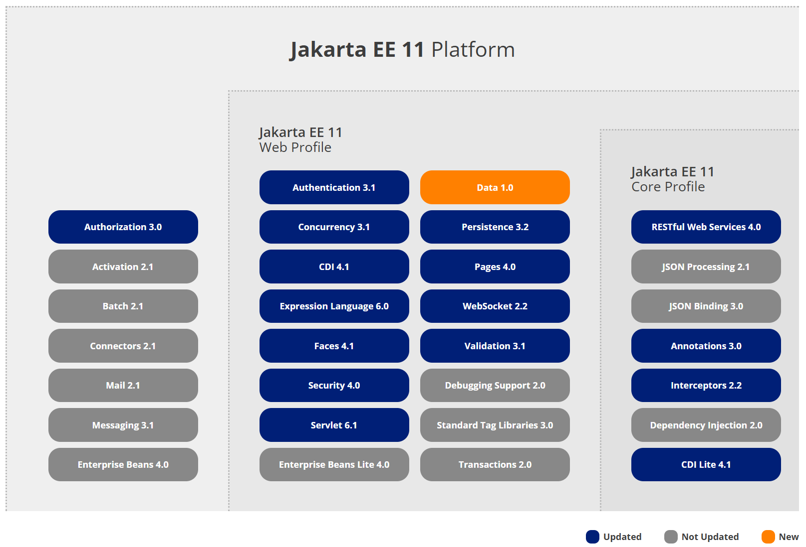

## 1.2 零基础开发者快速了解Spring与Java EE后端核心框架学习脉络

Spring 诞生之初是以 J2EE 的挑畔者身份而为广大 Java 开发者所熟知的。特别是当时 J2EE 平台中的 EJB（Enterprise Java Beans）标准，由于其设计本身的缺陷，导致在开发过程中使用非常复杂，代码侵入性很强。又由于 EJB 是依赖于容器的实现的，所以进行单元测试也变得极其困难，最终的后果是大多数开发者对 Java 企业级开发望而却步。

为此，Rod Johnson 为 Java 世界带来的 Spring。Spring 的目标就是要简化了 Java 企业级开发。
 

### Spring 与 Java EE 关系

早年，“Spring之父” Rod Johnson 对传统的 Java EE 系统框架臃肿、低效、脱离现实的种种现状提出了质疑，并积极寻求探索革新。在2002年，Rod Johnson 编著的《Expert One-on-One J2EE Design and Development》一书，可以说旗帜鲜明的指出了当时 Java EE 架构在实际开发中的种种弊端。

在该书中，Rod Johnson 表明了如下的观点：

* Java EE 不能包治百病。任何技术都不可能是“银弹”，即便是在当时来说，Java EE 已经是企业级开发的最好的选择了，但仍不能说 Java EE 可以解决任何问题。
* 小心“正统”的开发方式。特别是 Sun 公司所推崇的 Java EE 的开发方式，在实际开发中并不完全适用，甚至是在误导开发者。Rod Johnson 坦言，所谓“正统”的开发方式都是面向规范的，而不是面向实际要解决的问题。这必然就导致了像 EJB 这种复杂规范无法真实落地的情况。

Rod Johnson 正是洞察到了传统 Java EE 开发上的弊端，从而推出了 Spring 框架，致力于解决 Java EE 开发上的问题。

虽然，Spring 喊出了“Without EJB”（不需要 EJB）的口号，但本质上，它并非想要完全挑战整个 Java EE 平台。Spring 力图冲破 Java EE 传统开发的困境，从实际需求出发，着眼于构建轻便、灵巧，易于开发、测试和部署的轻量级开发框架。

Spring 在很大程度是为了置换当时以 EJB 为核心的 Java EE 开发方式。Rod Johnson 对 EJB 的各种笨重臃肿的结构进行了逐一的分析和否定，并分别以简洁实用的方式替换之。EJB 是一种复杂的技术，虽然很好地解决了一些问题，但在许多情况下却增加了比其商业价值更大的复杂性。

传统 Java EE 应用的开发效率是低下的，应用服务器厂商对各种技术的支持并没有真正统一，导致 Java EE 的应用没有真正实现“Write Once, Run Anywhere”（一次编写，各处运行）的承诺。Spring 作为开源的中间件，独立于各种应用服务器，甚至无须应用服务器的支持，也能提供应用服务器的功能，如声明式事务、事务处理等。

Spring 致力于 Java EE 应用的各层的解决方案，而不是仅仅专注于某一层的方案。可以说 Spring 是企业应用开发的“一站式”选择，并贯穿表现层、业务层及持久层。然而，Spring 并不想取代那些已有的框架，而是与它们无缝地整合。

虽然表面上看来，有些人会认为 Spring 和 Java EE 是竞争关系，实际上 Spring 是对 Java EE 改进和补充。Spring 本身也集成非常多的 Java EE 平台规范，诸如 Servlet API（JSR 340）、WebSocket API（JSR 356）、Concurrency Utilities（JSR 236）、JSON Binding API（JSR 367）、Bean Validation（JSR 303）、JPA（JSR 338）、JMS（JSR 914）、Dependency Injection（JSR 330）、Common Annotations（JSR 250）等。

简言之，Spring 的目标就是要简化了 Java EE 开发。现如今，Spring 俨然成为了 Java EE 的代名词，成为了构建 Java EE 应用的事实上标准。大多数 Java 项目会采用 Spring 作为框架的首选。

### Java EE 现状

1998年12月8日，Java 2 企业平台 J2EE 发布，正式进军企业级应用开发领域。

1999年6月，随着 Java 的快速发展，Sun 公司将 Java 分为了三个版本，即标准版（J2SE）、企业版（J2EE）和微型版（J2ME）。从版本的划分可以看出当时 Java 语言的野心，企图统治桌面应用、服务器端应用以及移动端应用。

Java EE 是一套用于开发企业级应用程序的 Java 平台标准，它包括了多种服务和API，例如 JDBC、JNDI、EJB、JPA、Servlet、JSP 等。在过去的几年中，Java EE 的发展受到了 Oracle 的管理和推动，但随着时间的推移，Oracle 开始寻求将 Java EE 转变为一个更开放的生态系统。

2017年10月：Oracle 宣布将 Java EE 移交给 Eclipse 基金会，并更名为 Jakarta EE。这一变更反映了 Java EE 向 Jakarta EE 的过渡，旨在建立一个更加开放和社区驱动的平台。

Jakarta EE：Jakarta EE 是 Java EE 的新名称，代表了其在 Eclipse 基金会下的新生命。Eclipse 基金会将继续负责 Jakarta EE 的开发和维护。

目前，Jakarta EE最新版本是Jakarta EE 11。下图是Jakarta EE 11平台架构图。

