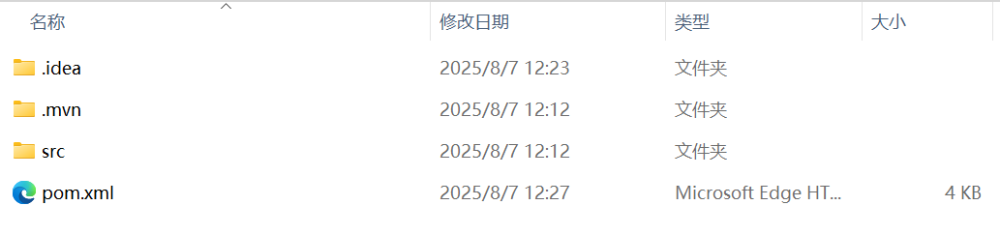
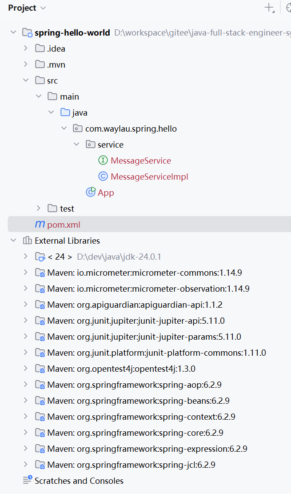
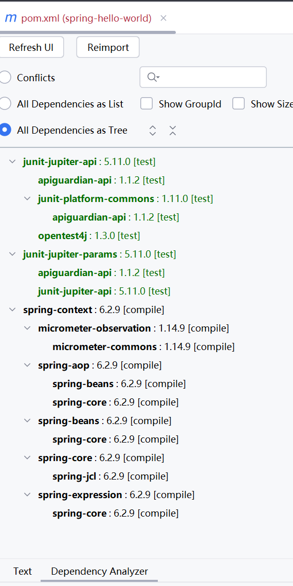

## 1.4 实战：快速开启第一个Spring项目


本章节，我们将要进入 Spring 实战部分了。从代码角度来实际看下 Spring 是如何运作的。

### 1.4.1 Hello World

依照编程惯例，我们的第一个 Spirng 应用是一个“Hello World”项目。从过执行该应用，能够输出“Hello World”字样。

Spring 框架包含许多不同的模块。在这个应用中，我们需要 Spring 提供核心功能的`spring-context` 模块。

不管你是否选择使用依赖管理工具，都需要确保`spring-context`模块的 jar 在你的应用的类路径下。

当然，为了方便管理依赖，建议读者选择 Maven 或者 Gradle 来管理项目。

### 1.4.2 使用 Maven

目前，在业界流行的项目管理方式是使用 Maven。执行命令行`mvn -v`确保您在您的电脑上已经安装了 Maven ：

```
>mvn -v

Apache Maven 3.9.9 (8e8579a9e76f7d015ee5ec7bfcdc97d260186937)
Maven home: D:\dev\java\apache-maven-3.9.9
Java version: 24.0.1, vendor: Oracle Corporation, runtime: D:\dev\java\jdk-24.0.1
Default locale: zh_CN, platform encoding: UTF-8
OS name: "windows 11", version: "10.0", arch: "amd64", family: "windows"
```


执行以下命令进行初始化项目原型：

```
mvn archetype:generate -DgroupId=com.waylau.spring.hello -DartifactId=spring-hello-world -DarchetypeArtifactId=maven-archetype-quickstart -DarchetypeVersion=1.5 -DinteractiveMode=false
```

此时会创建一个名为“spring-hello-world”的项目，目录结构如下。




将项目用IDEA打开，可以看到默认的pom.xml文件如下：


```xml
<?xml version="1.0" encoding="UTF-8"?>
<project xmlns="http://maven.apache.org/POM/4.0.0" xmlns:xsi="http://www.w3.org/2001/XMLSchema-instance"
  xsi:schemaLocation="http://maven.apache.org/POM/4.0.0 http://maven.apache.org/xsd/maven-4.0.0.xsd">
  <modelVersion>4.0.0</modelVersion>

  <groupId>com.waylau.spring.hello</groupId>
  <artifactId>spring-hello-world</artifactId>
  <version>1.0-SNAPSHOT</version>

  <name>spring-hello-world</name>
  <!-- FIXME change it to the project's website -->
  <url>http://www.example.com</url>

  <properties>
    <project.build.sourceEncoding>UTF-8</project.build.sourceEncoding>
    <maven.compiler.release>17</maven.compiler.release>
  </properties>

  <dependencyManagement>
    <dependencies>
      <dependency>
        <groupId>org.junit</groupId>
        <artifactId>junit-bom</artifactId>
        <version>5.11.0</version>
        <type>pom</type>
        <scope>import</scope>
      </dependency>
    </dependencies>
  </dependencyManagement>

  <dependencies>
    <dependency>
      <groupId>org.junit.jupiter</groupId>
      <artifactId>junit-jupiter-api</artifactId>
      <scope>test</scope>
    </dependency>
    <!-- Optionally: parameterized tests support -->
    <dependency>
      <groupId>org.junit.jupiter</groupId>
      <artifactId>junit-jupiter-params</artifactId>
      <scope>test</scope>
    </dependency>
  </dependencies>

  <build>
    <pluginManagement><!-- lock down plugins versions to avoid using Maven defaults (may be moved to parent pom) -->
      <plugins>
        <!-- clean lifecycle, see https://maven.apache.org/ref/current/maven-core/lifecycles.html#clean_Lifecycle -->
        <plugin>
          <artifactId>maven-clean-plugin</artifactId>
          <version>3.4.0</version>
        </plugin>
        <!-- default lifecycle, jar packaging: see https://maven.apache.org/ref/current/maven-core/default-bindings.html#Plugin_bindings_for_jar_packaging -->
        <plugin>
          <artifactId>maven-resources-plugin</artifactId>
          <version>3.3.1</version>
        </plugin>
        <plugin>
          <artifactId>maven-compiler-plugin</artifactId>
          <version>3.13.0</version>
        </plugin>
        <plugin>
          <artifactId>maven-surefire-plugin</artifactId>
          <version>3.3.0</version>
        </plugin>
        <plugin>
          <artifactId>maven-jar-plugin</artifactId>
          <version>3.4.2</version>
        </plugin>
        <plugin>
          <artifactId>maven-install-plugin</artifactId>
          <version>3.1.2</version>
        </plugin>
        <plugin>
          <artifactId>maven-deploy-plugin</artifactId>
          <version>3.1.2</version>
        </plugin>
        <!-- site lifecycle, see https://maven.apache.org/ref/current/maven-core/lifecycles.html#site_Lifecycle -->
        <plugin>
          <artifactId>maven-site-plugin</artifactId>
          <version>3.12.1</version>
        </plugin>
        <plugin>
          <artifactId>maven-project-info-reports-plugin</artifactId>
          <version>3.6.1</version>
        </plugin>
      </plugins>
    </pluginManagement>
  </build>
</project>
```

可以对pom.xml文件进行按需配置。比如，我们需要将`spring-context`模块引入我们的应用，就在pom.xml文件中添加如下的 Maven 配置片段：

```xml
<dependencies>
    <dependency>
        <groupId>org.springframework</groupId>
        <artifactId>spring-context</artifactId>
        <version>6.2.9</version>
    </dependency>
    <!-- ...为节约篇幅，此处省略非核心内容 -->
</dependencies>
```


添加了`spring-context`模块之后，能够在工程里面看到如下图1-3所示的依赖包：



图1-3 spring-context 的依赖包

也许读者会有这样的疑问，为什么只添加了`spring-context`依赖包，却会多出这么多的其他 jar 包？这就是 jar 包的依赖关系。`spring-context`包本身会依赖其他 jar，比如  
`spring-aop`、`spring-beans`、`spring-core`、`spring-expression`、`spring-jcl`五个依赖。而这五个依赖自身又会有其他的依赖，最终就会产生依赖树。这就是 Maven 的依赖管理机制。


图1-4 展示了在 IDEA 工具下所分析出的`spring-context`包的依赖树。




### 1.4.3 创建服务类

在实际的开发过程中，开发组往往会推崇“面向接口编程”的方式。“Hello World”项目虽然是一个非常小的应用，但仍然可以从一开始就采用规范的编码习惯。

我们首先定义了一个消息服务接口 MessageService。该接口的主要职责是打印消息。

```java
package com.waylau.spring.hello.service;

/**
 * MessageService 消息服务 
 * 
 * @author <a href="https://waylau.com">Way Lau</a>
 * @version 2025/08/07
**/
public interface MessageService {
    String getMessage();
}
```

接着，我们创建消息服务类接口的实现 MessageServiceImpl，来返回我们真实的想要的业务消息。

```java
package com.waylau.spring.hello.service;

import org.springframework.stereotype.Service;

/**
 * MessageServiceImpl 消息服务 
 * 
 * @author <a href="https://waylau.com">Way Lau</a>
 * @version 2025/08/07
**/
@Service
public class MessageServiceImpl implements MessageService {

    @Override
    public String getMessage() {
        return "Hello World!";
    }
}
```

其中，`@Service`注解声明这个 MessageServiceImpl 是一个 Spring bean。

### 1.4.4 创建打印器

消息服务完成之后，我们创建了一个打印器 MessagePrinter，用于打印消息。

```java
package com.waylau.spring.hello;

import com.waylau.spring.hello.service.MessageService;
import org.springframework.beans.factory.annotation.Autowired;
import org.springframework.stereotype.Component;

/**
 * MessagePrinter 打印器
 *
 * @author <a href="https://waylau.com">Way Lau</a>
 * @version 2025/08/08
 **/
@Component
public class MessagePrinter {
    final private MessageService service;

    @Autowired
    public MessagePrinter(MessageService service) {
        this.service = service;
    }

    public void printMessage() {
        String message = this.service.getMessage();
        System.out.println(message);
    }
}
```

我们期望，在执行 printMessage 方法之后就能将消息内容打印出来。而消息内容，是依赖于 MessageService 来提供的。这里，我们通过`@Autowired`注解，来将 MessageService 自动注入。

其中，`@Component`的作用是和`@Service`注解一样的，都是为了声明这个类是一个 Spring bean。

### 1.4.5 创建应用主类

好了，打印器也已经完成了，那么由谁来执行这个打印器呢？此时，我们需要有一个应用的入口类。

```java
package com.waylau.spring.hello;

import org.springframework.context.ApplicationContext;
import org.springframework.context.annotation.AnnotationConfigApplicationContext;
import org.springframework.context.annotation.ComponentScan;

/**
 * Hello world!
 */
@ComponentScan
public class App {
    public static void main(String[] args) {
        ApplicationContext context =
                new AnnotationConfigApplicationContext(App.class);
        MessagePrinter printer = context.getBean(MessagePrinter.class);
        printer.printMessage();
    }
}
```

App 是一个典型的 Java 应用类，其中 main 方法就是应用执行的入口。上面的例子显示了依赖注入的基本概念，Spring 管理了所有的 bean 的实例化，MessagePrinter 无需通过 new 来实例化，而是直接从 Spring 容器中取出来的就能用了。AnnotationConfigApplicationContext 类是 Spring 上下文的其中一种实现，实现了基于 Java 配置类的加载，主要用于管理 Spring bean。

App 上的`@ComponentScan`注解非常重要。`@ComponentScan`会自动扫描指定包下的全部标有`@Component`的类，并注册成 bean，当然也包括`@Component`下的子注解`@Service`、`@Repository`、`@Controller` 等。这些 bean 一般是结合`@Autowired`构造函数来注入。

### 1.4.6 运行

运行 App 类，就能在控制台看到“Hello World!”字样的消息了。


