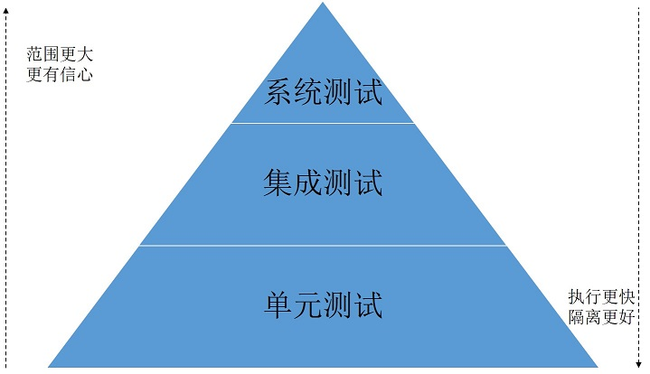

## 3.1 全栈测试战略：单元测试到集成测试筑起后端质量防线

在当今的互联网开发模式中，虽然传统的测试的角色已经发生了巨大的变革，但就其测试工作而言，其本质并未改变，其目的都是为了检验软件系统是否满足需求，以及检测软件中是否存在bug。下面，我们就对常用的测试方案做下下探讨。

###  3.1.1 测试类型

下图展示的是一个通用性的测试金字塔。

在这个测试金字塔中，从底向上，形象地将测试分为了不同的类型。

#### 1. 单元测试

单元测试是在软件开发过程中要进行的最低级别的测试活动，软件的独立单元将在与程序的其他部分相隔离的情况下进行测试。

单元测试的范围局限在服务内部，它是围绕着一组相关联的案例编写的。比如，在C语言中，单元通常是指一个函数；在 Java 等面向对象的编程语言中，单元通常是指一个类。所谓的单元，就是指人为规定的最小的被测功能模块。因为测试范围小，所以执行速度很快。

单元测试用例往往由编写模块的开发人员自己来编写。在 TDD（Test-Driven Development，测试驱动开发）的开发实践中，开发人员在开发功能代码之前，就需要先编写单元测试用例代码，测试代码确定了需要编写什么样的产品代码。TDD 在敏捷开发中被广泛采用。

单元测试往往可以通过xUnit等框架来自动化进行测试。比如，Java 平台中，JUnit 测试框架（<http://junit.org/>）已然是用于单元测试的事实上的标准。

#### 2. 集成测试

集成测试主要用于测试各个模块能否正确交互，并测试其作为子系统的交互性以查看接口是否存在缺陷。

集成测试的目的在于，通过集成模块检查路径畅通与否，来确认模块与外部组件的交互情况。集成测试可以结合 CI（持续集成）的实践，来快速能找到外部组件间的逻辑回归与断裂，从而有助于评估各个单独模块中所含逻辑的正确性。

集成测试按照不同的项目类型，有时也细分为组件测试、契约测试等。比如在微服务架构中，微服务中的组件测试，是使用测试替代与内部API端点，通过替换外部协作的组件，来实现对各个组件的独立测试。组件测试提通过尽量减少可移动部件来降低整体构件的复杂性。组件测试也能确认微服务的网络配置是否正确，以及是否能够对网络请求进行处理。
而契约测试会测试外部服务的边界，以查看服务调用的输入/输出，并测试该服务能否符合契约预期。

#### 3. 系统测试

系统测试是用于测试集成系统运行的完整性，这里面涉及应用系统的前端界面和后台数据存储。该测试可能会涉及到外部依赖资源，比如数据库、文件系统、网络服务等。系统测试在一些面向服务的系统架构中被称为“端到端测试”。因此在微服务测试方案中，端到端测试占据了重要的角色。在微服务架构中有一些执行相同行为的可移动部件，端到端测试时需要找出覆盖缺口，并确保在架构重构时业务功能不会受到影响。

由于系统测试是面向整个完整系统来进行测试，所以测试的涉及面将更广，所需要测试时间也更加长。

###  3.1.2 测试范围

不同的测试类型，其对应的测试范围也是不同的。单元测试所需要的测试范围最小，意味着其隔离性更好，同时也能在最快时间内得到测试的结果。单元测试有助于及早发现程序的缺陷，降低修复的成本。系统测试涉及的测试范围最广，所需要的测试时间也最长。如果在系统测试阶段发现缺陷，则修复该缺陷的成本自然也就越高。

在 Google 公司，对于测试的类型和范围，一般按照规模划分为小型测试、中型测试、大型测试，其实就是我们平常理解的单元测试、集成测试、系统测试。

* **小型测试**：小型测试是为了验证一个代码单元的功能，一般与运行环境隔离。小型测试是所有测试类型的范畴最小的。在预设的范畴内，小型测试可以提供更加全面的底层代码覆盖率。小型测试里，外部的服务，比如文件系统、网络、数据库等等，必须通过 mock 或者 fake 来实现。这样可以减少被测试类所需要的依赖。
小型测试的可以拥有更加频繁的执行频率，并且可以很快发现问题并修复问题。
* **中型测试**：中型测试主要是用于验证多个模块之间的交互是否正常。一般情况下，在 Google 由 SET 来执行中型测试。对于中型测试，推荐使用 mock 来解决外部服务的依赖问题。有时处于性能考虑，在不能使用mock的场景下，也可以使用轻量级的 fake。
* **大型测试**：大型测试是在一个较高的层次上运行，以验证系统作为一个整体是否工作正常。

###  3.1.3 测试比例

每种测试类型都有其优缺点，特别是系统测试，涉及的范围最广，花费的时间成本也最高。所以在实际的测试过程中，要合理安排各种测试类型的测试比例。正如测试金字塔所展示的，越是底层，所需要的测试数量将会越大。那么每种测试类型的需要占用多大的比例呢？实际上，这里并没有一个具体的数字，按照经验来说，顺着金字塔从上往下，下面一层的测试数量要比上面一层的测试数量多出一个数量级。

当然，这种比例也并非固定不变的。如果当前的测试比例存在问题，那么就要及时尝试调整不同类型的测试比例，以符合自己项目的实际情况。

