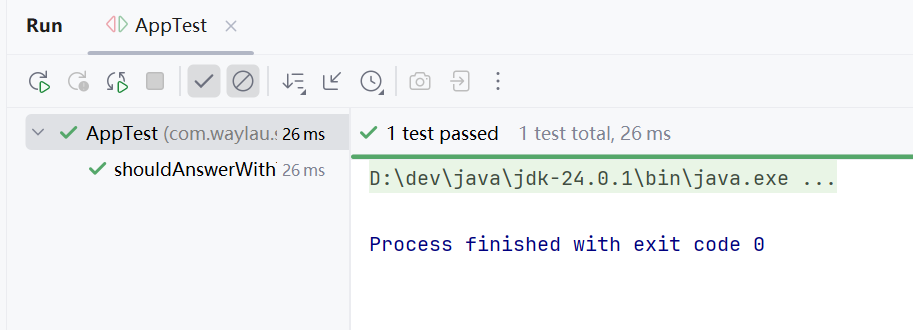

## 3.4 实战：快速编写Spring项目的测试类


本节演示如何快速编写Spring项目的测试类。


### 初始化项目原型


执行以下命令进行初始化项目原型：

```
mvn archetype:generate -DgroupId=com.waylau.spring.test -DartifactId=spring-integration-test -DarchetypeArtifactId=maven-archetype-quickstart -DarchetypeVersion=1.5 -DinteractiveMode=false
```

此时会创建一个名为“spring-integration-test”的项目。

我们需要将`spring-context`、`spring-test`模块引入我们的应用，就在pom.xml文件中添加如下的 Maven 配置片段：

```xml
<dependencyManagement>
  <dependencies>
    <dependency>
      <groupId>org.springframework</groupId>
      <artifactId>spring-framework-bom</artifactId>
      <version>6.2.9</version>
      <type>pom</type>
      <scope>import</scope>
    </dependency>

    <!-- ...为节约篇幅，此处省略非核心内容 -->
  </dependencies>
</dependencyManagement>

<dependencies>
    <dependency>
        <groupId>org.springframework</groupId>
        <artifactId>spring-context</artifactId>
    </dependency>
    <dependency>
        <groupId>org.springframework</groupId>
        <artifactId>spring-test</artifactId>
            <scope>test</scope>
    </dependency>
    <!-- ...为节约篇幅，此处省略非核心内容 -->
</dependencies>
```


### 创建服务类


我们首先定义了一个消息服务接口 MessageService。该接口的主要职责是打印消息。

```java
package com.waylau.spring.test.service;

/**
 * MessageService 消息服务 
 * 
 * @author <a href="https://waylau.com">Way Lau</a>
 * @version 2025/08/07
 */
public interface MessageService {
    String getMessage();
}
```

接着，我们创建消息服务类接口的实现 MessageServiceImpl，来返回我们真实的想要的业务消息。

```java
package com.waylau.spring.test.service;

import org.springframework.stereotype.Service;

/**
 * MessageServiceImpl 消息服务 
 * 
 * @author <a href="https://waylau.com">Way Lau</a>
 * @version 2025/08/07
**/
@Service
public class MessageServiceImpl implements MessageService {

    @Override
    public String getMessage() {
        return "Hello World!";
    }
}
```

其中，`@Service`注解声明这个 MessageServiceImpl 是一个 Spring bean。


### 1.4.5 创建应用主类

我们需要有一个应用的入口类。

```java
package com.waylau.spring.test;

import org.springframework.context.annotation.ComponentScan;

/**
 * Hello world 测试例子
 */
@ComponentScan
public class App {
    public static void main(String[] args) {
    }
}
```


App 上的`@ComponentScan`注解非常重要。`@ComponentScan`会自动扫描指定包下的全部标有`@Component`的类及其子注解，并注册成 bean。


### 创建测试类


在test目录下，创建针对MessageService的测试类。

```java
package com.waylau.spring.test.service;

import com.waylau.spring.test.App;
import org.junit.jupiter.api.Test;
import org.junit.jupiter.api.extension.ExtendWith;
import org.springframework.beans.factory.annotation.Autowired;
import org.springframework.test.context.ContextConfiguration;
import org.springframework.test.context.junit.jupiter.SpringExtension;

import static org.junit.jupiter.api.Assertions.assertEquals;

/**
 * MessageServiceTest MessageService test
 *
 * @author <a href="https://waylau.com">Way Lau</a>
 * @version 2025/08/09
 **/
@ExtendWith(SpringExtension.class)
@ContextConfiguration(classes = App.class)
public class MessageServiceTest {

    @Autowired
    private MessageService service;

    @Test
    void testGetMessage() {
        assertEquals("Hello World!", service.getMessage());
    }

}
```


显示如下面图片所示的绿色标识，则证明测试通过。

