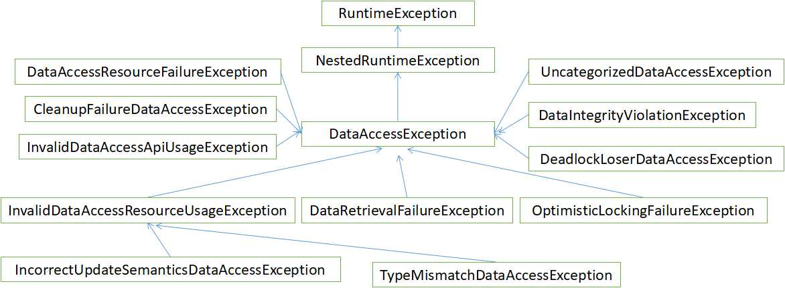

## 4.2 快速掌握DAO模式下基于JDBC的数据访问

JDBC（Java Data Base Connectivity）是一种用于执行SQL语句的 Java API，可以为多种关系型数据库提供统一访问，它由一组用 Java 语言编写的类和接口组成。JDBC 提供了一种基准，据此可以构建更高级的工具和接口，使数据库开发人员能够编写数据库应用程序。

但是，在 Java 企业级应用中，使用底层的 JDBC API 来编写程序还是显得过于繁琐，比如，需要写很多的样板代码带来打开和关闭数据库连接，需要处理很多的异常等等。

针对上述问题，Spring JDBC 框架对底层的 JDBC API 进行了封装，负责所有的低层细节，包括如何开始打开连接，准备和执行SQL语句，处理异常，处理事务，到最后关闭连接等等。所以，使用 Spring JDBC 开发人员需要做的仅仅是定义连接参数，指定要执行的 SQL 语句，从而可以从繁琐的 JDBC API 中解放出来，专注于自己的业务。

### DAO 常用异常类

Spring 将特定于技术的异常（如 SQLException），统一转换为其自己的异常类层次结构，并将 DataAccessException 作为根异常以方便转换。这些异常包装了原始异常，因此不会丢失原始异常的出错信息。

除了 JDBC 异常外，Spring 还可以封装 Hibernate 特定的异常，将它们转换为一组专注的运行时异常（对于 JPA 异常也是如此）。这使得开发过程变得简便了，因为无需在 DAO 中编写繁琐的 `catch-and-throw` 代码块和异常声明。同时，JDBC 异常（包括特定于数据库的方言）由于已经转换为相同的层次结构，这意味着可以在一致的编程模型中使用 JDBC 的执行操作。

以上列举的 Spring 的各种模板类支持各种 ORM 框架。如果使用基于拦截器的类，那么我们的程序必须关心并处理 HibernateExceptions 和 PersistenceExceptions 本身，最好是通过分别授权给 SessionFactoryUtils 的 `convertHibernateAccessException(..)` 或 `convertJpaAccessException()` 方法。这些方法将这些异常转化为与 `org.springframework.dao` 中异常层级兼容的异常。由于 PersistenceExceptions 没有被检查，它可以被简单的抛出，这也牺牲了 DAO 在异常上的抽象。

下图4-1展示了 Spring DAO 提供的异常层:

### 不同的 JDBC 访问方式

Spring JDBC 提供了几种方法，以运用不同类与数据库的接口。除了三种风格的 JdbcTemplate 之外，新的 SimpleJdbcInsert 和 SimpleJdbcCall 这两个类通过利用 JDBC 驱动提供的数据库元数据来简化 JDBC 操作，而 RDBMS Object 样式采用了更类似于 JDO Query 设计的面向对象的方法。

#### JdbcTemplate

JdbcTemplate 是最经典的 Spring JDBC 方法。这是一种最底层的方法，其他方法内部都借助于 JdbcTemplate 来完成。

#### NamedParameterJdbcTemplate

NamedParameterJdbcTemplate 封装了 JdbcTemplate 以提供命名参数，而不是传统的 JDBC “?”占位符。当一个 SQL 语句有多个参数时，这种方法提供了更好的可读性和易用性。

#### SimpleJdbcInsert 和 SimpleJdbcCall

SimpleJdbcInsert 和 SimpleJdbcCall 优化数据库元数据，以限制必要配置的数量。这种方法简化了编码，只需要提供表或过程的名称，并提供与列名匹配的参数映射。这仅在数据库提供足够的元数据时有效。如果数据库不提供此元数据，则必须提供参数的显式配置。

#### RDBMS Object

RDBMS Object 包括 MappingSqlQuery、SqlUpdate 和 StoredProcedure，需要你在数据访问层初始化期间建立可重用的并且是线程安全的对象。此方法在 JDO Query 之后建模，你可以在其中定义查询字符串，声明参数并编译查询。一旦这样做了，执行方法可以多次调用传入的各种参数值。
