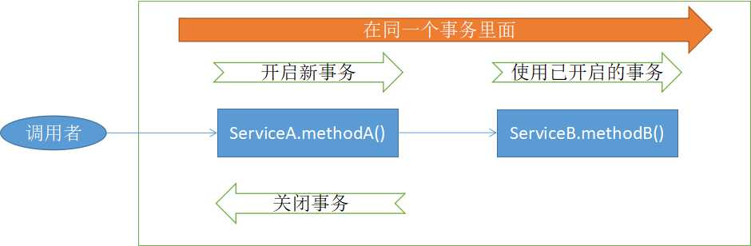
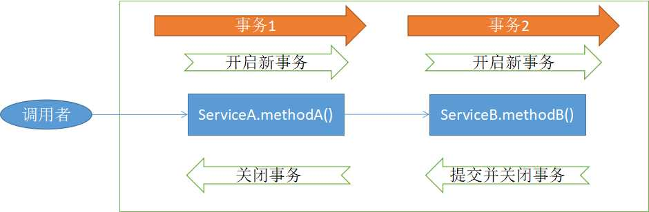
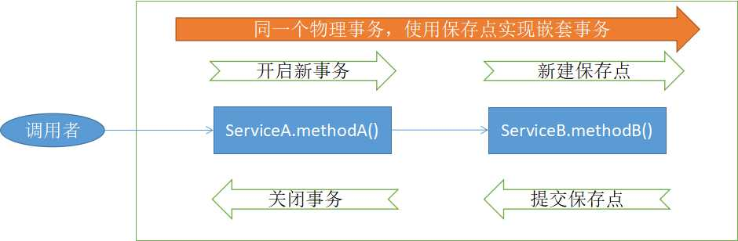

## 5.4 掌握事务传播机制

本节详细介绍了 Spring 事务传播机制。Spring 的事务传播机制类型定义在了 Propagation 枚举类中：

```java
public enum Propagation {

	REQUIRED(TransactionDefinition.PROPAGATION_REQUIRED),

	SUPPORTS(TransactionDefinition.PROPAGATION_SUPPORTS),

	MANDATORY(TransactionDefinition.PROPAGATION_MANDATORY),

	REQUIRES_NEW(TransactionDefinition.PROPAGATION_REQUIRES_NEW),

	NOT_SUPPORTED(TransactionDefinition.PROPAGATION_NOT_SUPPORTED),

	NEVER(TransactionDefinition.PROPAGATION_NEVER),
 
	NESTED(TransactionDefinition.PROPAGATION_NESTED);

    // ...
}
```

下面，主要对常用的 PROPAGATION_REQUIRED、PROPAGATION_REQUIRES_NEW、PROPAGATION_NESTED 做详解的介绍。

#### PROPAGATION_REQUIRED

PROPAGATION_REQUIRED 表示，加入当前正要执行的事务不在另外一个事务里，那么就起一个新的事务。

比如说，ServiceB.methodB 的事务级别定义为 PROPAGATION_REQUIRED, 那么由于执行 ServiceA.methodA 的时候， ServiceA.methodA 已经起了事务，这时调用ServiceB.methodB，ServiceB.methodB 看到自己已经运行在 ServiceA.methodA 的事务内部，就不再起新的事务。而假如 ServiceA.methodA 运行的时候发现自己没有在事务中，他就会为自己分配一个事务。

这样，在 ServiceA.methodA 或者在 ServiceB.methodB 内的任何地方出现异常，事务都会被回滚。即使 ServiceB.methodB 的事务已经被提交，但是 ServiceA.methodA 在接下来异常了要回滚，那么 ServiceB.methodB 也会回滚。

图5-2 展示了 PROPAGATION_REQUIRED 类型的事务处理流程。





#### PROPAGATION_REQUIRES_NEW

比如我们设计 ServiceA.methodA 的事务级别为 PROPAGATION_REQUIRED，ServiceB.methodB 的事务级别为 PROPAGATION_REQUIRES_NEW，那么当执行到 ServiceB.methodB 的时候，ServiceA.methodA 所在的事务就会挂起，ServiceB.methodB 会起一个新的事务。等 ServiceB.methodB 的事务完成以后，ServiceA.methodA 才继续执行。他与PROPAGATION_REQUIRED 的事务区别在于事务的回滚程度了。因为 ServiceB.methodB 是新起一个事务，那么就是存在两个不同的事务。如果 ServiceB.methodB 已经提交，那么ServiceA.methodA 失败回滚，ServiceB.methodB 是不会回滚的。如果 ServiceB.methodB 失败回滚，如果他抛出的异常被 ServiceA.methodA 捕获，ServiceA.methodA 事务仍然可能提交。


图5-3 展示了 PROPAGATION_REQUIRES_NEW 类型的事务处理流程。





#### PROPAGATION_NESTED

PROPAGATION_NESTED 使用具有可回滚到的多个保存点的单个物理事务。PROPAGATION_NESTED 与 PROPAGATION_REQUIRES_NEW 的区别是，PROPAGATION_REQUIRES_NEW 另起一个事务，将会与他的父事务相互独立，而 PROPAGATION_NESTED 的事务和他的父事务是相依的，他的提交是要等和他的父事务一块提交的。也就是说，如果父事务最后回滚，他也要回滚的。如果
子事务回滚或提交不会导致父事务回滚或提交，但父事务回滚将导致子事务回滚。


图5-4 展示了 PROPAGATION_NESTED 类型的事务处理流程。





