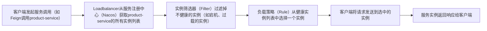

# 5.1 Spring Cloud Loadbalancer解决负载均衡的核心痛点


在微服务架构中，单个服务通常会部署多个实例以应对高并发和故障冗余，而**负载均衡**是将请求合理分发到多个服务实例的核心机制。Spring Cloud Loadbalancer是Spring Cloud官方推出的新一代负载均衡器，替代了已停更的Ribbon，成为Spring Cloud生态中默认的负载均衡组件，它轻量、可扩展、适配云原生环境，是企业级微服务架构实现负载均衡的首选方案。

## 一、负载均衡的核心痛点与Spring Cloud Loadbalancer的定位
### 1. 微服务中负载均衡的核心痛点
微服务架构下，服务实例的IP/端口会随动态扩缩容、故障重启频繁变化，若没有负载均衡机制，会面临以下问题：
- **请求集中**：所有请求都发送到单个服务实例，导致实例过载宕机，其他实例却闲置。
- **故障无法隔离**：某个服务实例故障后，请求仍被转发到该实例，导致请求失败。
- **无法适配动态场景**：无法感知服务实例的新增、下线，需手动修改配置才能切换实例。
- **负载策略单一**：仅支持简单的轮询，无法根据实例的负载情况（如CPU、内存使用率）智能分发请求。

### 2. Spring Cloud Loadbalancer的核心定位
Spring Cloud Loadbalancer是**Spring Cloud生态的核心负载均衡组件**，它与Spring Cloud服务发现（Nacos/Eureka/Consul）无缝整合，提供**客户端负载均衡**能力，核心定位是：
> 为微服务间的调用（如OpenFeign、RestTemplate）提供动态的、可扩展的负载均衡能力，自动感知服务实例的变化，将请求分发到健康的实例上，提升系统的可用性和性能。

### 3. Spring Cloud Loadbalancer的核心优势（对比Ribbon）
| 特性                | Ribbon（已停更）| Spring Cloud Loadbalancer                |
|---------------------|---------------------------------------|------------------------------------------|
| 维护状态            | 停止维护，存在安全漏洞                | 持续迭代，适配Spring Cloud新版本（如3.x） |
| 轻量性              | 依赖多，体积大                        | 轻量，核心依赖少，启动速度快              |
| 扩展性              | 扩展需继承复杂的抽象类，成本高        | 基于SPI机制，扩展简单，支持自定义负载策略  |
| 云原生适配          | 对云原生（K8s）支持有限               | 原生支持云原生环境，可整合K8s服务发现     |
| 反应式编程支持      | 不支持Reactor响应式编程               | 支持Reactor响应式编程，适配WebFlux        |
| 负载策略            | 内置策略少（轮询、随机）| 内置多种策略，且支持自定义                |

## 二、负载均衡的两种模式：理解客户端负载均衡的核心
在介绍Spring Cloud Loadbalancer之前，需先明确负载均衡的两种核心模式，这是理解其工作原理的基础：

### 1. 服务端负载均衡（如Nginx）
- **工作方式**：负载均衡器部署在服务前端，所有请求先发送到负载均衡器，由负载均衡器根据服务实例列表将请求转发到具体实例。
- **特点**：集中式管理，适合网关层的负载均衡，但无法感知服务实例的内部负载情况，且负载均衡器本身可能成为瓶颈。

### 2. 客户端负载均衡（如Spring Cloud Loadbalancer）
- **工作方式**：负载均衡逻辑嵌入在调用方（客户端）中，客户端从服务注册中心获取服务实例列表，自行决定将请求发送到哪个实例。
- **特点**：分布式部署，无单点瓶颈，客户端可直接感知服务实例的健康状态和负载情况，适配微服务的动态场景。
- **Spring Cloud Loadbalancer的核心模式**：**客户端负载均衡**，也是微服务架构中最常用的负载均衡模式。

## 三、Spring Cloud Loadbalancer核心原理：从实例获取到请求分发
Spring Cloud Loadbalancer的工作流程可分为**实例获取、实例筛选、负载选择、请求分发**四个核心步骤，整体逻辑如下：


### 1. 核心步骤详解
#### （1）实例获取：与服务发现整合
Spring Cloud Loadbalancer会自动与Spring Cloud服务发现组件（如Nacos、Eureka）整合，通过**ServiceInstanceListSupplier**接口从注册中心获取服务的所有实例列表（包含IP、端口、元数据、健康状态等信息）。
- 例如：调用`product-service`时，Loadbalancer会从Nacos获取该服务的实例列表：`192.168.1.100:8081`、`192.168.1.101:8081`、`192.168.1.102:8081`。
- 关键特性：**实时更新**，当服务实例新增、下线或状态变化时，实例列表会自动刷新，无需手动干预。

#### （2）实例筛选：过滤不健康实例
Loadbalancer通过**LoadBalancerClientFilter**等筛选器，过滤掉不符合条件的实例，只保留健康的实例：
- **默认筛选规则**：过滤掉处于下线状态、端口不可用的实例。
- **自定义筛选**：可扩展筛选器，例如过滤掉CPU使用率超过80%的实例、过滤掉非指定版本的实例（如只保留`version=v2`的实例）。

#### （3）负载选择：选择目标实例
Loadbalancer通过**负载策略（Rule）** 从健康实例列表中选择一个实例，这是负载均衡的核心环节：
- **内置负载策略**：
  1. **RoundRobinLoadBalancer（轮询策略）**：默认策略，按顺序依次选择实例（如100→101→102→100…），实现请求的均匀分发。
  2. **RandomLoadBalancer（随机策略）**：随机选择一个实例，适合实例性能相近的场景。
  3. **WeightedRandomLoadBalancer（加权随机策略）**：根据实例的权重随机选择，权重高的实例被选中的概率大（可通过实例元数据设置权重）。
- **自定义负载策略**：可实现`ReactorServiceInstanceLoadBalancer`接口，开发自定义策略（如根据实例的响应时间、CPU使用率选择实例）。

#### （4）请求分发：发送请求到目标实例
客户端（如OpenFeign、RestTemplate）将请求发送到选中的实例，完成负载均衡的最后一步。

## 四、Spring Cloud Loadbalancer快速上手：两种集成方式
Spring Cloud Loadbalancer与Spring Cloud生态无缝整合，主要有两种集成方式：**RestTemplate + Loadbalancer**、**OpenFeign + Loadbalancer**，以下以Spring Cloud Alibaba + Nacos为例演示快速上手流程。

### 前置条件
1. 已搭建Nacos服务注册中心（本地地址：`127.0.0.1:8848`）。
2. 已创建Spring Boot项目（如`order-service`），并接入Nacos服务发现。

### 步骤1：引入Spring Cloud Loadbalancer依赖
在`pom.xml`中引入依赖（Spring Cloud 2020+版本后，OpenFeign默认依赖Loadbalancer，但若使用RestTemplate，需显式引入）：
```xml
<!-- Spring Cloud Loadbalancer 核心依赖 -->
<dependency>
    <groupId>org.springframework.cloud</groupId>
    <artifactId>spring-cloud-starter-loadbalancer</artifactId>
</dependency>

<!-- 若使用Nacos服务发现，需引入以下依赖 -->
<dependency>
    <groupId>com.alibaba.cloud</groupId>
    <artifactId>spring-cloud-starter-alibaba-nacos-discovery</artifactId>
</dependency>
```

### 方式1：RestTemplate整合Loadbalancer
通过`@LoadBalanced`注解为RestTemplate添加负载均衡能力：
```java
import org.springframework.cloud.client.loadbalancer.LoadBalanced;
import org.springframework.context.annotation.Bean;
import org.springframework.context.annotation.Configuration;
import org.springframework.web.client.RestTemplate;

@Configuration
public class RestTemplateConfig {

    @Bean
    @LoadBalanced // 开启负载均衡能力
    public RestTemplate restTemplate() {
        return new RestTemplate();
    }
}
```

在业务代码中使用RestTemplate调用服务（直接使用服务名，而非IP:端口）：
```java
import org.springframework.beans.factory.annotation.Autowired;
import org.springframework.web.bind.annotation.GetMapping;
import org.springframework.web.bind.annotation.RestController;
import org.springframework.web.client.RestTemplate;

@RestController
public class OrderController {

    @Autowired
    private RestTemplate restTemplate;

    @GetMapping("/order/callProduct")
    public String callProductService() {
        // 直接使用服务名（product-service），Loadbalancer会自动解析为具体的实例地址
        String url = "http://product-service/api/product/1";
        return restTemplate.getForObject(url, String.class);
    }
}
```

### 方式2：OpenFeign整合Loadbalancer
OpenFeign默认整合Spring Cloud Loadbalancer，无需额外配置，只需定义Feign接口即可自动实现负载均衡：
```java
import org.springframework.cloud.openfeign.FeignClient;
import org.springframework.web.bind.annotation.GetMapping;
import org.springframework.web.bind.annotation.PathVariable;

@FeignClient(name = "product-service") // 服务名
public interface ProductFeignClient {

    @GetMapping("/api/product/{id}")
    String getProductById(@PathVariable("id") Long id);
}
```

在业务代码中注入Feign接口调用，Loadbalancer会自动为其提供负载均衡能力：
```java
import org.springframework.beans.factory.annotation.Autowired;
import org.springframework.web.bind.annotation.GetMapping;
import org.springframework.web.bind.annotation.PathVariable;
import org.springframework.web.bind.annotation.RestController;

@RestController
public class OrderController {

    @Autowired
    private ProductFeignClient productFeignClient;

    @GetMapping("/order/getProduct/{id}")
    public String getProduct(@PathVariable Long id) {
        // Feign调用会自动通过Loadbalancer选择实例
        return productFeignClient.getProductById(id);
    }
}
```

### 测试验证
1. 启动多个`product-service`实例（如端口8081、8082、8083），并注册到Nacos。
2. 访问`order-service`的接口，可看到请求被依次分发到不同的`product-service`实例（轮询策略），实现了负载均衡。

## 五、企业级配置：自定义负载策略与高级特性
快速上手后，需通过自定义配置实现企业级的负载均衡需求，以下是核心配置策略。

### 1. 自定义负载策略（以加权轮询为例）
Spring Cloud Loadbalancer支持自定义负载策略，以下实现**加权轮询策略**（根据实例权重分发请求，权重高的实例接收更多请求）：

#### 步骤1：定义实例权重（通过Nacos元数据设置）
在`product-service`的`application.yml`中添加元数据，设置实例权重：
```yaml
spring:
  application:
    name: product-service
  cloud:
    nacos:
      discovery:
        server-addr: 127.0.0.1:8848
        # 设置实例元数据，权重为5
        metadata:
          weight: 5
server:
  port: 8081
```
其他实例可设置不同的权重（如8082端口设置`weight: 3`，8083端口设置`weight: 2`）。

#### 步骤2：实现自定义负载均衡器
```java
import org.springframework.cloud.client.ServiceInstance;
import org.springframework.cloud.loadbalancer.core.ReactorLoadBalancer;
import org.springframework.cloud.loadbalancer.core.ServiceInstanceListSupplier;
import org.springframework.cloud.loadbalancer.support.LoadBalancerClientFactory;
import org.springframework.context.annotation.Bean;
import org.springframework.context.annotation.Configuration;
import org.springframework.core.env.Environment;

// 注意：该类不能放在@ComponentScan的扫描范围内，否则会成为全局配置
@Configuration
public class WeightedLoadBalancerConfig {

    @Bean
    public ReactorLoadBalancer<ServiceInstance> reactorServiceInstanceLoadBalancer(
            Environment environment,
            LoadBalancerClientFactory loadBalancerClientFactory) {
        String serviceId = environment.getProperty(LoadBalancerClientFactory.PROPERTY_NAME);
        // 自定义加权轮询负载均衡器（需实现ReactorServiceInstanceLoadBalancer接口）
        return new WeightedRoundRobinLoadBalancer(
                loadBalancerClientFactory.getLazyProvider(serviceId, ServiceInstanceListSupplier.class),
                serviceId);
    }
}
```

#### 步骤3：指定服务使用自定义策略
在Feign接口或启动类中指定服务使用自定义配置：
```java
import org.springframework.cloud.openfeign.FeignClient;
import org.springframework.web.bind.annotation.GetMapping;
import org.springframework.web.bind.annotation.PathVariable;

// configuration指定自定义配置类
@FeignClient(name = "product-service", configuration = WeightedLoadBalancerConfig.class)
public interface ProductFeignClient {

    @GetMapping("/api/product/{id}")
    String getProductById(@PathVariable("id") Long id);
}
```

### 2. 配置负载均衡超时与重试
通过配置实现请求的超时控制和重试机制，提升系统的容错能力：
```yaml
# application.yml
spring:
  cloud:
    loadbalancer:
      # 配置重试机制
      retry:
        enabled: true # 开启重试
      # 配置请求超时（结合RestTemplate/Feign的超时配置）
      client:
        config:
          product-service: # 针对具体服务配置，default为全局配置
            connect-timeout: 5000 # 连接超时
            read-timeout: 5000 # 读取超时
```

### 3. 支持响应式编程（WebFlux）
Spring Cloud Loadbalancer支持Reactor响应式编程，适配Spring WebFlux：
```java
import org.springframework.cloud.client.loadbalancer.reactive.ReactorLoadBalancerExchangeFilterFunction;
import org.springframework.web.reactive.function.client.WebClient;
import org.springframework.context.annotation.Bean;
import org.springframework.context.annotation.Configuration;

@Configuration
public class WebClientConfig {

    @Bean
    public WebClient webClient(ReactorLoadBalancerExchangeFilterFunction lbFunction) {
        return WebClient.builder()
                .filter(lbFunction) // 添加负载均衡过滤器
                .build();
    }
}
```

在业务代码中使用WebClient调用服务：
```java
import org.springframework.beans.factory.annotation.Autowired;
import org.springframework.web.bind.annotation.GetMapping;
import org.springframework.web.bind.annotation.RestController;
import org.springframework.web.reactive.function.client.WebClient;
import reactor.core.publisher.Mono;

@RestController
public class OrderController {

    @Autowired
    private WebClient webClient;

    @GetMapping("/order/getProductReactive/{id}")
    public Mono<String> getProductReactive(@PathVariable Long id) {
        return webClient.get()
                .uri("http://product-service/api/product/{id}", id)
                .retrieve()
                .bodyToMono(String.class);
    }
}
```

## 六、企业级最佳实践：负载均衡的核心建议
1. **分层负载均衡**：网关层使用Nginx（服务端负载均衡）处理客户端请求，微服务间使用Spring Cloud Loadbalancer（客户端负载均衡）处理内部调用，兼顾集中式管理和分布式灵活性。
2. **结合服务健康检查**：与Sentinel、Nacos的健康检查整合，过滤掉不健康的实例，避免请求转发到故障实例。
3. **根据业务场景选择负载策略**：
   - 普通场景：使用默认的轮询策略，实现请求均匀分发。
   - 高并发场景：使用加权轮询策略，将更多请求分发到性能更好的实例。
   - 实时性要求高的场景：使用响应时间优先策略，选择响应时间最短的实例。
4. **配置合理的超时与重试**：避免请求长时间阻塞，同时通过重试机制提升请求成功率（注意：重试需保证接口幂等性）。
5. **监控负载均衡状态**：通过Spring Boot Actuator暴露Loadbalancer的指标（如实例列表、选择次数），结合Prometheus+Grafana监控负载均衡状态，及时发现异常。

## 总结
1. **核心定位**：Spring Cloud Loadbalancer是Spring Cloud生态的默认客户端负载均衡器，替代了Ribbon，提供轻量、可扩展、云原生友好的负载均衡能力。
2. **工作原理**：通过**实例获取→实例筛选→负载选择→请求分发**的流程，将请求分发到健康的服务实例，核心是客户端负载均衡模式。
3. **快速上手**：支持与RestTemplate、OpenFeign、WebFlux整合，只需少量配置即可实现负载均衡。
4. **企业级配置**：支持自定义负载策略、超时重试、响应式编程，可根据业务需求实现个性化的负载均衡方案。

掌握Spring Cloud Loadbalancer的核心用法和企业级配置，能有效提升微服务架构的可用性和性能，是构建企业级微服务的必备技能。