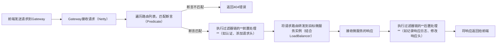

# 6.1 Spring Cloud Gateway解决API网关的核心痛点

在微服务架构中，前端请求需要路由到不同的微服务，同时还需处理认证、限流、跨域、日志等公共逻辑，若每个微服务都单独实现这些逻辑，会导致代码冗余、维护成本高。**Spring Cloud Gateway**是Spring Cloud官方推出的新一代API网关，基于Spring Boot和Spring WebFlux构建，采用响应式编程模型，提供路由转发、过滤器链、限流熔断等企业级能力，是微服务架构中统一入口的核心组件。

## 一、API网关的核心痛点与Spring Cloud Gateway的定位
### 1. 微服务中API网关的核心痛点
微服务架构下，没有统一的API网关时，会面临以下问题：
- **请求路由混乱**：前端需要记住每个微服务的地址，不同环境（开发、测试、生产）的地址还需手动切换，维护成本高。
- **公共逻辑冗余**：认证、授权、限流、日志、跨域等公共逻辑需在每个微服务中重复实现，代码冗余且难以统一更新。
- **服务暴露风险**：微服务直接暴露给前端，IP和端口泄露，存在安全隐患；且无法对请求进行统一的安全过滤。
- **性能瓶颈**：传统网关（如Zuul 1.x）基于同步阻塞模型，高并发场景下性能不足。

### 2. Spring Cloud Gateway的核心定位
Spring Cloud Gateway是**Spring Cloud生态的核心API网关组件**，替代了已停更的Zuul 1.x，其核心定位是：
> 作为微服务架构的统一入口，处理所有前端请求的路由转发，并通过过滤器链实现认证、限流、日志、跨域等公共逻辑，同时提供高性能的响应式处理能力，保障系统在高并发场景下的稳定性。

### 3. Spring Cloud Gateway的核心优势（对比传统网关）
| 特性                | Zuul 1.x（已停更）| Spring Cloud Gateway                    |
|---------------------|---------------------------------------|------------------------------------------|
| 编程模型            | 同步阻塞（Servlet）| 异步非阻塞（WebFlux/Netty）|
| 性能                | 高并发下性能较低                      | 高并发下性能优异，支持百万级QPS          |
| 功能丰富度          | 过滤器功能简单，扩展能力弱            | 内置多种路由断言、过滤器，扩展能力强      |
| 整合性              | 与Spring Cloud生态整合度一般          | 与Spring Cloud生态无缝整合（Nacos、LoadBalancer、Sentinel） |
| 动态路由            | 不支持动态路由，修改需重启            | 支持动态路由，配置可实时刷新            |
| 响应式编程支持      | 不支持                                | 原生支持Reactor响应式编程                |

### 4. Spring Cloud Gateway的核心概念
要理解Spring Cloud Gateway，需先掌握三个核心概念：
- **路由（Route）**：网关的基本单元，由**ID、目标URI、断言集合、过滤器集合**组成。当断言为真时，请求会被路由到目标URI。
- **断言（Predicate）**：用于匹配请求的条件（如请求路径、请求方法、请求头、请求参数等），支持多种内置断言，也可自定义。
- **过滤器（Filter）**：分为**GatewayFilter（局部过滤器，针对单个路由）** 和**GlobalFilter（全局过滤器，针对所有路由）**，用于在请求路由前后执行自定义逻辑（如修改请求头、记录日志、限流等）。

## 二、Spring Cloud Gateway核心原理：路由与过滤器链的工作逻辑
Spring Cloud Gateway的工作流程本质是**“请求接收→断言匹配→过滤器链预处理→路由转发→过滤器链后处理→响应返回”**，整体逻辑如下：


### 核心步骤详解
#### （1）请求接收与断言匹配
- Gateway基于Netty接收前端请求，然后遍历配置的所有路由，依次匹配路由的断言条件。
- 例如：路由断言为`Path=/order/**`，则所有路径以`/order/`开头的请求会匹配该路由。
- 特性：支持多个断言组合（逻辑与），只有所有断言都为真时，路由才会被匹配。

#### （2）过滤器链预处理
匹配到路由后，会先执行过滤器链的前置处理逻辑，例如：
- 验证请求头中的token是否有效（认证过滤器）。
- 为请求添加Trace ID（链路追踪过滤器）。
- 限制请求的QPS（限流过滤器）。
- 若前置处理失败（如token无效），会直接返回响应，不再进行路由转发。

#### （3）路由转发与负载均衡
预处理完成后，Gateway会将请求转发到路由的目标URI。若目标URI是服务名（如`lb://order-service`），则会结合Spring Cloud Loadbalancer实现负载均衡，选择具体的微服务实例。
- `lb://`是Gateway的负载均衡协议前缀，代表使用Loadbalancer选择实例。

#### （4）过滤器链后处理与响应返回
微服务返回响应后，Gateway会执行过滤器链的后置处理逻辑（如记录响应时间、修改响应头），然后将响应返回给前端。

## 三、Spring Cloud Gateway快速上手：实现基本路由转发
以下以**Spring Cloud Alibaba + Nacos**环境为例，演示Spring Cloud Gateway的快速上手流程，实现请求路由到订单服务和商品服务。

### 前置条件
1. 已搭建Nacos服务注册中心（本地地址：`127.0.0.1:8848`）。
2. 已创建两个微服务：`order-service`（端口8081）、`product-service`（端口8082），并注册到Nacos。
3. 已创建Spring Boot项目`gateway-service`（作为网关服务）。

### 步骤1：引入Spring Cloud Gateway依赖
在`gateway-service`的`pom.xml`中引入依赖（注意：**不要引入spring-web依赖，否则会冲突**，Gateway基于WebFlux）：
```xml
<!-- Spring Cloud Gateway 核心依赖 -->
<dependency>
    <groupId>org.springframework.cloud</groupId>
    <artifactId>spring-cloud-starter-gateway</artifactId>
</dependency>

<!-- Nacos服务发现依赖（用于通过服务名路由） -->
<dependency>
    <groupId>com.alibaba.cloud</groupId>
    <artifactId>spring-cloud-starter-alibaba-nacos-discovery</artifactId>
</dependency>

<!-- Spring Cloud Loadbalancer依赖（用于负载均衡） -->
<dependency>
    <groupId>org.springframework.cloud</groupId>
    <artifactId>spring-cloud-starter-loadbalancer</artifactId>
</dependency>
```

### 步骤2：配置基本路由
在`gateway-service`的`application.yml`中配置路由规则，实现请求路由到对应的微服务：
```yaml
spring:
  application:
    name: gateway-service
  cloud:
    # Nacos服务发现配置
    nacos:
      discovery:
        server-addr: 127.0.0.1:8848
    # Gateway配置
    gateway:
      # 路由列表
      routes:
        # 订单服务路由（ID唯一）
        - id: order-service-route
          # 目标URI：lb://代表使用负载均衡，后面跟服务名
          uri: lb://order-service
          # 断言：匹配路径以/order/开头的请求
          predicates:
            - Path=/order/**
          # 过滤器：前缀过滤（去掉/order前缀，转发到订单服务的根路径）
          filters:
            - StripPrefix=1 # StripPrefix=1表示去掉第一个前缀（/order）

        # 商品服务路由
        - id: product-service-route
          uri: lb://product-service
          predicates:
            - Path=/product/**
          filters:
            - StripPrefix=1

      # 全局跨域配置（解决前端跨域问题）
      globalcors:
        cors-configurations:
          '[/**]':
            allowed-origins: "*" # 生产环境需指定具体域名（如https://www.example.com）
            allowed-methods: "*" # 允许所有HTTP方法（GET、POST、PUT、DELETE等）
            allowed-headers: "*" # 允许所有请求头
            allow-credentials: true # 允许携带Cookie
server:
  port: 8080 # 网关端口，前端统一请求该端口
```

### 步骤3：测试验证
1. 启动Nacos、`order-service`、`product-service`、`gateway-service`。
2. 访问网关的订单服务接口：`http://localhost:8080/order/api/order/1`，请求会被路由到`order-service`的`/api/order/1`接口。
3. 访问网关的商品服务接口：`http://localhost:8080/product/api/product/1`，请求会被路由到`product-service`的`/api/product/1`接口。
4. 启动多个`order-service`实例，网关会通过Loadbalancer实现负载均衡，将请求分发到不同实例。

## 四、企业级核心功能：过滤器与高级配置
快速上手后，需通过过滤器和高级配置实现企业级的网关需求，以下是核心功能的实现方法。

### 1. 全局过滤器：统一认证与链路追踪
全局过滤器会作用于所有路由，适合实现认证、链路追踪、日志记录等公共逻辑。以下实现**JWT认证**和**Trace ID链路追踪**的全局过滤器：
```java
import org.springframework.cloud.gateway.filter.GlobalFilter;
import org.springframework.cloud.gateway.filter.GatewayFilterChain;
import org.springframework.core.Ordered;
import org.springframework.http.HttpStatus;
import org.springframework.http.server.reactive.ServerHttpRequest;
import org.springframework.stereotype.Component;
import org.springframework.web.server.ServerWebExchange;
import reactor.core.publisher.Mono;
import java.util.UUID;

@Component
public class GlobalAuthFilter implements GlobalFilter, Ordered {

    @Override
    public Mono<Void> filter(ServerWebExchange exchange, GatewayFilterChain chain) {
        ServerHttpRequest request = exchange.getRequest();

        // 1. 添加Trace ID（链路追踪）
        String traceId = UUID.randomUUID().toString();
        // 若请求头中已有Trace ID，直接使用
        if (request.getHeaders().containsKey("X-Trace-ID")) {
            traceId = request.getHeaders().getFirst("X-Trace-ID");
        }
        // 将Trace ID添加到请求头，传递给微服务
        ServerHttpRequest newRequest = request.mutate()
                .header("X-Trace-ID", traceId)
                .build();
        ServerWebExchange newExchange = exchange.mutate().request(newRequest).build();

        // 2. JWT认证（排除登录接口等白名单）
        String path = request.getPath().toString();
        if (path.contains("/login") || path.contains("/register")) {
            // 白名单接口，直接放行
            return chain.filter(newExchange);
        }

        // 获取请求头中的token
        String token = request.getHeaders().getFirst("Authorization");
        if (token == null || !token.startsWith("Bearer ")) {
            // token不存在，返回401未授权
            exchange.getResponse().setStatusCode(HttpStatus.UNAUTHORIZED);
            return exchange.getResponse().setComplete();
        }

        // 验证token有效性（此处简化，实际需调用认证服务或解析JWT）
        String jwtToken = token.substring(7);
        if (!validateJwtToken(jwtToken)) {
            exchange.getResponse().setStatusCode(HttpStatus.UNAUTHORIZED);
            return exchange.getResponse().setComplete();
        }

        // 认证通过，继续执行过滤器链
        return chain.filter(newExchange);
    }

    // 模拟JWT token验证
    private boolean validateJwtToken(String token) {
        // 实际逻辑：解析JWT，验证签名和过期时间
        return "valid-token".equals(token);
    }

    @Override
    public int getOrder() {
        // 过滤器执行顺序，数值越小，执行越早
        return -100;
    }
}
```

### 2. 限流过滤器：整合Sentinel实现流量控制
高并发场景下，需要对请求进行限流，防止服务过载。Spring Cloud Gateway可与Sentinel整合，实现基于QPS、请求数的限流：
#### 步骤1：引入Sentinel依赖
```xml
<dependency>
    <groupId>com.alibaba.cloud</groupId>
    <artifactId>spring-cloud-starter-alibaba-sentinel</artifactId>
</dependency>
<dependency>
    <groupId>com.alibaba.cloud</groupId>
    <artifactId>spring-cloud-alibaba-sentinel-gateway</artifactId>
</dependency>
```

#### 步骤2：配置Sentinel限流规则
```yaml
spring:
  cloud:
    sentinel:
      transport:
        dashboard: 127.0.0.1:8080 # Sentinel控制台地址
      gateway:
        enabled: true
        routes:
          order-service-route: # 路由ID
            resource-mode: ROUTE_ID # 基于路由ID限流
            grade: QPS # 限流维度：QPS（每秒请求数）
            count: 100 # 限流阈值：每秒最多100个请求
```

### 3. 动态路由：配置实时刷新
Spring Cloud Gateway支持动态路由，可通过Nacos配置中心实现路由配置的实时刷新，无需重启网关：
#### 步骤1：引入Nacos配置中心依赖
```xml
<dependency>
    <groupId>com.alibaba.cloud</groupId>
    <artifactId>spring-cloud-starter-alibaba-nacos-config</artifactId>
</dependency>
```

#### 步骤2：配置Nacos动态路由
在Nacos中创建`gateway-service.yaml`配置文件，添加路由配置；然后在网关项目中配置Nacos地址，开启配置自动刷新，即可实现路由的动态更新。

### 4. 响应处理：统一响应格式
通过过滤器统一处理微服务的响应，返回标准化的响应格式：
```java
import org.springframework.cloud.gateway.filter.GatewayFilter;
import org.springframework.cloud.gateway.filter.factory.AbstractGatewayFilterFactory;
import org.springframework.stereotype.Component;
import org.springframework.web.reactive.function.BodyInserters;
import org.springframework.web.reactive.function.client.WebClient;
import reactor.core.publisher.Mono;

@Component
public class ResponseFilter extends AbstractGatewayFilterFactory<ResponseFilter.Config> {

    private final WebClient webClient;

    public ResponseFilter(WebClient.Builder webClientBuilder) {
        super(Config.class);
        this.webClient = webClientBuilder.build();
    }

    @Override
    public GatewayFilter apply(Config config) {
        return (exchange, chain) -> {
            return chain.filter(exchange).then(Mono.fromRunnable(() -> {
                // 读取微服务的响应，封装为统一格式
                // 此处为简化示例，实际需处理响应体
                String responseBody = "{\"code\":200,\"message\":\"success\",\"data\":" + exchange.getResponse().getBody() + "}";
                exchange.getResponse().getHeaders().setContentType(org.springframework.http.MediaType.APPLICATION_JSON);
                exchange.getResponse().writeWith(BodyInserters.fromValue(responseBody.getBytes()));
            }));
        };
    }

    public static class Config {
        // 可配置过滤器参数
    }
}
```

## 五、企业级最佳实践：Gateway的核心配置建议
1. **分层网关架构**：采用“接入层网关（Nginx）+ 业务层网关（Spring Cloud Gateway）”的架构。Nginx处理SSL卸载、静态资源缓存、DNS解析；Spring Cloud Gateway处理路由转发、认证、限流等业务逻辑。
2. **性能优化**：
   - 调整Netty的线程池大小，适配高并发场景。
   - 开启响应压缩，减少网络传输数据量。
   - 避免在过滤器中执行耗时操作（如数据库查询），可通过异步方式处理。
3. **安全防护**：
   - 配置黑白名单，限制非法IP访问。
   - 整合WAF（Web应用防火墙），过滤SQL注入、XSS攻击等恶意请求。
   - 对敏感接口进行限流，防止暴力攻击。
4. **监控与告警**：
   - 通过Spring Boot Actuator暴露网关的指标（如请求数、响应时间、错误数）。
   - 结合Prometheus+Grafana监控网关性能，设置告警规则（如QPS超过阈值、错误率过高时告警）。
5. **容灾处理**：
   - 配置网关的熔断机制，当微服务故障时，返回友好的降级响应。
   - 部署多个网关实例，通过Nginx实现网关的负载均衡，避免单点故障。

## 总结
1. **核心定位**：Spring Cloud Gateway是Spring Cloud生态的新一代API网关，基于异步非阻塞模型，提供高性能的路由转发和过滤器链能力，是微服务架构的统一入口。
2. **核心原理**：通过**路由、断言、过滤器**三大核心组件，实现请求的匹配、路由转发和公共逻辑处理，工作流程为“请求接收→断言匹配→过滤器预处理→路由转发→过滤器后处理→响应返回”。
3. **快速上手**：只需配置路由规则，即可实现请求的路由转发和负载均衡，同时支持全局跨域配置。
4. **企业级配置**：通过全局过滤器实现统一认证、链路追踪，整合Sentinel实现限流，支持动态路由和统一响应格式，可满足企业级的网关需求。

掌握Spring Cloud Gateway的核心用法和企业级配置，能有效解决微服务架构中的请求路由和公共逻辑处理问题，提升系统的安全性、可维护性和性能。