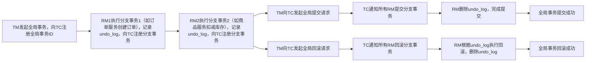

# 7.1 Seata处理分布式事务原理详解


在微服务架构中，业务逻辑往往跨多个微服务（如下单业务涉及订单服务、商品服务、支付服务），每个微服务都有自己的数据库，传统的单机事务（ACID）无法保证跨服务操作的数据一致性，这就是**分布式事务问题**。**Seata（Simple Extensible Autonomous Transaction Architecture）** 是阿里开源的分布式事务解决方案，专为微服务架构设计，支持多种事务模式，能高效解决跨服务、跨数据库的数据一致性问题，是企业级微服务架构处理分布式事务的首选框架。

## 一、分布式事务的核心痛点与Seata的定位
### 1. 微服务中分布式事务的核心痛点
微服务拆分后，跨服务的业务操作会面临以下数据一致性问题：
- **数据不一致**：例如下单时，订单服务创建了订单，但商品服务扣减库存失败，导致订单存在但库存未减少，数据出现不一致。
- **硬编码解决复杂**：若手动通过“补偿逻辑”（如库存扣减失败则删除订单）解决，代码冗余且容易遗漏边界场景（如网络超时）。
- **性能低下**：传统的分布式事务方案（如XA）虽然能保证强一致性，但性能损耗大，无法支撑高并发场景（如电商秒杀）。
- **运维复杂**：不同的分布式事务方案适配性差，整合到微服务架构中需要大量的配置和运维工作。

### 2. Seata的核心定位
Seata是**专为微服务架构设计的分布式事务框架**，其核心定位是：
> 为微服务架构提供**高性能、易使用、可扩展**的分布式事务解决方案，支持强一致性和最终一致性两种数据一致性模型，适配不同业务场景的需求，让开发者以类似单机事务的方式处理分布式事务。

### 3. Seata的核心优势（对比传统分布式事务方案）
| 特性                | 传统XA事务                | 消息队列最终一致性          | Seata                            |
|---------------------|---------------------------|-----------------------------|----------------------------------|
| 一致性级别          | 强一致性                  | 最终一致性                  | 支持强一致性（XA/AT）、最终一致性（TCC/SAGA） |
| 性能                | 低（全程锁资源）| 高（异步处理）| 高（AT模式无锁阶段提交）|
| 开发成本            | 低（数据库层面支持）| 高（需编写消息发送/消费逻辑）| 低（AT模式几乎无侵入，TCC/SAGA需编写业务逻辑） |
| 运维成本            | 低                        | 高（需维护消息队列）| 中（需部署Seata服务端）|
| 场景适配性          | 适合低并发、强一致场景    | 适合高并发、最终一致场景    | 适配所有场景，可灵活选择事务模式 |

### 4. Seata的核心角色
Seata架构包含三个核心角色，分工协作完成分布式事务管理：
- **TC（Transaction Coordinator）**：事务协调器，核心角色，负责维护全局事务的状态和分支事务的协调，是独立部署的服务端组件（Seata Server）。
- **TM（Transaction Manager）**：事务管理器，负责发起全局事务、提交或回滚全局事务，通常部署在业务应用中（微服务）。
- **RM（Resource Manager）**：资源管理器，负责管理分支事务的资源（数据库、消息队列等），与TC通信完成分支事务的注册、提交和回滚，部署在业务应用中（微服务）。

## 二、Seata的核心事务模式：适配不同业务场景
Seata提供了四种核心事务模式，分别适配不同的业务场景，开发者可根据业务的一致性要求和性能需求选择：

### 1. AT模式（默认推荐）：无侵入的强一致性方案
AT模式是Seata的默认模式，也是最常用的模式，**无侵入**（几乎不需要修改业务代码），支持强一致性，性能接近单机事务。

#### （1）AT模式的核心流程（两阶段提交）


#### （2）关键步骤详解
- **第一阶段（执行分支事务）**：
  1. TM发起全局事务，生成**全局事务ID（XID）**，并传播到所有参与的微服务。
  2. RM执行本地业务SQL（如创建订单、扣减库存），并在数据库中记录**undo_log**（数据修改前的快照）。
  3. RM向TC注册分支事务，报告分支事务的执行状态（成功/失败）。
- **第二阶段（提交/回滚）**：
  - **提交**：TC通知所有RM提交分支事务，RM直接删除undo_log，完成提交（无锁，性能高）。
  - **回滚**：TC通知所有RM回滚分支事务，RM根据undo_log中的快照数据，将数据恢复到修改前的状态，然后删除undo_log。

#### （3）适用场景
- 大多数微服务业务场景，尤其是需要**强一致性**且**希望开发成本低**的场景（如电商下单、支付结算）。
- 支持主流关系型数据库（MySQL、Oracle、PostgreSQL等）。

### 2. TCC模式：手动编码的强一致性方案
TCC（Try-Confirm-Cancel）模式是一种手动编码的分布式事务模式，需要开发者编写三个方法，灵活性高，支持非关系型数据库。

#### （1）TCC模式的核心流程
- **Try**：尝试执行业务，预留资源（如扣减库存前先冻结库存）。
- **Confirm**：确认执行业务，真正提交资源操作（如确认冻结的库存并扣减）。
- **Cancel**：取消执行业务，释放预留资源（如解冻冻结的库存）。

#### （2）关键特点
- **开发成本高**：需要开发者为每个业务编写Try、Confirm、Cancel三个方法，需处理各种边界场景（如网络超时）。
- **性能高**：无锁设计，全程由业务代码控制，性能优于XA模式。
- **适用场景**：需要操作非关系型数据库（如Redis、MongoDB）或自定义业务逻辑的强一致性场景（如金融交易）。

### 3. SAGA模式：长事务的最终一致性方案
SAGA模式专为**长事务**设计（如订单超时取消、物流状态更新），基于状态机实现，支持最终一致性，性能高。

#### （1）SAGA模式的核心流程
- **正向流程**：依次执行多个分支事务，完成业务操作。
- **补偿流程**：若某个分支事务失败，反向执行补偿逻辑，恢复之前的操作（如订单创建失败则回滚库存扣减）。

#### （2）关键特点
- **支持长事务**：事务可以持续数小时甚至数天（如订单超时未支付则取消）。
- **开发成本中**：需要编写正向业务逻辑和补偿逻辑。
- **适用场景**：长事务、最终一致性场景（如电商订单流程、物流配送流程）。

### 4. XA模式：数据库层面的强一致性方案
XA模式是基于数据库XA协议的分布式事务模式，由数据库层面保证强一致性，兼容性好但性能低。

#### （1）核心流程
- 第一阶段：TC通知所有RM准备（Prepare），RM执行业务并锁定资源，返回准备状态。
- 第二阶段：若所有RM都准备成功，TC通知提交；若有一个失败，TC通知回滚。

#### （2）关键特点
- **性能低**：全程锁定资源，直到事务提交，高并发场景下性能瓶颈明显。
- **开发成本低**：几乎无需修改业务代码，数据库层面支持。
- **适用场景**：低并发、强一致性要求极高的场景（如金融核心交易）。

## 三、Seata快速上手：AT模式实现分布式事务
以下以**Spring Cloud Alibaba + Nacos + Seata + MySQL**环境为例，演示Seata AT模式的快速上手流程，实现订单服务和商品服务的分布式事务（下单时创建订单并扣减库存，要么都成功，要么都失败）。

### 前置条件
1. 已搭建Nacos服务注册中心（本地地址：`127.0.0.1:8848`）。
2. 已下载并启动Seata Server（TC）：
   - 下载Seata安装包，修改配置文件（指定注册中心为Nacos）。
   - 执行`seata-server.bat`（Windows）或`seata-server.sh`（Linux）启动Seata Server。
3. 已创建两个微服务：`order-service`（订单服务）、`product-service`（商品服务），并配置好MySQL数据库。
4. 为每个微服务的数据库添加**undo_log表**（AT模式必需，用于记录数据快照）：
   ```sql
   CREATE TABLE `undo_log` (
     `id` bigint(20) NOT NULL AUTO_INCREMENT,
     `branch_id` bigint(20) NOT NULL,
     `xid` varchar(100) NOT NULL,
     `context` varchar(128) NOT NULL,
     `rollback_info` longblob NOT NULL,
     `log_status` int(11) NOT NULL,
     `log_created` datetime NOT NULL,
     `log_modified` datetime NOT NULL,
     `ext` varchar(100) DEFAULT NULL,
     PRIMARY KEY (`id`),
     UNIQUE KEY `ux_undo_log` (`xid`,`branch_id`)
   ) ENGINE=InnoDB AUTO_INCREMENT=1 DEFAULT CHARSET=utf8;
   ```

### 步骤1：引入Seata依赖
在`order-service`和`product-service`的`pom.xml`中引入Seata依赖：
```xml
<!-- Seata与Spring Cloud Alibaba整合依赖 -->
<dependency>
    <groupId>com.alibaba.cloud</groupId>
    <artifactId>spring-cloud-starter-alibaba-seata</artifactId>
</dependency>
<!-- Seata核心依赖 -->
<dependency>
    <groupId>io.seata</groupId>
    <artifactId>seata-spring-boot-starter</artifactId>
</dependency>
```

### 步骤2：配置Seata
在两个微服务的`application.yml`中配置Seata（指定TC地址、事务组、注册中心）：
```yaml
spring:
  application:
    name: order-service # product-service需改为product-service
  cloud:
    nacos:
      discovery:
        server-addr: 127.0.0.1:8848
    alibaba:
      seata:
        tx-service-group: my_test_tx_group # 事务组名称，需与Seata Server配置一致
seata:
  registry:
    type: nacos # 注册中心类型为Nacos
    nacos:
      server-addr: 127.0.0.1:8848
      namespace: ""
      group: SEATA_GROUP
  config:
    type: nacos
    nacos:
      server-addr: 127.0.0.1:8848
  service:
    vgroup-mapping:
      my_test_tx_group: default # 事务组与Seata Server集群映射
```

### 步骤3：编写业务代码
#### （1）商品服务：扣减库存接口
```java
// ProductService
@Service
public class ProductService {
    @Autowired
    private ProductMapper productMapper;

    // 扣减库存的本地方法
    public void deductStock(Long productId, Integer num) {
        // 1. 查询商品库存
        Product product = productMapper.selectById(productId);
        if (product == null) {
            throw new RuntimeException("商品不存在");
        }
        if (product.getStock() < num) {
            throw new RuntimeException("库存不足");
        }
        // 2. 扣减库存
        product.setStock(product.getStock() - num);
        productMapper.updateById(product);
    }
}

// ProductController
@RestController
@RequestMapping("/product")
public class ProductController {
    @Autowired
    private ProductService productService;

    @PostMapping("/deduct/{productId}/{num}")
    public String deductStock(@PathVariable Long productId, @PathVariable Integer num) {
        productService.deductStock(productId, num);
        return "库存扣减成功";
    }
}
```

#### （2）订单服务：创建订单并调用商品服务（全局事务入口）
```java
// OrderService
@Service
public class OrderService {
    @Autowired
    private OrderMapper orderMapper;
    @Autowired
    private RestTemplate restTemplate;

    // 全局事务入口，添加@GlobalTransactional注解
    @GlobalTransactional(rollbackFor = Exception.class)
    public void createOrder(Long productId, Integer num) {
        // 1. 创建订单（本地事务）
        Order order = new Order();
        order.setProductId(productId);
        order.setNum(num);
        order.setStatus(0); // 未支付
        orderMapper.insert(order);

        // 2. 调用商品服务扣减库存（远程事务）
        String url = "http://product-service/product/deduct/" + productId + "/" + num;
        restTemplate.postForObject(url, null, String.class);

        // 模拟异常，测试回滚（注释后则正常提交）
        // throw new RuntimeException("模拟订单创建失败，触发回滚");
    }
}

// OrderController
@RestController
@RequestMapping("/order")
public class OrderController {
    @Autowired
    private OrderService orderService;

    @PostMapping("/create/{productId}/{num}")
    public String createOrder(@PathVariable Long productId, @PathVariable Integer num) {
        try {
            orderService.createOrder(productId, num);
            return "订单创建成功";
        } catch (Exception e) {
            return "订单创建失败：" + e.getMessage();
        }
    }
}
```

### 步骤4：测试验证
1. 启动Nacos、Seata Server、`order-service`、`product-service`。
2. **正常场景**：访问`http://localhost:8081/order/create/1/1`（订单服务端口），订单创建成功，商品库存扣减成功。
3. **异常场景**：取消订单服务中异常代码的注释，再次访问接口，订单创建失败，商品库存也会回滚（恢复到扣减前的状态），实现分布式事务的一致性。

## 四、企业级配置：Seata的性能优化与生产实践
### 1. 性能优化（AT模式）
- **undo_log表优化**：将undo_log表创建在独立的表空间，开启索引缓存，提升读写性能。
- **连接池优化**：增大数据库连接池大小，避免因连接不足导致事务阻塞。
- **Seata Server集群部署**：部署多个Seata Server节点，通过Nacos实现负载均衡，避免单点故障，提升并发处理能力。
- **异步提交**：开启Seata的异步提交功能，减少TC与RM的同步通信时间。

### 2. 生产环境配置建议
- **事务组隔离**：不同业务线使用不同的事务组，避免相互影响。
- **日志持久化**：将Seata Server的日志持久化到MySQL或Elasticsearch，便于故障排查。
- **监控告警**：整合Prometheus+Grafana监控Seata的关键指标（如全局事务数、分支事务数、回滚率），设置告警规则（如回滚率超过5%时告警）。
- **数据备份**：定期备份undo_log表和Seata Server的元数据，防止数据丢失。

### 3. 常见问题与解决方案
- **分布式事务回滚失败**：检查undo_log表是否存在、数据快照是否完整，以及微服务与Seata Server的网络连通性。
- **性能瓶颈**：优先使用AT模式，避免使用XA模式；对高并发接口采用最终一致性方案（如SAGA）。
- **XID传播失败**：确保微服务间的调用（如Feign、RestTemplate）能正确传递XID（Seata已自动整合Feign，RestTemplate需添加拦截器）。

## 五、企业级最佳实践：Seata的场景化选型
1. **电商核心交易**：使用**AT模式**，保证订单、库存、支付的数据强一致性，同时兼顾性能。
2. **金融交易**：使用**TCC模式**或**XA模式**，满足金融行业的强一致性和合规要求。
3. **订单长流程**：使用**SAGA模式**，处理订单创建、支付、发货、确认收货的长事务，实现最终一致性。
4. **高并发秒杀**：结合**AT模式**和**消息队列**，先通过消息队列异步处理库存扣减，再通过Seata保证最终一致性。

## 总结
1. **核心定位**：Seata是专为微服务架构设计的分布式事务框架，支持AT、TCC、SAGA、XA四种事务模式，能高效解决跨服务的数据一致性问题。
2. **核心角色**：由TC（事务协调器）、TM（事务管理器）、RM（资源管理器）组成，分工协作完成分布式事务管理。
3. **快速上手**：AT模式是默认推荐的模式，只需添加注解和少量配置，即可实现分布式事务，几乎无业务侵入。
4. **企业级实践**：根据业务场景选择合适的事务模式，通过集群部署、性能优化和监控告警，保障生产环境的稳定性和性能。

掌握Seata的核心原理和企业级使用方法，能有效解决微服务架构中的分布式事务痛点，是构建企业级微服务的必备技能。