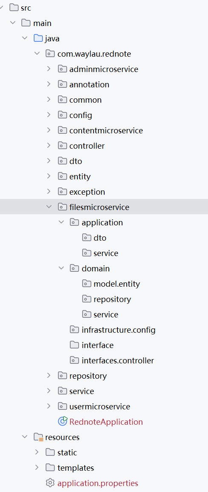
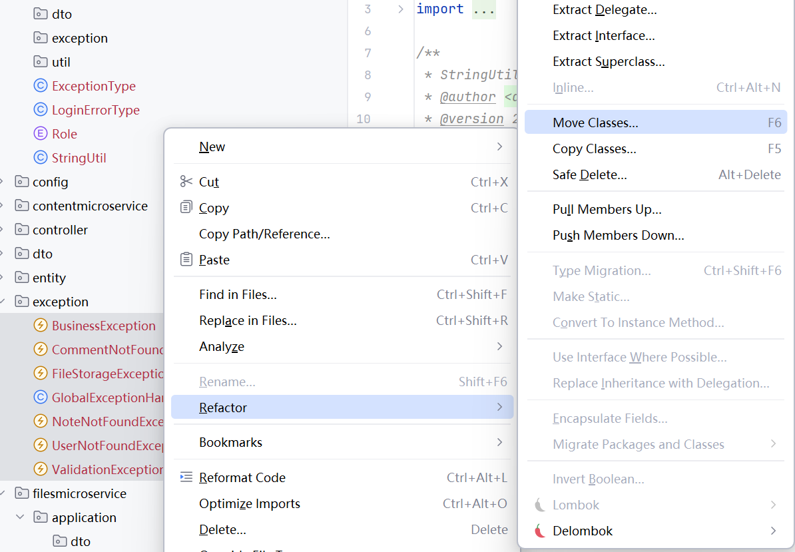
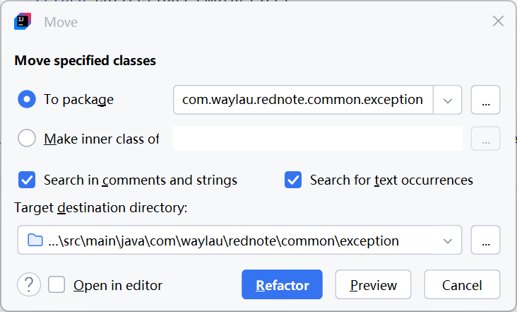
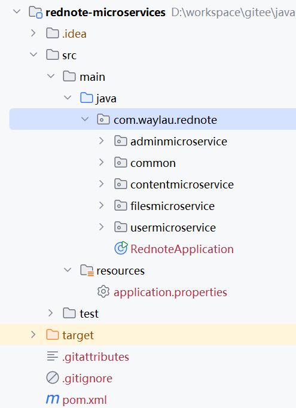

## 2.2 实战基于DDD的微服务代码结构改造

### 按照DDD分层架构新建包名


1. 修改项目名“rednote”为“rednote-microservices”
2. 将原有项目的下创建按照DDD分层架构要求的包名。以文件领域微服务为例，包名结构如下图2-1所示。




### 按照DDD分层架构对代码进行重构


通过重构的方式，将原有项目的下移动到DDD分层架构的对应包名下。IntelliJ IDEA的重构功能如下图2-2所示。



选中目标路径，点击“Refactor”按钮将代码进行移动。




### 清理冗余代码和包

1. 原先废弃的代码和注释进行清理
2. 被移走代码后，空缺的包进行删除
3. 移除`src/main/resources`包下的static、templates目录。
4. 移除`spring-boot-starter-thymeleaf`、`thymeleaf-extras-springsecurity6`、`spring-session-data-redis`
5. 删除以下配置信息
6. 删除IndexController类、ErrorController类

```
# Thymeleaf 配置
spring.thymeleaf.cache=false
spring.thymeleaf.encoding=UTF-8

# 会话超时
server.servlet.session.timeout=10m

# 配置 Spring Session
## 控制会话数据同步到 Redis 的时机，分别是 ON_SAVE 和 IMMEDIATE.
spring.session.redis.flush-mode=on_save
## 会话存储的key的命名空间，可以区分多应用下的key
spring.session.redis.namespace=spring:session:rednote
```


最终，代码结构如下图2-4所示。




### 运行调测


重构理论上不应该修改现有的业务逻辑。因此，重构完成之后，应运行调测确保启动正常、功能完整。
