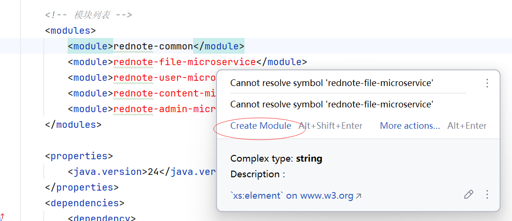
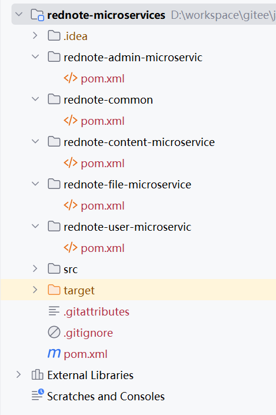

## 2.3 基于DDD的Maven多模块化改造

Maven多模块项目允许你将一个大型项目拆分为多个子模块，每个模块可以独立开发、构建和部署。下面是一个完整的多模块项目配置示例。

### 项目结构


```
rednote-microservices/
├── pom.xml (父POM)
├── rednote-common/               (公共模块)
│   ├── pom.xml
│   └── src/
│── rednote-file-microservice/         (文件领域微服务模块)
│   ├── pom.xml
│   └── src/
├── rednote-user-microservice/         (用户领域微服务模块)
│   ├── pom.xml
│   └── src/
├── rednote-content-microservice/      (内容领域微服务模块)
│   ├── pom.xml
│   └── src/
└── rednote-admin-microservice/        (管理领域微服务模块)
    ├── pom.xml
    └── src/
```    

### 关键点说明

1. **父POM**：
   - `packaging` 必须为 `pom`
   - 通过 `<modules>` 声明所有子模块
   - 使用 `<dependencyManagement>` 统一管理依赖版本
   - 使用 `<pluginManagement>` 统一管理插件配置

2. **子模块**：
   - 必须声明父POM的坐标
   - 可以继承父POM的依赖管理和插件管理
   - 可以定义自己的依赖和插件
   - 可以通过 `${project.version}` 引用父POM的版本号

3. **构建命令**：
   - 构建整个项目：`mvn clean install`
   - 构建特定模块：`mvn clean install -pl rednote-user-microservice`
   - 构建多个模块：`mvn clean install -pl rednote-common,rednote-file-microservice`
   - 构建并跳过测试：`mvn clean install -DskipTests`


### 父模块rednote-microservices

```xml
<?xml version="1.0" encoding="UTF-8"?>
<project xmlns="http://maven.apache.org/POM/4.0.0" xmlns:xsi="http://www.w3.org/2001/XMLSchema-instance"
	xsi:schemaLocation="http://maven.apache.org/POM/4.0.0 https://maven.apache.org/xsd/maven-4.0.0.xsd">
	<modelVersion>4.0.0</modelVersion>
	<parent>
		<groupId>org.springframework.boot</groupId>
		<artifactId>spring-boot-starter-parent</artifactId>
		<version>3.5.0</version>
		<relativePath/> <!-- lookup parent from repository -->
	</parent>
	<groupId>com.waylau</groupId>
	<artifactId>rednote-microservices</artifactId>
	<version>0.0.1-SNAPSHOT</version>
	<packaging>pom</packaging>  <!-- 父POM的packaging必须是pom -->
	<name>rednote-microservices</name>
	<description>RedNote. 仿“小红书”项目</description>
	<url/>
	<licenses>
		<license/>
	</licenses>
	<developers>
		<developer/>
	</developers>
	<scm>
		<connection/>
		<developerConnection/>
		<tag/>
		<url/>
	</scm>

	<!-- 模块列表 -->
	<modules>
		<module>rednote-common</module>
		<module>rednote-file-microservice</module>
		<module>rednote-user-microservice</module>
		<module>rednote-content-microservice</module>
		<module>rednote-admin-microservice</module>
	</modules>

	<properties>
		<java.version>24</java.version>
		<mysql-connector-j.version>9.3.0</mysql-connector-j.version>
		<jsonwebtoken.version>0.12.6</jsonwebtoken.version>
    <jakarta.persistence-api.version>3.1.0</jakarta.persistence-api.version>
	</properties>

	<dependencies>

		<dependency>
			<groupId>org.springframework.boot</groupId>
			<artifactId>spring-boot-starter-security</artifactId>
		</dependency>

		<dependency>
			<groupId>org.springframework.boot</groupId>
			<artifactId>spring-boot-starter-validation</artifactId>
		</dependency>
		<dependency>
			<groupId>org.springframework.boot</groupId>
			<artifactId>spring-boot-starter-web</artifactId>
		</dependency>

		<dependency>
			<groupId>org.projectlombok</groupId>
			<artifactId>lombok</artifactId>
			<optional>true</optional>
		</dependency>
		<dependency>
			<groupId>org.springframework.boot</groupId>
			<artifactId>spring-boot-starter-test</artifactId>
			<scope>test</scope>
		</dependency>
		<dependency>
			<groupId>org.springframework.security</groupId>
			<artifactId>spring-security-test</artifactId>
			<scope>test</scope>
		</dependency>
		<dependency>
			<groupId>org.springframework.boot</groupId>
			<artifactId>spring-boot-starter-data-redis</artifactId>
		</dependency>

		<dependency>
			<groupId>org.springframework.kafka</groupId>
			<artifactId>spring-kafka</artifactId>
		</dependency>

		<dependency>
			<groupId>io.jsonwebtoken</groupId>
			<artifactId>jjwt-api</artifactId>
			<version>${jsonwebtoken.version}</version>
		</dependency>
		<dependency>
			<groupId>io.jsonwebtoken</groupId>
			<artifactId>jjwt-impl</artifactId>
			<version>${jsonwebtoken.version}</version>
		</dependency>
		<dependency>
			<groupId>io.jsonwebtoken</groupId>
			<artifactId>jjwt-jackson</artifactId>
			<version>${jsonwebtoken.version}</version>
		</dependency>
	</dependencies>

	<build>
		<plugins>
			<plugin>
				<groupId>org.apache.maven.plugins</groupId>
				<artifactId>maven-compiler-plugin</artifactId>
				<configuration>
					<annotationProcessorPaths>
						<path>
							<groupId>org.projectlombok</groupId>
							<artifactId>lombok</artifactId>
						</path>
					</annotationProcessorPaths>
				</configuration>
			</plugin>
		</plugins>
	</build>

</project>
```


通过IntelliJ IDEA，在父POM中点击模块列表中的模块，可以自动创建子模块，如下图2-5所示。




最终，项目结构如下图2-6所示。




### 子模块rednote-common/pom.xml

```xml
<?xml version="1.0" encoding="UTF-8"?>
<project xmlns="http://maven.apache.org/POM/4.0.0"
         xmlns:xsi="http://www.w3.org/2001/XMLSchema-instance"
         xsi:schemaLocation="http://maven.apache.org/POM/4.0.0 http://maven.apache.org/xsd/maven-4.0.0.xsd">
    <parent>
        <groupId>com.waylau</groupId>
        <artifactId>rednote-microservices</artifactId>
        <version>0.0.1-SNAPSHOT</version>
    </parent>

    <modelVersion>4.0.0</modelVersion>
    <groupId>com.waylau</groupId>
    <artifactId>rednote-common</artifactId>
    <name>rednote-common</name>
    <packaging>jar</packaging>
    <description>公共模块</description>

    <!-- 子模块可以定义自己的依赖 -->
    <dependencies>
        <!--因移除了spring-boot-starter-data-jpa，因此需要手动添加-->
        <dependency>
            <groupId>jakarta.persistence</groupId>
            <artifactId>jakarta.persistence-api</artifactId>
            <version>${jakarta.persistence-api.version}</version>
        </dependency>

        <dependency>
            <groupId>org.springframework.boot</groupId>
            <artifactId>spring-boot-starter-security</artifactId>
        </dependency>

        <dependency>
            <groupId>org.springframework.security</groupId>
            <artifactId>spring-security-test</artifactId>
            <scope>test</scope>
        </dependency>

    </dependencies>
</project>
```

### 子模块rednote-file-microservice/pom.xml

```xml
<?xml version="1.0" encoding="UTF-8"?>
<project xmlns="http://maven.apache.org/POM/4.0.0"
         xmlns:xsi="http://www.w3.org/2001/XMLSchema-instance"
         xsi:schemaLocation="http://maven.apache.org/POM/4.0.0 http://maven.apache.org/xsd/maven-4.0.0.xsd">
    <parent>
        <groupId>com.waylau</groupId>
        <artifactId>rednote-microservices</artifactId>
        <version>0.0.1-SNAPSHOT</version>
    </parent>

    <modelVersion>4.0.0</modelVersion>
    <groupId>com.waylau</groupId>
    <artifactId>rednote-file-microservice</artifactId>
    <name>rednote-file-microservice</name>
    <packaging>jar</packaging>
    <description>文件领域微服务模块</description>

    <!-- 子模块可以定义自己的依赖 -->
    <dependencies>
        <!-- 依赖公共模块 -->
        <dependency>
            <groupId>com.waylau</groupId>
            <artifactId>rednote-common</artifactId>
            <version>${project.version}</version>
        </dependency>

        <dependency>
            <groupId>org.springframework.boot</groupId>
            <artifactId>spring-boot-starter-data-mongodb</artifactId>
        </dependency>
    </dependencies>

    <!-- 子模块可以定义自己的插件-->
    <build>
        <plugins>
            <plugin>
                <groupId>org.springframework.boot</groupId>
                <artifactId>spring-boot-maven-plugin</artifactId>
            </plugin>
        </plugins>
    </build>
</project>
```

### 子模块rednote-user-microservice/pom.xml

```xml
<?xml version="1.0" encoding="UTF-8"?>
<project xmlns="http://maven.apache.org/POM/4.0.0"
         xmlns:xsi="http://www.w3.org/2001/XMLSchema-instance"
         xsi:schemaLocation="http://maven.apache.org/POM/4.0.0 http://maven.apache.org/xsd/maven-4.0.0.xsd">
    <parent>
        <groupId>com.waylau</groupId>
        <artifactId>rednote-microservices</artifactId>
        <version>0.0.1-SNAPSHOT</version>
    </parent>

    <modelVersion>4.0.0</modelVersion>
    <groupId>com.waylau</groupId>
    <artifactId>rednote-user-microservice</artifactId>
    <name>rednote-user-microservice</name>
    <packaging>jar</packaging>
    <description>用户领域微服务模块</description>

    <!-- 子模块可以定义自己的依赖 -->
    <dependencies>
        <!-- 依赖公共模块 -->
        <dependency>
            <groupId>com.waylau</groupId>
            <artifactId>rednote-common</artifactId>
            <version>${project.version}</version>
        </dependency>

        <dependency>
            <groupId>org.springframework.boot</groupId>
            <artifactId>spring-boot-starter-data-jpa</artifactId>
        </dependency>
        <dependency>
            <groupId>com.mysql</groupId>
            <artifactId>mysql-connector-j</artifactId>
            <scope>runtime</scope>
            <version>${mysql-connector-j.version}</version>
        </dependency>
    </dependencies>

    <!-- 子模块可以定义自己的插件-->
    <build>
        <plugins>
            <plugin>
                <groupId>org.springframework.boot</groupId>
                <artifactId>spring-boot-maven-plugin</artifactId>
            </plugin>
        </plugins>
    </build>
</project>
```

### 子模块rednote-admin-microservice/pom.xml

```xml
<?xml version="1.0" encoding="UTF-8"?>
<project xmlns="http://maven.apache.org/POM/4.0.0"
         xmlns:xsi="http://www.w3.org/2001/XMLSchema-instance"
         xsi:schemaLocation="http://maven.apache.org/POM/4.0.0 http://maven.apache.org/xsd/maven-4.0.0.xsd">
    <parent>
        <groupId>com.waylau</groupId>
        <artifactId>rednote-microservices</artifactId>
        <version>0.0.1-SNAPSHOT</version>
    </parent>

    <modelVersion>4.0.0</modelVersion>
    <groupId>com.waylau</groupId>
    <artifactId>rednote-admin-microservice</artifactId>
    <name>rednote-admin-microservice</name>
    <packaging>jar</packaging>
    <description>管理领域微服务模块</description>

    <!-- 子模块可以定义自己的依赖 -->
    <dependencies>
        <!-- 依赖公共模块 -->
        <dependency>
            <groupId>com.waylau</groupId>
            <artifactId>rednote-common</artifactId>
            <version>${project.version}</version>
        </dependency>
    </dependencies>

    <!-- 子模块可以定义自己的插件-->
    <build>
        <plugins>
            <plugin>
                <groupId>org.springframework.boot</groupId>
                <artifactId>spring-boot-maven-plugin</artifactId>
            </plugin>
        </plugins>
    </build>
</project>
```

### 子模块rednote-content-microservice/pom.xml

```xml
<?xml version="1.0" encoding="UTF-8"?>
<project xmlns="http://maven.apache.org/POM/4.0.0"
         xmlns:xsi="http://www.w3.org/2001/XMLSchema-instance"
         xsi:schemaLocation="http://maven.apache.org/POM/4.0.0 http://maven.apache.org/xsd/maven-4.0.0.xsd">
    <parent>
        <groupId>com.waylau</groupId>
        <artifactId>rednote-microservices</artifactId>
        <version>0.0.1-SNAPSHOT</version>
    </parent>

    <modelVersion>4.0.0</modelVersion>
    <groupId>com.waylau</groupId>
    <artifactId>rednote-content-microservice</artifactId>
    <name>rednote-content-microservice</name>
    <packaging>jar</packaging>
    <description>内容领域微服务模块</description>

    <!-- 子模块可以定义自己的依赖 -->
    <dependencies>
        <!-- 依赖公共模块 -->
        <dependency>
            <groupId>com.waylau</groupId>
            <artifactId>rednote-common</artifactId>
            <version>${project.version}</version>
        </dependency>

        <dependency>
            <groupId>org.springframework.boot</groupId>
            <artifactId>spring-boot-starter-data-jpa</artifactId>
        </dependency>
        <dependency>
            <groupId>com.mysql</groupId>
            <artifactId>mysql-connector-j</artifactId>
            <scope>runtime</scope>
            <version>${mysql-connector-j.version}</version>
        </dependency>
    </dependencies>

    <!-- 子模块可以定义自己的插件-->
    <build>
        <plugins>
            <plugin>
                <groupId>org.springframework.boot</groupId>
                <artifactId>spring-boot-maven-plugin</artifactId>
            </plugin>
        </plugins>
    </build>
</project>
```


### 最佳实践

1. 将公共依赖和插件配置放在父POM中
2. 使用属性管理版本号，便于统一升级
3. 合理划分模块，避免循环依赖
4. 为每个模块定义清晰的职责
5. 考虑使用Maven的聚合和继承特性分离关注点

这样的多模块结构适合中大型项目，可以提高代码复用性、降低耦合度，并简化项目维护。