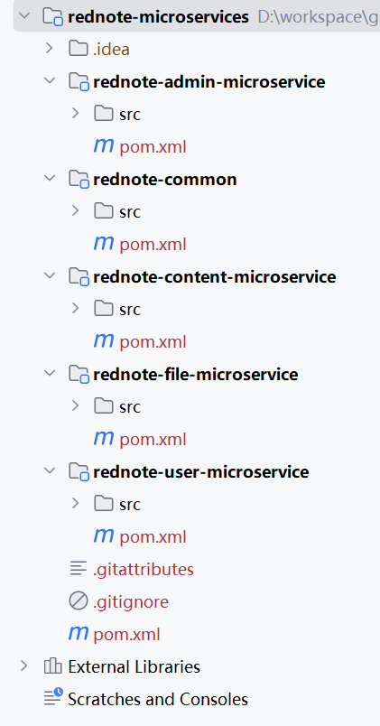

## 2.4 现有代码迁移至指定模块下


### 按照包名迁移至指定模块下


按照包名将代码整体迁移至与包名对应的指定模块。


### 领域微服务模块放置启动类


四个领域微服务下放置启动类RednoteApplication。


```java
import org.springframework.boot.SpringApplication;
import org.springframework.boot.autoconfigure.SpringBootApplication;

@SpringBootApplication
public class RednoteApplication {

	public static void main(String[] args) {
		SpringApplication.run(RednoteApplication.class, args);
	}

}
```


### 领域微服务模块放置应用配置


#### rednote-file-microservice

```
spring.application.name=rednote-file-microservice
server.port=9010


# 文件上传配置
file.upload-dir=/data/rednote
file.static-path-prefix=/uploads/

# 上传文件大小限制
spring.servlet.multipart.max-file-size=10MB
spring.servlet.multipart.max-request-size=10MB

# 配置内嵌的 tomcat 的最大吞吐量
server.tomcat.max-swallow-size = 100MB

# 配置 MongoDB
spring.data.mongodb.uri=mongodb://localhost:27017
spring.data.mongodb.grid-fs-database=rednote_files
spring.data.mongodb.database=rednote

# 配置 JWT
## 你的Base64编码密钥（至少256位）
app.jwtSecret=bQUBj9U7io0VXuhlaC9XmeaSGSwkqOlG4itHzIgUvOk=
## 24小时
app.jwtExpirationMs=86400000
```

#### rednote-user-microservice

```
spring.application.name=rednote-user-microservice
server.port=9020

# 数据库配置
spring.datasource.url=jdbc:mysql://localhost:3306/rednote
spring.datasource.username=root
spring.datasource.password=123456

## 启动时更新表结构，添加缺少的列，修改已有列类型等，但不会删除任何东西。
spring.jpa.properties.hibernate.hbm2ddl.auto=update
## 显示SQL
spring.jpa.show-sql=true

# 管理员配置
admin.username=admin
admin.password=admin123

# 配置 JWT
## 你的Base64编码密钥（至少256位）
app.jwtSecret=bQUBj9U7io0VXuhlaC9XmeaSGSwkqOlG4itHzIgUvOk=
## 24小时
app.jwtExpirationMs=86400000
```


#### rednote-content-microservice

```
spring.application.name=rednote-content-microservice
server.port=9030

# 数据库配置
spring.datasource.url=jdbc:mysql://localhost:3306/rednote
spring.datasource.username=root
spring.datasource.password=123456

## 启动时更新表结构，添加缺少的列，修改已有列类型等，但不会删除任何东西。
spring.jpa.properties.hibernate.hbm2ddl.auto=update
## 显示SQL
spring.jpa.show-sql=true

# 文件上传配置
file.upload-dir=/data/rednote
file.static-path-prefix=/uploads/

# 上传文件大小限制
spring.servlet.multipart.max-file-size=10MB
spring.servlet.multipart.max-request-size=10MB

# 配置内嵌的 tomcat 的最大吞吐量
server.tomcat.max-swallow-size = 100MB

# 配置 Spring Data Redis
spring.data.redis.host: localhost
spring.data.redis.port: 6379
spring.data.redis.password:

# 配置 Kafka
spring.kafka.bootstrap-servers=localhost:9092
spring.kafka.producer.key-serializer=org.apache.kafka.common.serialization.StringSerializer
spring.kafka.producer.value-serializer=org.springframework.kafka.support.serializer.JsonSerializer
spring.kafka.producer.retries=3
spring.kafka.producer.batch-size=16384
spring.kafka.producer.buffer-memory=33554432
spring.kafka.consumer.group-id=rednote-group
spring.kafka.consumer.auto-offset-reset=earliest
spring.kafka.consumer.key-deserializer=org.apache.kafka.common.serialization.StringDeserializer
spring.kafka.consumer.value-deserializer=org.springframework.kafka.support.serializer.JsonDeserializer
spring.kafka.consumer.properties.spring.json.trusted.packages=com.waylau.rednote.*

# 配置 JWT
## 你的Base64编码密钥（至少256位）
app.jwtSecret=bQUBj9U7io0VXuhlaC9XmeaSGSwkqOlG4itHzIgUvOk=
## 24小时
app.jwtExpirationMs=86400000
```


#### rednote-admin-microservice

```xml
spring.application.name=rednote-admin-microservice
server.port=9040

# 配置 Spring Data Redis
spring.data.redis.host: localhost
spring.data.redis.port: 6379
spring.data.redis.password:

# 配置 Kafka
spring.kafka.bootstrap-servers=localhost:9092
spring.kafka.producer.key-serializer=org.apache.kafka.common.serialization.StringSerializer
spring.kafka.producer.value-serializer=org.springframework.kafka.support.serializer.JsonSerializer
spring.kafka.producer.retries=3
spring.kafka.producer.batch-size=16384
spring.kafka.producer.buffer-memory=33554432
spring.kafka.consumer.group-id=rednote-group
spring.kafka.consumer.auto-offset-reset=earliest
spring.kafka.consumer.key-deserializer=org.apache.kafka.common.serialization.StringDeserializer
spring.kafka.consumer.value-deserializer=org.springframework.kafka.support.serializer.JsonDeserializer
spring.kafka.consumer.properties.spring.json.trusted.packages=com.waylau.rednote.*

# 配置 JWT
## 你的Base64编码密钥（至少256位）
app.jwtSecret=bQUBj9U7io0VXuhlaC9XmeaSGSwkqOlG4itHzIgUvOk=
## 24小时
app.jwtExpirationMs=86400000
```


最终，代码结构如下图2-7所示。


